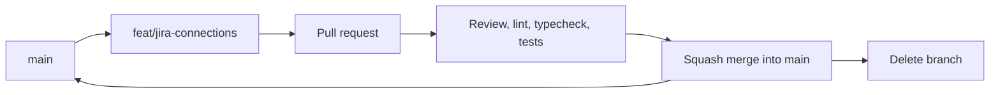

# Branching, commits and pull requests

## Branching

Trunk based. `main` is always deployable. Branches are short lived, days not weeks.



| Rule | Detail |
|---|---|
| Name | `type/short-topic`, kebab case. `feat/`, `fix/`, `chore/`, `docs/`, `refactor/` |
| Base | Always branch from current `main` |
| Size | One reason to exist. If the description needs an "and", split it |
| Updating | Rebase on `main`. Do not merge `main` into your branch |
| Force push | Fine on your own branch, never on `main` |
| Merge | Squash. One commit per PR on `main` |
| After merge | Delete the branch, local and remote |
| Never | Commit straight to `main`, even for a typo |

## Commits

```
Add the Testing Studio and per-tester Jira connections

Jira was one platform account for the whole organisation, so every bug was
filed by qa-bot. Each person now stores their own site, email and API token,
encrypted at rest, and a project maps to the site its bugs go to.
```

- Subject: imperative, no full stop, 72 characters or fewer. "Add", "Fix", "Move", not "Added" or "Fixing".
- Body: why the change exists and what it breaks. Skip it only when the subject truly says everything.
- No "fix stuff", "wip", "address comments", "final". Say what changed.
- One logical change per commit. A rename and its call sites are one change. A rename and a new feature
  are two.
- The commit that changes behaviour also carries the README, `.env.example` and migration it needs.
- No "Generated with" or model attribution lines in the message.

## Pull requests

`.github/pull_request_template.md` loads automatically. Fill it in, do not delete the headings.

Before requesting review:

- [ ] `pnpm lint`, `pnpm typecheck` and `pnpm test` pass locally
- [ ] Docs and `.env.example` updated in the same PR
- [ ] No secrets, tokens or real customer data in the diff
- [ ] Migrations are additive and numbered next
- [ ] Screenshot or short clip for anything with a UI
- [ ] You have read your own diff top to bottom

For reviewers:

- Review the diff against the stated intent, not against how you would have written it.
- Block on: correctness, data loss, missing permission or tenant scoping, secrets, an untested branch.
- Comment without blocking on: naming, structure preference, anything you would call a nitpick.
- Label each comment. "Blocking:" or "Nit:".
