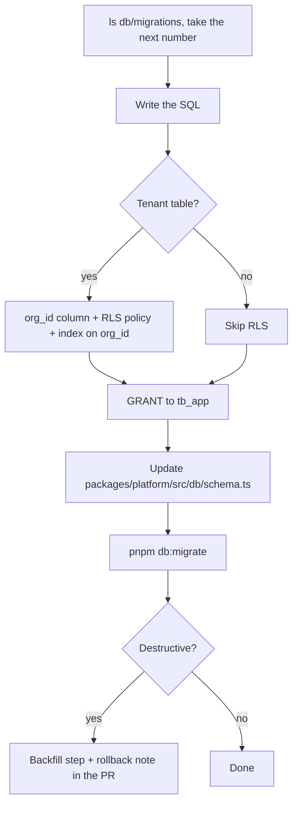

# Adding a migration

Migrations are append only. Someone else has already run every merged file, so the only safe change is
a new one.



## Steps

1. **Find the next number.** `ls db/migrations | tail -3`. Files are `NNNN_snake_case_name.sql`, four digits,
   zero padded. Never reuse a number, never edit a merged file, not even its comments.

2. **Write the SQL.** Open the two or three most recent migrations first and match their shape. Schemas in
   use: `iam`, `repo`, `execution`, `defect`, `search`, `analytics`, `docs`, `audit`, `collab`, `studio`.

3. **Every tenant table gets `org_id` and an RLS policy.** RLS reads `app.org_id`, which `withTenant` sets
   transaction-locally. A table without a policy is readable across tenants by any query that forgets to
   filter, which is every query eventually.

   The policy reads `iam.current_org()`, defined in `0001_foundation.sql`. Both halves are needed: `USING`
   stops reads, `WITH CHECK` stops writing a row into another tenant.

   ```sql
   CREATE TABLE studio.thing (
     id         uuid PRIMARY KEY DEFAULT gen_random_uuid(),
     org_id     uuid NOT NULL,
     project_id uuid NOT NULL REFERENCES repo.project (id),
     name       text NOT NULL CHECK (length(name) BETWEEN 1 AND 200),
     created_at timestamptz NOT NULL DEFAULT now()
   );
   CREATE INDEX thing_project_idx ON studio.thing (org_id, project_id);

   ALTER TABLE studio.thing ENABLE ROW LEVEL SECURITY;
   CREATE POLICY tenant ON studio.thing
     USING (org_id = iam.current_org()) WITH CHECK (org_id = iam.current_org());
   ```

   For several tables at once, use the `DO $$ ... FOREACH` loop at the bottom of
   `0017_studio_tests.sql` rather than repeating the policy by hand. Copy from the newest migration that
   creates a table if it disagrees with this snippet.

4. **Grant the app role.** RLS is not access. Without a grant, `tb_app` gets a permission error on the first
   query, and the table looks broken rather than protected.

   ```sql
   GRANT SELECT, INSERT, UPDATE, DELETE ON studio.thing TO tb_app;
   ```

   Append-only history tables get `GRANT SELECT, INSERT` only, the way `studio.test_version` does.

5. **Update `packages/platform/src/db/schema.ts` in the same commit.** The Kysely types and the SQL describe
   the same thing. If only one changes, the other is a lie the compiler will happily believe.

6. **Constraints in the database, not only in code.** `CHECK` on lengths and enumerated values, `UNIQUE` on
   what must be unique, foreign keys on what must exist. The database is the last place a bad row can be
   stopped.

7. **Index for a query you have written.** No speculative indexes: each one costs on every insert and update.
   Lead the index with `org_id` when the query is tenant scoped.

8. **Run it.** `pnpm db:migrate`. Then `pnpm --filter @tb/core-api test` if the change touches anything the
   API tests read.

9. **Comment the non-obvious column in the SQL file.** Why the column exists, what it means when null, which
   values are allowed and why. The migration is what someone reads a year from now, not the PR that added it.

## Destructive changes

Dropping a column, renaming one, or adding `NOT NULL` to an existing column breaks the running version while
the deploy is in flight. Do it in two migrations, one release apart:

| Step | Migration | Safe because |
|---|---|---|
| 1 | Add the new column, nullable. Backfill it. Write both columns | Old code keeps working |
| 2 | Next release: stop writing the old column, then drop it | Nothing reads it any more |

Say in the PR what the rollback is. "Revert the commit" is only true for additive migrations.

## Do not

- Do not edit a merged migration.
- Do not put seed or demo data in a migration. That belongs in the seed.
- Do not create a tenant table without RLS.
- Do not `DROP` anything in the same migration that adds its replacement.
