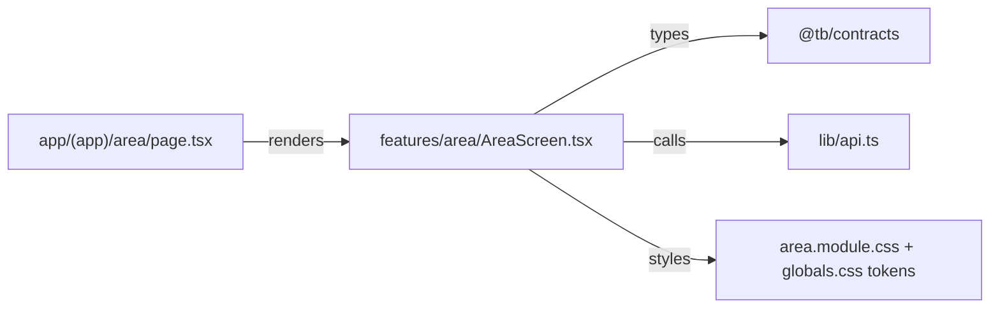

# Adding a screen

## Where things go

| Thing | Path |
|---|---|
| The screen | `apps/web/src/features/<area>/<Area>Screen.tsx` |
| The route | `apps/web/src/app/(app)/<area>/page.tsx`, a thin wrapper that renders the screen |
| Styles | `apps/web/src/features/<area>/<area>.module.css` |
| Design tokens | `apps/web/src/app/globals.css`, from the Claude Design canvas |
| Shared components | `apps/web/src/components/` |
| Server calls | `apps/web/src/lib/api.ts` |
| Formatting helpers | `apps/web/src/lib/format.ts` |

## Rules

- **Keep logic out of the route file.** `page.tsx` renders the screen and nothing else.
- **Styling is CSS modules plus tokens.** No inline style objects for anything reusable, and no new colour
  that is not already a token in `globals.css`. If you need a new token, add it there, not in the module.
- **Server calls go through `lib/api.ts`.** Do not call `fetch` directly from a component. Errors come back
  as `ApiError`, so handle them rather than letting them reach the console.
- **Types come from `@tb/contracts`.** Never redeclare a request or response shape the API already owns.
- **Icons come from `components/Icon.tsx`.** Add to it rather than pasting an SVG into a screen.
- **Loading, empty and error states are part of the screen**, not a follow up. A screen that only handles
  the happy path is unfinished. An empty state says what the thing is and how to create the first one.
- **Accessibility is not optional**: a label on every input, a visible focus state, keyboard reachability
  for anything clickable, and the right roles where a pattern calls for them (`role="tablist"` and friends).
- Tabs and filters belong in the URL (`?tab=runs&id=…`) so a link reproduces the view. `StudioScreen.tsx`
  is the example.
- Dates and numbers go through `lib/format.ts`. Dates are shown in IST.

## Before the PR

- `pnpm --filter @tb/web lint` and `typecheck` pass.
- Screenshot in the PR. Before and after if you changed something that already existed.
- Check it at a narrow width. The grid screens are the ones that break.
