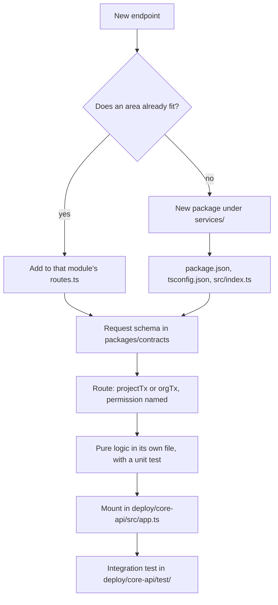

# Adding a service module or a route

Service modules hold routes, queries and pure domain logic. `deploy/core-api` mounts them and owns the
process. A module never starts a server, reads `process.env`, or talks to another module's tables.



## Look first

Open `services/defect` before writing anything. It is the fullest example: routes, queries, a pure
scoring file with its own test, an external client, and a background worker.

| File | Holds |
|---|---|
| `index.ts` | The public surface. Named exports only, nothing else is importable |
| `routes.ts` | The Fastify plugin: schema, permission, transaction, then a call into the logic |
| `<area>.ts` | Queries against the `Tx` |
| `<pure>.ts` + `<pure>.test.ts` | Domain logic with no database, and its unit test |

## Steps

1. **Decide whether you need a new package at all.** Most work is a new route in an existing module. A new
   package is for a genuinely new domain area, one that would own its own tables.

2. **If new, copy the package shape** from `services/defect/package.json`: `@tb/<name>`, private, ESM,
   `"exports": { ".": "./src/index.ts" }`, and the three scripts `test`, `typecheck`, `lint`. Dependencies
   are `@tb/contracts`, `@tb/iam`, `@tb/platform`, plus `fastify`, `fastify-type-provider-zod`, `kysely`
   and `zod`. Add a `tsconfig.json` next to a sibling's. Run `pnpm install` so the workspace picks it up.

3. **Put the request schema in `packages/contracts`**, not in the route file. The web app imports the same
   schema and the same response type, so the two cannot drift.

4. **Write the route thin.** Validate, check permission, open the transaction, call the logic, return.

   ```ts
   app.withTypeProvider<ZodTypeProvider>().post(
     '/projects/:projectId/things',
     { schema: { params: Project, body: CreateThingBody } },
     (req) => projectTx(db, req, req.params.projectId, 'thing.write', (trx) => createThing(trx, req.body)),
   );
   ```

5. **Pick the right transaction helper.** This is the security decision on every route.

   | Helper | Use when | Does |
   |---|---|---|
   | `projectTx` | The route is about one project | Checks the permission, opens the tenant transaction, 404s if the project is not visible |
   | `orgTx` | The route is org wide, such as settings | Checks the org permission, opens the tenant transaction |
   | `tenantTx` | There is genuinely no permission to check | Opens the tenant transaction only |

   Never call `withTenant` from a route, and never query the raw `Db` inside a request. Both skip the
   permission check, and the raw `Db` skips RLS as well.

6. **Keep the logic out of the route.** Anything with a rule in it, a calculation, a parse or a comparison,
   goes in its own file with no database and no Fastify import. That file gets a `*.test.ts` beside it.
   `bug-report.ts` and `similarity.ts` are what this looks like.

7. **Errors use `AppError`** from `@tb/platform`: `notFound()`, `badRequest()`, `forbidden()`. Never throw a
   bare string, never return a 200 with an error inside it.

8. **Export from `index.ts`**, then mount in `deploy/core-api/src/app.ts` with
   `await api.register(thingRoutes, deps)`. Pass extra dependencies as options rather than importing them
   inside the module.

9. **Test both layers.** The pure logic gets a unit test beside it. The route gets a case in
   `deploy/core-api/test/`, which runs against the local stack and must assert the 403 and the 404, not
   only the happy path.

10. **Run `pnpm lint`, `pnpm typecheck` and the tests** before you open the PR.

## Background workers

A worker exports a `start*` function that core-api calls, the way `startReconciler` and
`startAttachmentWorker` do. It does not start itself on import. It takes its interval and dependencies as
arguments so a test can drive it directly.

## Do not

- Do not read `process.env` in a module. Config is loaded once in `@tb/platform` and passed in.
- Do not query another module's tables. Call across through an exported function.
- Do not put a Zod schema for a request body anywhere but `packages/contracts`.
- Do not add a dependency that a sibling module already has a helper for.
