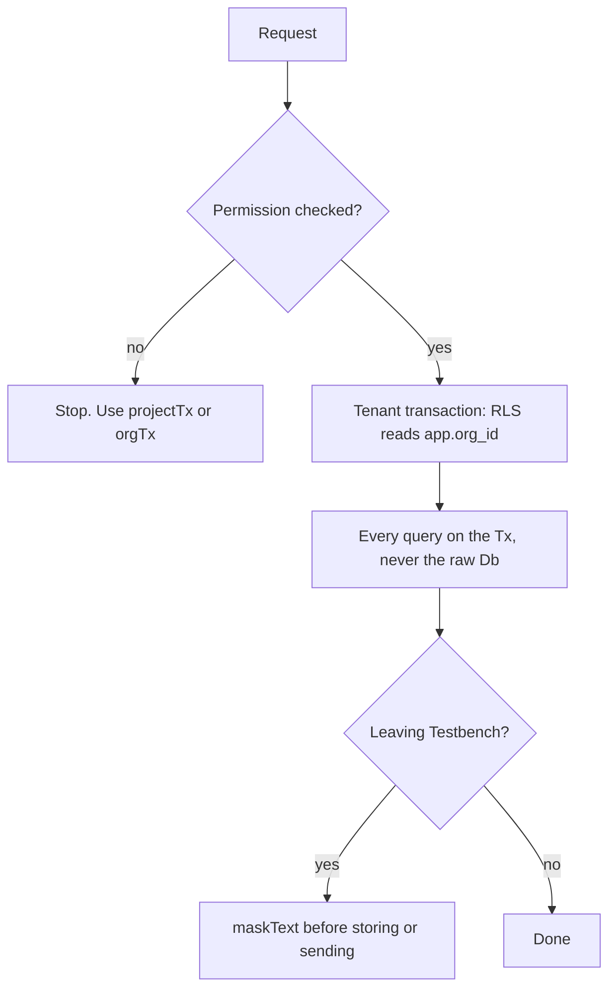

# Tenant isolation and secrets

A mistake here leaks another tenant's data or a customer's credentials. Nothing below is negotiable for
the sake of a smaller diff.

## Transactions and scoping

- **Routes open their transaction with `projectTx` or `orgTx`, never `withTenant` directly.** They check
  the permission first, then open the tenant transaction, and `projectTx` also confirms the project is
  visible and answers 404 if it is not.

  | Helper | Use when |
  |---|---|
  | `projectTx` | The route is about one project |
  | `orgTx` | The route is org wide, such as settings |
  | `tenantTx` | There is genuinely no permission to check |
  | `withUser` | Before an organisation is chosen, where only the person's own memberships are visible |

- **Never query on a raw `Db` inside a request.** Use the `Tx` the helper hands you. A query on the pool
  skips RLS entirely and sees every organisation.
- **Never take `orgId` from the request body.** It comes from the authenticated session, always.
- RLS reads `app.org_id`, set transaction-locally, so a pooled connection cannot carry one tenant's
  context into the next request that borrows it.
- Permission checks live on the route, not in the UI. A hidden button is not a permission.

## Secrets

- **Encrypt with `encryptSecret`, never store raw.** Jira tokens, tenant AI keys and linked Slack tokens
  are AES-256-GCM. Decrypt at the point of use, never into a log, a response or an error message.
- New secrets get a key in `.env.example` with an obvious placeholder, in the same commit.
- Nothing sensitive in logs: no tokens, no full card or phone numbers, no request bodies from auth routes.

## Masking

- **Mask before storage, never after.** `maskText` runs on its way into evidence, bug reports, attachments
  and captured traffic. Masking a value that was already written leaves the unmasked copy behind.

## Outbound requests

- Any URL the server fetches is checked first. The Test Browser and any new outbound fetch go through the
  SSRF guard in `deploy/browser-live/src/net-guard.ts`, which checks after DNS resolution so redirects and
  subresources are covered too.
- `BROWSER_ALLOW_PRIVATE=true` is a local switch that turns the guard off. It must never be set in a
  deployed environment.

## Database

- **Every tenant table carries `org_id` and an RLS policy**, with both `USING` and `WITH CHECK` on
  `iam.current_org()`. A table without one is a data leak waiting for its first query.
- **RLS is not access.** The table also needs `GRANT ... TO tb_app`, or the first query fails with a
  permission error and the table looks broken rather than protected.
- Migrations are append only. See the `new-migration` skill.

## Reviewing for this

Block the PR on any of: a query on the raw `Db`, a route with no permission helper, a new table with no
RLS policy, a secret stored in plain text, a log line with a token in it, an outbound fetch with no guard.
