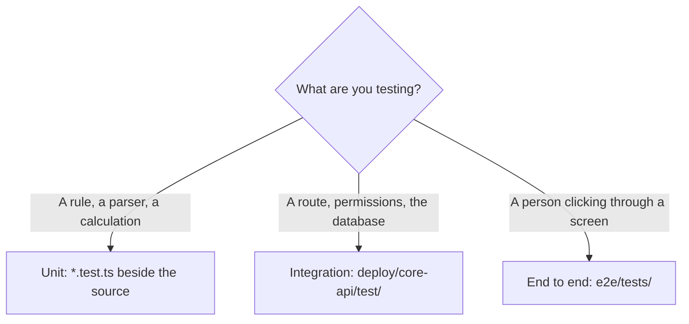

# Testing

Three layers. Put the test in the cheapest one that can actually catch the bug.



| Layer | Where | Runs against | Use it for |
|---|---|---|---|
| Unit | `*.test.ts` next to the file | Nothing. Pure functions | Domain logic, parsing, masking, similarity, formatting |
| Integration | `deploy/core-api/test/*.test.ts` | The local Docker stack | Routes, permissions, RLS, migrations, anything with SQL |
| End to end | `e2e/tests/` | The running app through Playwright | A whole journey a person performs |

## Rules

- **Most tests are unit tests.** Pull the logic out of the route so it can be one. `bug-report.ts` and
  `similarity.ts` are the pattern: no database, no Fastify, just input and output.
- **Integration tests create and delete their own organisation.** Use the harness in
  `deploy/core-api/test/harness.ts`. Never depend on seeded data, never leave rows behind.
- **Test the permission, not just the happy path.** A route test that only checks a 200 has not tested the
  thing most likely to be wrong. Assert the 403 and the 404 too.
- **AI stays on `AI_MODE=mock` in tests.** A test that calls a real provider is slow, costs money and fails
  when someone else's network does.
- **A bug fix starts with the failing test.** Write it, watch it fail, then fix it. Otherwise you do not
  know that you fixed it.
- Every non trivial branch, loop, parser or permission path leaves one runnable test behind. Trivial one
  liners do not need a test.
- No snapshot tests of whole API responses. They fail on every unrelated change and nobody reads the diff.
- A flaky test is a broken test. Fix it or delete it, do not retry it.

## Running them

```sh
pnpm test                          # everything, needs the stack up for the core-api tests
pnpm turbo run test --filter='!@tb/core-api'   # unit tests only, no Docker needed
pnpm --filter @tb/core-api test    # integration, needs pnpm infra:up and pnpm db:migrate first
pnpm test:e2e                      # Playwright, needs pnpm dev running
```

CI splits it the same way: `check` runs lint, typecheck and the unit tests; `integration` brings the
Docker stack up and runs the core-api tests. See `.github/workflows/ci.yml`.
