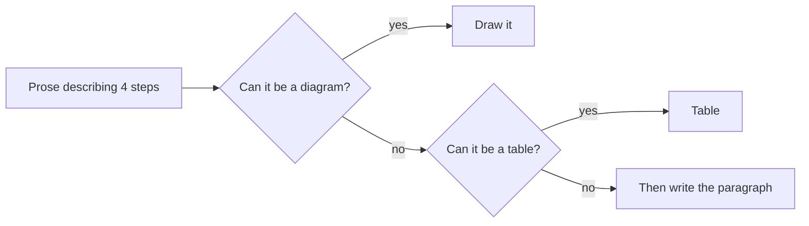

# How documentation is written here

## Shape

Any process, flow or architecture gets a diagram. Mermaid, fenced, in the markdown file itself.

- Diagram first, table second, prose last. A paragraph explaining a sequence of steps is a diagram that
  has not been drawn yet.
- Tables for anything with repeating shape: ports, roles, env vars, file layout, options.
- Keep a diagram under about 12 nodes. Split it rather than growing it.
- Every document says what the thing is and how to run or use it, in the first ten lines. No warm up.
- Link to the file or the plan instead of restating it. One source of truth per fact.
- Update the document in the same commit as the code. A doc that lags is worse than no doc.
- Diagrams must render. Check the fence says `mermaid`, and that node ids have no spaces or stray brackets.

## Voice

Write like a person explaining it to the next engineer, not like a model producing a document.

Do:

- Short sentences. One idea each.
- Plain words. "Uses", not "leverages". "Because", not "due to the fact that".
- Bullets over paragraphs. Lead the bullet with the point.
- Real numbers, real paths, real commands. `pnpm db:migrate`, not "run the migration tooling".
- Say the limit out loud. "Runs above 5,000 cases are prepared in the background" beats "handles large runs".
- British spelling, matching the README: organisation, licence, behaviour.

Do not:

- No padded opening ("In this document we will explore...") and no summary of what you just said.
- No filler: "it is important to note", "seamlessly", "robust", "comprehensive", "delve", "leverage",
  "in today's fast paced".
- No em dashes, no decorative emoji, no bold scattered mid sentence for emphasis.
- No restating a heading in the first line under it.
- No hedging a fact you can check. Go and check it.
- No "Generated with" or model attribution lines in documents or PR bodies.

Length test: if the explanation is longer than the thing it explains, cut the explanation.

## Where documents live

| Kind | Where |
|---|---|
| How to run the project, what exists | `README.md` |
| Architecture, plans, designs | `docs/` |
| Why a line of code is the way it is | A comment in that file, not a document |
| What changed and why | The commit message and the PR, not a document |

Do not create a new document for a small change. Update the one that already covers the topic.
