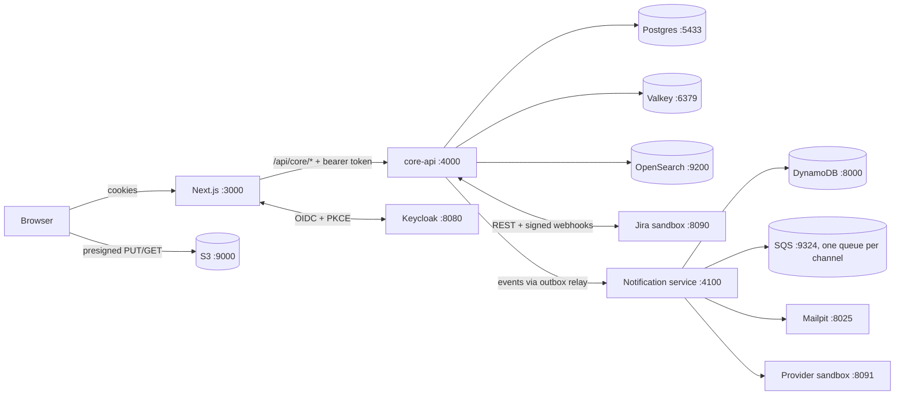
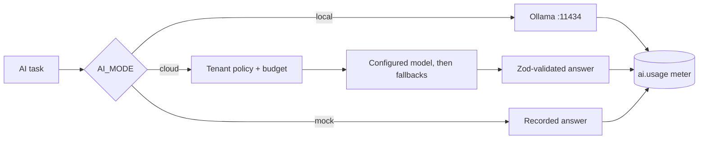
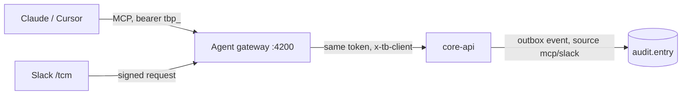

# Testbench

Test management for testers: test cases, runs and execution, with Jira, notifications, analytics and more to follow.
Architecture and roadmap: [docs/HLD.md](docs/HLD.md).

Built so far:
- **M1**: sign in, browse and edit test cases (module tree, 1,00,000-row grid, bulk edits, versions), create runs,
  and execute them step by step with evidence uploads.
- **M2**: TQL search (proximity, grouping, saved and shared filters), bugs logged to Jira from a failed step with a
  duplicate check, Jira status sync by webhook and reconciler, the retest queue, and background preparation for runs
  above 5,000 cases.
- **M3**: a standalone notification service (email, SMS, Slack, Microsoft Teams, Discord, in-app) with rules,
  templates, per-person preferences and quiet hours, unread fallback to email, retries and a delivery log; the bell,
  the notification console and personal settings in the web app.
- **M4**: analytics (overview, release readiness with go/no-go sign-off, test health, build comparison, workload),
  PRDs with requirement extraction, version diff, traceability and change impact (linked cases flagged Needs review),
  and AI assist (draft cases from a requirement, edge-case suggestions) through one provider layer for OpenAI,
  Anthropic, xAI and offline Ollama, with per-task models, tenant policy, bring-your-own keys and token budgets.
- **M5 (part 1)**: the admin console (members and invitations, custom roles with guardrails, integrations, AI
  providers, the audit log), personal access tokens, the MCP server for Claude and other agents, and the Slack bot.
- **Projects**: many projects per organisation, grouped by product line; a switcher in the top bar, a portfolio
  page with each project's health, creating projects (optionally copying another's module tree) and archiving.
- **M5 (part 2)**: live boards (documents on TipTap, sheets, Excalidraw whiteboards) synced with Yjs through a
  Hocuspocus collaboration server, and meetings with calendar invites, live notes and action items that become
  test cases.

## Run it locally

Needs Node 24, pnpm 11 (via corepack) and Docker Desktop.

```sh
cp .env.example .env
pnpm install
pnpm infra:up             # Postgres, Valkey, Keycloak, S3, OpenSearch, Jira sandbox, DynamoDB, SQS, providers, Mailpit
pnpm db:migrate
pnpm seed --size dev      # PAY with 1,00,000 cases, plus KYC and MOB; --size demo gives PAY 1,000
pnpm search:reindex       # builds the search index from Postgres (after every seed)
pnpm dev                  # web :3000, core-api :4000, notification service :4100, agent gateway :4200, collaboration :4300
```



The **Jira sandbox** at http://localhost:8090 stands in for Jira Cloud. Changing a bug's status there sends a signed
webhook to core-api, which is how you "fix" a bug locally and watch it reach the retest queue. To use a real Jira
Cloud site, set `JIRA_BASE_URL`, `JIRA_EMAIL`, `JIRA_API_TOKEN` and `JIRA_WEBHOOK_SECRET` in `.env`.

Notifications land in **Mailpit** (email, http://localhost:8025), the **provider sandbox** (Slack, Teams, Discord and
SMS, http://localhost:8091) and the bell. Admins manage rules, templates and channels in the Notification console;
pointing a channel at a real Slack, Teams or Discord webhook sends for real.

**AI** runs offline by default (`AI_MODE=local`): install [Ollama](https://ollama.com) and `ollama pull qwen3:4b`, or
start the `ai` profile (`docker compose -f infra/local/docker-compose.yml --profile ai up -d`). On a CPU a call takes
about a minute. `AI_MODE=cloud` uses the provider keys in `.env` (or keys an Org Admin adds in Settings → AI);
`AI_MODE=mock` answers from recorded responses, which is what the tests use.



PRDs whose paragraphs start with ids such as `REQ-AP-04` are read without AI and keep their ids across versions;
other documents go through AI extraction.

**Agents and Slack.** Create a personal access token in Settings → Access tokens, then connect Claude Code:

```sh
claude mcp add --transport http testbench http://localhost:4200/mcp --header "Authorization: Bearer tbp_…"
```

The gateway calls core-api with that token, so an agent can do exactly what its owner can, and every change it
makes shows up in the audit log with source `mcp`. Slack commands (`/tcm login tbp_…`, `/tcm status RUN-3 PAY`,
`/tcm run smoke PAY 8812`) can be tried without a Slack workspace at http://localhost:8091/slack-console.



### Accounts

All passwords are `Testbench@123` (local realm only).

| Email | Role |
|---|---|
| anita.desai@paytrail.in | Org Admin |
| rahul.verma@paytrail.in | Project Admin |
| sneha.iyer@paytrail.in | Test Lead |
| aarav.mehta@paytrail.in | Tester (PAY only) |
| aditya.chauhan@paytrail.in | Viewer |

Keycloak admin console: http://localhost:8080 (admin / admin).

## Tests

```sh
pnpm test        # unit tests everywhere, plus API integration tests against the local stack
pnpm test:e2e    # Playwright, signs in through Keycloak; needs `pnpm dev` running
```

The integration tests create their own organisations and users and delete them afterwards, so they never touch seeded data.

## Layout

| Path | What |
|---|---|
| `apps/web` | Next.js app. Screens live in `src/features/*`; design tokens in `src/app/globals.css` come from the Claude Design canvas |
| `deploy/core-api` | The API process: mounts the service modules below (HLD §1.1) |
| `services/iam`, `repository`, `execution`, `search`, `defect`, `analytics`, `docs`, `ai`, `audit`, `collab`, `meetings` | Service modules: routes, queries, and pure domain logic with unit tests |
| `services/notification`, `deploy/notification-local` | The standalone notification service (its own DynamoDB and SQS) and its local process |
| `deploy/collab-server` | Hocuspocus server for live boards; opens a board only with a ticket core-api signed |
| `deploy/agent-gateway` | MCP server and Slack bot; holds no data or permissions of its own |
| `services/notify-client` | core-api's side: turns events into notifications, and the inbox, preferences and console routes |
| `packages/tql` | The TQL query language: parser, autocomplete and highlighting, shared by API and web |
| `packages/contracts` | Request schemas (Zod) and response types shared by API and web |
| `packages/platform` | Config, auth, tenant-scoped DB transactions, cache, S3, outbox |
| `db` | SQL migrations and the seed |
| `infra/local` | Docker Compose and Keycloak realm |
| `e2e` | Playwright tests |

## Notes

- Postgres is on port **5433** because 5432 is often used by other local projects.
- S3 is **SeaweedFS**: MinIO no longer publishes community images. The app only speaks the S3 API.
- Runs up to 5,000 cases are created in the request; larger ones are prepared in the background (up to 10 lakh cases).
- Events reach consumers (such as the search indexer) through the transactional outbox and an in-process relay;
  EventBridge takes over the delivery when the platform moves to AWS.
