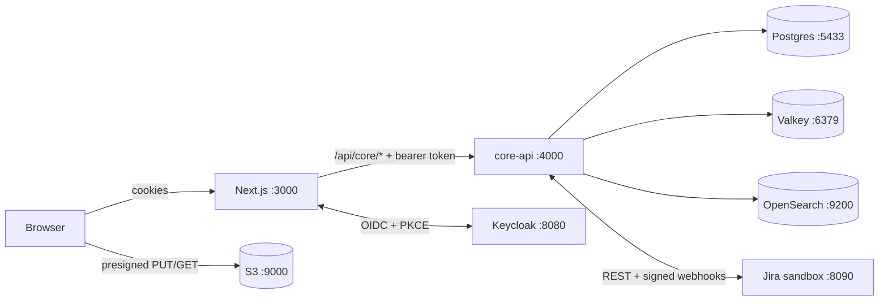

# Testbench

Test management for testers: test cases, runs and execution, with Jira, notifications, analytics and more to follow.
Architecture and roadmap: [docs/HLD.md](docs/HLD.md).

Built so far:
- **M1**: sign in, browse and edit test cases (module tree, 1,00,000-row grid, bulk edits, versions), create runs,
  and execute them step by step with evidence uploads.
- **M2**: TQL search (proximity, grouping, saved and shared filters), bugs logged to Jira from a failed step with a
  duplicate check, Jira status sync by webhook and reconciler, the retest queue, and background preparation for runs
  above 5,000 cases.

## Run it locally

Needs Node 24, pnpm 11 (via corepack) and Docker Desktop.

```sh
cp .env.example .env
pnpm install
pnpm infra:up             # Postgres, Valkey, Keycloak, S3 (SeaweedFS), OpenSearch, Jira sandbox, Mailpit
pnpm db:migrate
pnpm seed --size dev      # 1,00,000 cases; use --size demo for 1,000
pnpm search:reindex       # builds the search index from Postgres (after every seed)
pnpm dev                  # web on http://localhost:3000, API on http://localhost:4000
```



The **Jira sandbox** at http://localhost:8090 stands in for Jira Cloud. Changing a bug's status there sends a signed
webhook to core-api, which is how you "fix" a bug locally and watch it reach the retest queue. To use a real Jira
Cloud site, set `JIRA_BASE_URL`, `JIRA_EMAIL`, `JIRA_API_TOKEN` and `JIRA_WEBHOOK_SECRET` in `.env`.

### Accounts

All passwords are `Testbench@123` (local realm only).

| Email | Role |
|---|---|
| anita.desai@paytrail.in | Org Admin |
| rahul.verma@paytrail.in | Project Admin |
| sneha.iyer@paytrail.in | Test Lead |
| aarav.mehta@paytrail.in | Tester (PAY only) |
| aditya.chauhan@paytrail.in | Viewer |

Keycloak admin console: http://localhost:8080 (admin / admin).

## Tests

```sh
pnpm test        # unit tests everywhere, plus API integration tests against the local stack
pnpm test:e2e    # Playwright, signs in through Keycloak; needs `pnpm dev` running
```

The integration tests create their own organisations and users and delete them afterwards, so they never touch seeded data.

## Layout

| Path | What |
|---|---|
| `apps/web` | Next.js app. Screens live in `src/features/*`; design tokens in `src/app/globals.css` come from the Claude Design canvas |
| `deploy/core-api` | The API process: mounts the service modules below (HLD §1.1) |
| `services/iam`, `repository`, `execution`, `search`, `defect` | Service modules: routes, queries, and pure domain logic with unit tests |
| `packages/tql` | The TQL query language: parser, autocomplete and highlighting, shared by API and web |
| `packages/contracts` | Request schemas (Zod) and response types shared by API and web |
| `packages/platform` | Config, auth, tenant-scoped DB transactions, cache, S3, outbox |
| `db` | SQL migrations and the seed |
| `infra/local` | Docker Compose and Keycloak realm |
| `e2e` | Playwright tests |

## Notes

- Postgres is on port **5433** because 5432 is often used by other local projects.
- S3 is **SeaweedFS**: MinIO no longer publishes community images. The app only speaks the S3 API.
- Runs up to 5,000 cases are created in the request; larger ones are prepared in the background (up to 10 lakh cases).
- Events reach consumers (such as the search indexer) through the transactional outbox and an in-process relay;
  EventBridge takes over the delivery when the platform moves to AWS.
