# Test Management Platform — Architecture & Workflows

A complete platform for testers covering the whole testing lifecycle: writing test cases, planning and running tests, tracking bugs in Jira, keeping PRDs and documents, reviews, collaboration, meetings, analytics and notifications. It can also be used through AI agents (MCP) and a Slack bot.

**Stack:** Next.js (frontend) · Node.js (backend, TypeScript) · PostgreSQL · AWS
**Region:** ap-south-1 (Mumbai) primary, ap-south-2 (Hyderabad) for disaster recovery, so data stays in India.
**Scale:** 1,000 users a day, and up to **10 million test cases in a single project** (§3.1). Data volume, not traffic, drives the design.
**AI:** OpenAI, xAI (Grok), Anthropic, and fully offline local models, all behind one provider layer (§2.3).
**Current phase:** local-first. The whole platform runs on a developer laptop (§10) before any AWS deployment.
**Principle:** everything that runs on AWS also runs locally. Local development runs the same features, not a reduced version (see §10).

---

## 1. Service map

| # | Service | What it owns | AWS runtime | Data store |
|---|---|---|---|---|
| 1 | **Identity & Access (IAM)** | Orgs, users, SSO, SCIM, roles, permissions, invites, onboarding, personal access tokens (PATs), OAuth clients for MCP/Slack | ECS Fargate | Postgres `iam` |
| 2 | **Test Repository** | Projects, functionality/module tree, test cases, steps, shared steps, parameters/data sets, versions, labels, custom fields, review workflow, Excel import/export | ECS Fargate | Postgres `repo` |
| 3 | **Execution** | Test plans, runs (smoke/regression/custom), dynamic and static runs, scheduling, results, evidence, environments, builds, configuration matrix, exploratory sessions, automation result ingestion, flaky detection | ECS + EventBridge Scheduler | Postgres `exec` |
| 4 | **Defect Integration** | Jira bug creation, two-way status sync, retest queue, bug linking and tracking | ECS + Lambda (webhooks) | Postgres `defect` |
| 5 | **Search & Query** | TQL (a JQL-like query language), full-text search, proximity search, grouping, saved and shared filters, autocomplete | ECS + OpenSearch | OpenSearch |
| 6 | **Analytics & Reporting** | Dashboards, trends, coverage, traceability matrix, release readiness and go/no-go sign-off, exports | ECS + Lambda | Postgres read replica + materialized views |
| 7 | **Docs & Knowledge** | PRDs and related documents, attachments, version history, extracting requirements from PRDs, links from requirements to test cases | ECS | Postgres `docs` + S3 |
| 8 | **Collaboration** | Review comments, @mentions, presence, live editing of documents, sheets and whiteboards, boards | ECS (WebSocket, sticky sessions) | Postgres + S3 snapshots |
| 9 | **Meetings** | Scheduling through Google/M365 calendars, meeting notes, transcript import, turning action items into test cases or bugs | ECS | Postgres `meet` |
| 10 | **AI Assist** | Generating test cases from PRDs, suggesting edge cases, detecting duplicates, choosing tests based on what changed; the provider layer for OpenAI / xAI / Anthropic / local models (§2.3) | ECS | Postgres `ai` (jobs, usage, config) + OpenSearch k-NN (vectors) |
| 11 | **Agent & Bot Gateway** | MCP server (Streamable HTTP, OAuth 2.1) for Claude, Cursor and other agents, and the Slack bot | ECS | none (calls the public API) |
| 12 | **Notification** (serverless, standalone, has its own UI) | Email, SMS, Teams, Slack, Discord and in-app messages, templates, preferences, routing, digests, delivery logs | Lambda + SQS + API Gateway | DynamoDB |
| — | **Audit** | Append-only log of who changed what and when, for every service | Lambda | Postgres `audit` (partitioned) |

**Extensions:** Testing Studio (live browser, no-code automation, API and load testing) and Requirements Intelligence (knowledge graph, test design) add a Studio module, runner services and a Python ML worker. See [testing-studio-plan.md](testing-studio-plan.md), [technical-design.md](technical-design.md) and [implementation-plan.md](implementation-plan.md).

**Shared infrastructure (not separate services):**
- EventBridge as the event bus
- The transactional outbox pattern in each service
- S3 presigned uploads
- ElastiCache Valkey (Redis-compatible)
- OpenTelemetry for tracing and metrics

### 1.1 Phased deployment

The 12 services above are **module boundaries**, not 12 deployments from day one. At the current traffic target (1,000 users a day, see §7.1) they ship as 5 deploy units. Each module keeps its own Postgres schema, its own outbox and events-only communication, so moving a module into its own deployment later is a configuration and pipeline change, not a rewrite.

| Deploy unit | Modules inside | Why grouped |
|---|---|---|
| **core-api** | IAM, Test Repository, Execution, Defect Integration, Audit consumer | The main request path; same scaling profile |
| **insight** | Search & Query (+ indexer), Analytics & Reporting | Read-heavy, owns OpenSearch and the read replica |
| **knowledge** | Docs & Knowledge, Collaboration, Meetings, AI Assist | Long-lived WebSocket connections and slow AI calls; kept away from core-api latency |
| **agent-gateway** | MCP server, Slack bot | Public surface for external agents; separate rate limits and blast radius |
| **notification** | Notification (serverless) | Already standalone, with its own UI and data store |

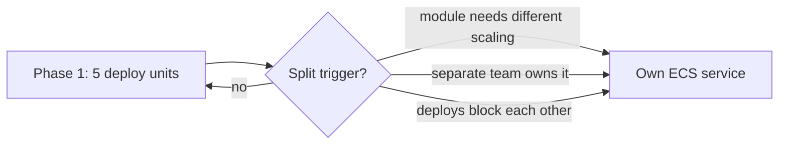

**Split triggers:** split a module out only when one of these is true: it needs a different scaling profile, a separate team owns it, or its deploys keep blocking other modules. Without a trigger, one more deployment only adds a pipeline, an alarm set and on-call surface.

The repository layout in §11 stays per module. A deploy unit is a thin entrypoint that mounts several modules' routers and consumers into one Node process.

---

## 2. Architecture

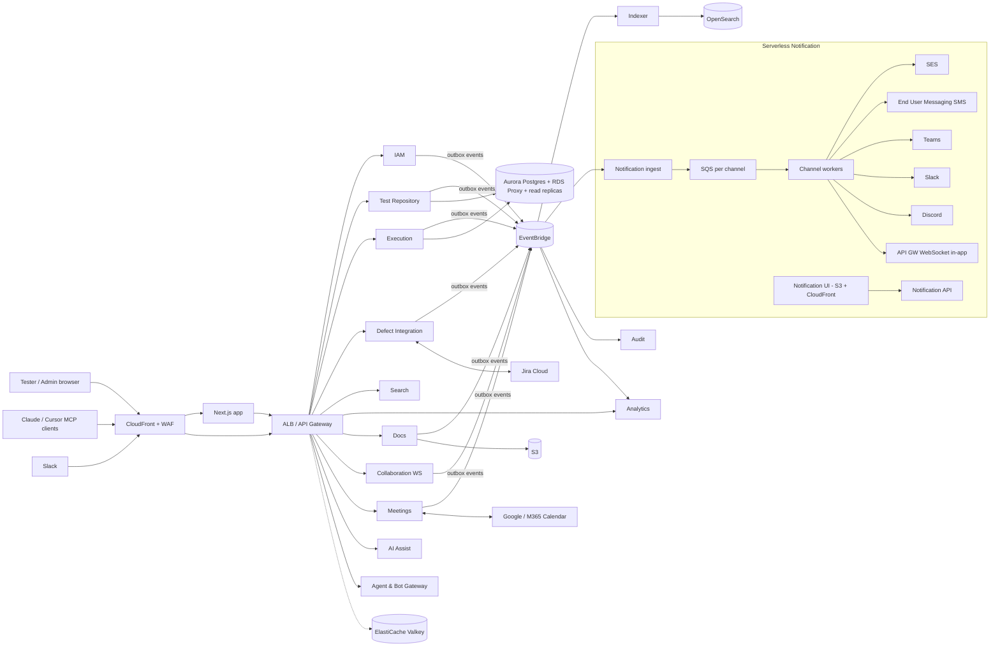

**Communication rules:**
- The frontend and API clients call services synchronously over REST.
- Services never call each other synchronously in a chain. They exchange EventBridge events, so if one service goes down the others keep working.
- Each service writes its events to an outbox table in the same transaction as its data change, and a relay publishes them. This means no event is ever lost or published for a change that rolled back.

### 2.1 Frontend module map (Next.js App Router)

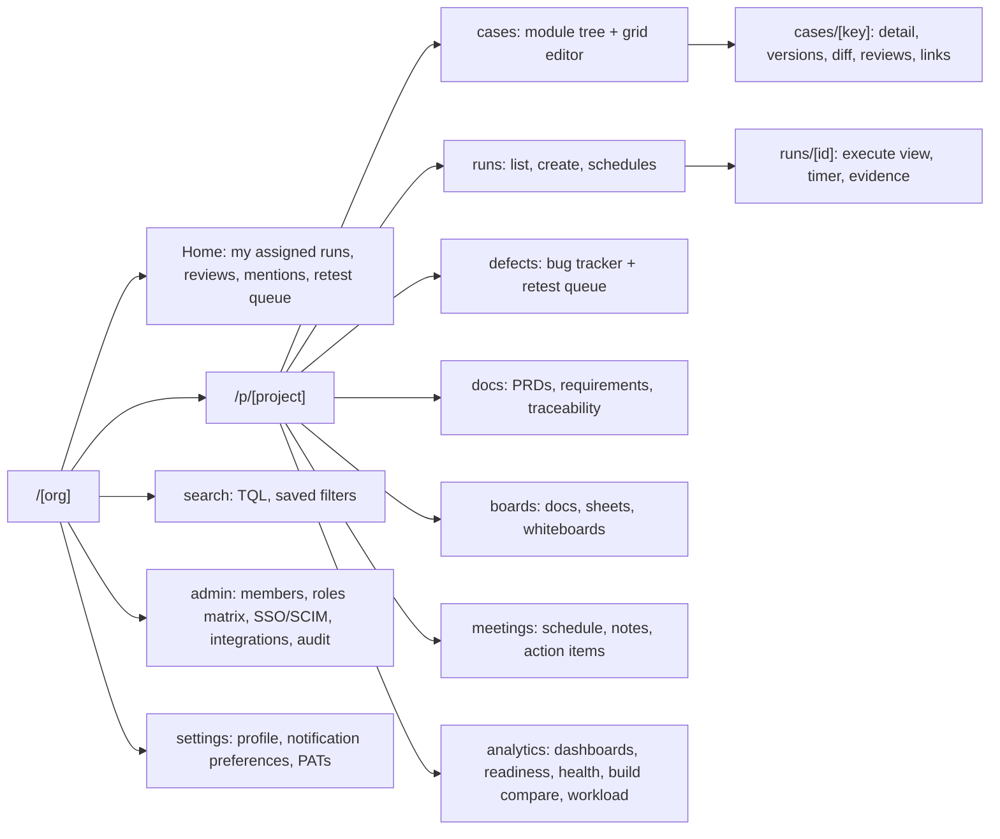

**Shared UI components**, used across pages:

| Component | Used in | Notes |
|---|---|---|
| Module tree | cases, runs, analytics | Virtualised; lazy-loads children from the `ltree` path |
| Grid editor | cases, run item lists | Keyboard-first, paste from Excel, virtualised rows over server-side pages (works the same at 100 or 10M cases, §3.1) |
| TQL input | search, run creation, dashboards, filters | Autocomplete from `/search/suggest`, inline syntax errors |
| Command palette (Ctrl+K) | every page | Jump to any case/run/bug by key, run a TQL query, trigger actions |
| Evidence uploader | execute view, bug form | Presigned S3 upload, paste screenshot from clipboard |
| Comment thread + presence | case, run, doc, board | Mentions, resolve/unresolve, live avatars |
| Notification bell | global header | In-app channel over the API Gateway WebSocket |

**Rendering:** list and dashboard pages are Server Components with tag-based revalidation. The grid editor, execute view, TQL input and collaborative editors are Client Components, since they are interaction-heavy.

### 2.2 Service components and key endpoints

All REST endpoints sit under `/api/v1` and are scoped by org from the token. The tables list the main endpoints only; the full contract lives in `packages/contracts`.

| Service | Internal components | Key endpoints |
|---|---|---|
| **IAM** | OIDC callback handler, permission resolver (Redis-cached), SCIM server, PAT issuer, invite mailer | `POST /invites` · `GET/POST/PATCH /roles` · `PUT /projects/{p}/members/{u}` · `POST /tokens` · `/scim/v2/Users`, `/scim/v2/Groups` |
| **Test Repository** | Case API, version store, review engine, Excel import/export worker, Gherkin parser, dependency validator (rejects cycles) | `GET/POST /projects/{p}/modules` · `GET/POST/PATCH /cases` · `POST /cases/bulk` · `GET /cases/{id}/versions` · `POST /cases/{id}/reviews` · `POST /imports` |
| **Execution** | Plan/run API, run expander (TQL, config matrix, dependency order), result recorder, scheduler handler, automation ingest worker, flaky detector | `POST /runs` · `POST /runs/{id}/items/{item}/results` · `POST /schedules` · `POST /automation/reports` · `GET /runs/compare?base=&head=` |
| **Defect Integration** | Jira client (OAuth 3LO), webhook receiver (Lambda), reconciler job, similar-bug finder, retest queue | `POST /defects` · `GET /defects/similar?q=` · `GET /defects` · `POST /defects/{id}/retest` · `POST /webhooks/jira` |
| **Search & Query** | TQL parser/translator, indexer consumer, query API, filter subscription matcher | `POST /search` · `GET /search/suggest` · `GET/POST /filters` · `POST /filters/{id}/subscriptions` |
| **Analytics** | Event consumers writing rollup tables, materialized view refresher, export worker | `GET /dashboards/{id}` · `GET /reports/readiness?release=` · `GET /reports/health` · `GET /reports/workload` · `POST /exports` |
| **Docs & Knowledge** | Upload API (presigned), document parser, requirement extractor, requirement diff + impact flagger | `POST /documents` · `POST /documents/{id}/versions` · `GET /requirements` · `GET /traceability` |
| **Collaboration** | Hocuspocus WebSocket server, snapshot writer (S3), comment API, presence | `WS /collab/{docId}` · `GET/POST /comments` |
| **Meetings** | Google/M365 calendar connectors, notes, action-item converter | `POST /meetings` · `POST /action-items/{id}/convert` |
| **AI Assist** | Provider layer (§2.3), generation workers, embedding writer (OpenSearch k-NN), duplicate detector consumer, usage meter | `POST /ai/generate-cases` · `POST /ai/edge-cases` · `GET/PUT /ai/config` · `GET /ai/usage` |
| **Agent & Bot Gateway** | MCP server (Streamable HTTP), Slack events/commands handler, OAuth client registry | `POST /mcp` · `POST /slack/events` · `POST /slack/commands` |
| **Notification** | Ingest API, rule router, template renderer, channel workers, preferences API, WebSocket API | `POST /v1/notify` · `/templates` · `/rules` · `/channels` · `GET /deliveries` · `PUT /preferences` |
| **Audit** | Event consumer, query API | `GET /audit?actor=&entity=&from=&to=` |

### 2.3 AI provider layer

All AI calls go through one layer inside AI Assist, built on the **Vercel AI SDK** (`ai` package) with its provider packages. The SDK already smooths over the differences between providers for chat, tool calls and structured output, so we don't write our own wrapper. The hosted Vercel AI Gateway is **not** used: calls go straight from our servers to the provider, so the data path stays under our control.

| Provider | Package | Chat / generation | Embeddings |
|---|---|---|---|
| OpenAI | `@ai-sdk/openai` | Yes | Yes (supports a reduced `dimensions` setting, see §6) |
| Anthropic (direct API) | `@ai-sdk/anthropic` | Yes | **No.** Anthropic has no embedding model; pair it with another embedding provider |
| Anthropic on Amazon Bedrock | `@ai-sdk/amazon-bedrock` | Yes, from ap-south-1 through Global cross-Region inference | Bedrock embedding models (confirm availability in ap-south-1 before choosing) |
| xAI (Grok) | `@ai-sdk/xai` | Yes | **Unconfirmed.** Sources disagree on whether a public embeddings API exists. Treat it as chat-only until verified |
| Local / offline (Ollama) | Ollama community provider for the AI SDK | Yes (small models, slow on CPU) | Yes (small local embedding model) |

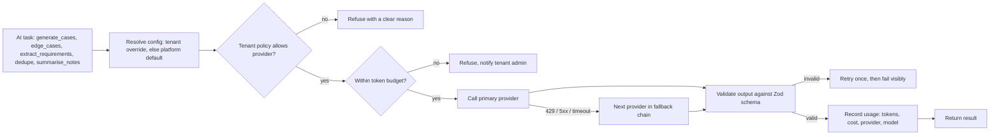

**Rules:**
- **Config is per task, not global.** Each task has `{ provider, model, fallback[], maxTokens }`. For example, requirement extraction on Claude, edge cases on Grok, embeddings on OpenAI. Model IDs are configuration values, never constants in code, because providers release new models every few months.
- **Keys:** a platform key per provider in Secrets Manager by default. A tenant can optionally bring its own key (BYOK). It is encrypted with KMS, write-only through the API, and never returned or logged.
- **Tenant policy:** an admin can turn AI off, or allow only certain providers. Examples: "local only", or "Bedrock only". Global cross-Region inference on Bedrock may process a request outside India, so a tenant with strict data-residency needs should choose "local only" or a region-pinned option.
- **Structured output:** every task returns JSON validated with a Zod schema (`generateObject`). Provider differences show up as a validation failure, not as bad data in the database.
- **Budgets:** monthly token budget per tenant, with an alert at 80% and a hard stop at 100%.
- **Embeddings are tied to their model.** Each vector field records the model that produced it. Changing the embedding model starts a background re-embed into a new field, and search switches over only when it finishes. Vectors from different models are never compared.
- **Prompts live in the repo, with versions.** A small evaluation set of fixed PRDs with known expected requirements runs against each configured provider, so a provider or model switch can be compared before it goes live.

---

## 3. Core data model

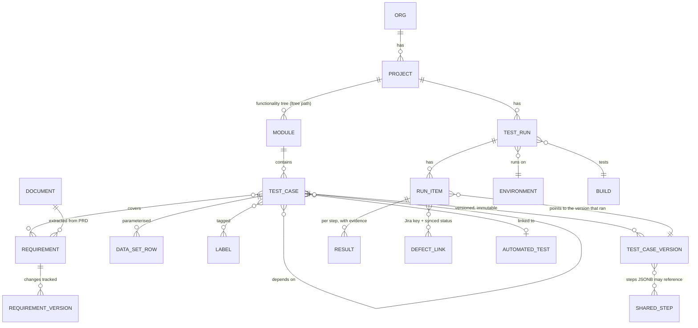

**Decisions a future developer should not undo:**
- **A run item points to the exact case version it ran, and versions are never modified.** Editing a case creates a new version, so past runs keep their history. The run item stores a version ID, not a copy: a 1M-case regression run would otherwise copy about 5 GB.
- **Steps are stored as a JSONB array inside the case version, not as separate rows.** At 10M cases × ~3 versions × ~10 steps, one row per step would mean about 300M rows. Steps are always read and written together with their version, so nothing needs to query a single step on its own.
- **The module tree uses the Postgres `ltree` type.** "Everything under Payments > UPI" is a single indexed query.
- **Every table has `org_id`, with Postgres Row-Level Security (RLS) enabled.** Tenant isolation is enforced by the database, not only by application code.
- **Custom fields are stored in a `JSONB` column with a GIN index.** Adding a field needs no migration.
- **The `results` and `audit` tables are partitioned by month.** They grow fastest, and old partitions can be detached and archived.
- **A case version has a `format` of `steps` or `gherkin`.** Gherkin text is stored as written and parsed into steps at execution time (each Given/When/Then becomes one step), so results are recorded the same way for both formats.
- **Case dependencies form a graph with no cycles.** The Repository rejects a save that would create a cycle, so the run expander can always order the cases.

### 3.1 Designing for 10 million cases in one project

**Volume for one 10M-case project** (estimates; the `perf` seed in §10 exists to replace them with measurements):

| Data | Rows | Size |
|---|---|---|
| Test cases (current metadata) | 10M | ~10 GB |
| Case versions (steps as JSONB, ~3 per case) | ~30M | ~90 GB |
| OpenSearch documents (one per case, latest version) | 10M | ~40 GB primary, ~80 GB with 1 replica |
| Vectors (512 dimensions, on-disk mode, see §6) | 10M | ~20 GB on disk, a few GB in memory |

Postgres handles tables this size fine with the right indexes. The design problem is keeping every *screen and operation* from touching all 10M rows at once:

| Area | Rule at 10M |
|---|---|
| Partitioning | `test_case` and `case_version` are hash-partitioned by `project_id` (32 partitions). A single 10M project sits in one partition, which Postgres handles well. Partitioning keeps vacuum and index rebuilds bounded as the total across all tenants grows into hundreds of millions of rows. |
| Module tree | GiST index on `(project_id, path)` using `btree_gist` + `ltree`. Case counts per module (by status, priority, label) live in a `module_stats` table updated from events. The tree never runs `COUNT(*)`. Counts may lag by a few seconds. |
| Grid editor and lists | Always paged from the server with keyset pagination on `(sort_key, id)`. List queries (filters, sort, grouping) are served from OpenSearch; Postgres is used for fetching and saving a single case. Totals are shown as approximate ("~2.3M") above 10,000. |
| Bulk actions | "Select all matching" sends the **TQL query**, not a list of IDs. A background job processes it in chunks of 5,000, and each chunk is idempotent, so a crashed job resumes from where it stopped. Progress is shown through the in-app WebSocket. |
| Large runs | A run created from a filter that matches, say, 800k cases is expanded by a background job that writes run items in bulk with `COPY`. The run shows "Preparing…" with progress, and testers can start on items already created. |
| Step results | Keyed by `(run_item_id, step_index)`. This is safe because the version a run item points to never changes. |
| Import | Streamed CSV/XLSX parsing in a background job (never loaded into memory in one piece). CSV has no row limit. XLSX is limited by the format to about 1M rows per sheet. |
| Export | Streamed to S3 as CSV, then a download link is sent. XLSX exports over 1M rows split into several sheets or files. |
| Analytics | Event-driven rollup tables, updated incrementally. Materialized views are built on the rollups only, never on the 10M-row tables. |
| Reindex | A new OpenSearch index is built alongside the live one, and an alias swaps over when it's complete. Searches keep working during a full 10M reindex. |

---

## 4. Event catalog (main events)

| Event | Producer | Consumers |
|---|---|---|
| `testcase.created/updated/deleted` | Repository | Search indexer, Audit, AI (duplicate check) |
| `testcase.review.requested/approved/rejected` | Repository | Notification, Audit |
| `run.created/scheduled/started/completed` | Execution | Notification, Analytics, Audit |
| `result.recorded` | Execution | Analytics, Search indexer |
| `defect.created/status_changed` | Defect | Execution (retest queue), Notification, Analytics |
| `comment.created` / `mention.created` | Collaboration | Notification, Audit |
| `document.updated` | Docs | Search indexer, AI (requirement extraction) |
| `requirement.changed` | Docs | Repository (flag linked cases "Needs review"), Notification |
| `defect.retest.passed/failed` | Defect | Jira (comment/transition), Execution, Notification |
| `filter.matched` | Search (subscription matcher) | Notification |
| `meeting.scheduled` / `actionitem.created` | Meetings | Notification |
| `user.invited/role_changed` | IAM | Notification, Audit, Redis permission cache invalidation |

Every event has the same envelope: `{ id, type, org_id, project_id, actor, occurred_at, version, data }`. Consumers must be idempotent, keyed on `id`, so a redelivered event is processed only once.

---

## 5. User workflows

### 5.1 Onboarding

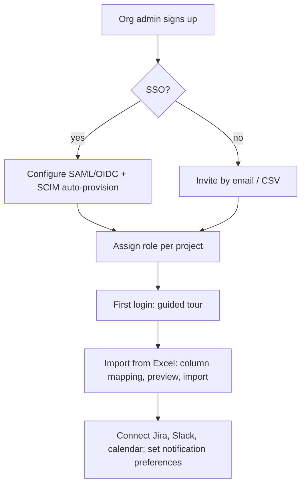

**Roles (scoped per project):**

| Role | Permissions |
|---|---|
| Org Admin | Everything |
| Project Admin | Manage one project and its members |
| Test Lead | Approve test cases, manage runs, sign off releases |
| Tester | Write and execute tests |
| Viewer | Read only |
| Guest | Only items explicitly shared with them |

- The admin UI shows a matrix of roles against permissions, and admins can create custom roles.
- Resolved permissions are cached in Redis per `(user, project)`. A `user.role_changed` event clears the cached entry.

### 5.2 Writing test cases

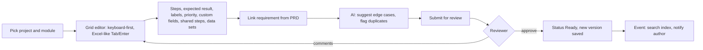

Editor features:
- Bulk edit and multi-select
- Drag and drop to reorder cases or move them between modules
- Autosave with conflict warnings
- Version history with a diff view and restore
- Paste directly from Excel
- Two case formats: a step table, or BDD/Gherkin (`Given / When / Then`) with syntax highlighting, step autocomplete and `.feature` file export for automation engineers
- Prerequisites: mark "depends on" other cases (for example, every checkout case depends on "Login works")
- Estimated duration per case, used by the workload view (§5.3)
- Command palette (Ctrl+K) and keyboard shortcuts, so a tester can write and execute without the mouse:

| Shortcut | Action |
|---|---|
| `Ctrl+K` | Command palette: jump to a case/run/bug by key, run TQL, any action |
| `Tab` / `Enter` | Next cell / new row in the grid editor |
| `P` / `F` / `B` / `S` | Mark current step Pass / Fail / Blocked / Skip (execute view) |
| `J` / `K` | Next / previous run item |
| `Ctrl+Shift+B` | Log bug from the current step |
| `?` | Show all shortcuts |

### 5.3 Test plans and runs (smoke, regression, scheduled)

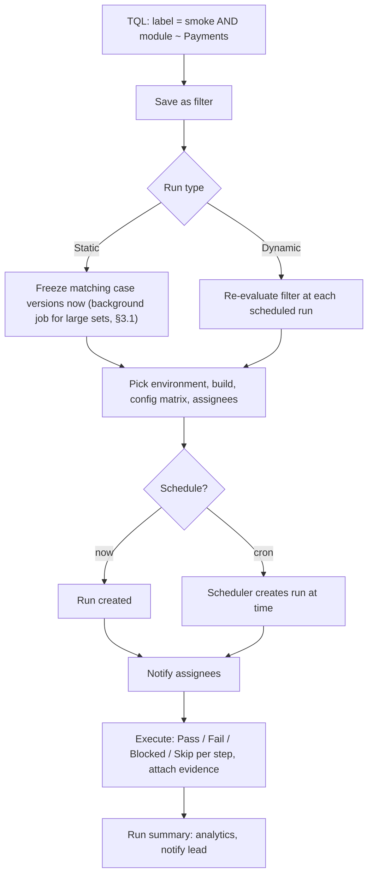

**Configuration matrix:** a single run can expand across browser, OS and device combinations, and results are tracked separately for each combination.

**Dependencies and run order:** the run expander sorts cases so prerequisites come first (a topological sort over the "depends on" graph). If a prerequisite fails, its dependents are marked **Blocked** automatically, with the failing case as the reason, so testers don't spend time on cases that can't pass.

**Workload-aware assignment:** while assigning, the lead sees each tester's open run items × estimated duration against their available hours for the run window. Actual time comes from the execute-view timer, so estimates get more accurate over time.

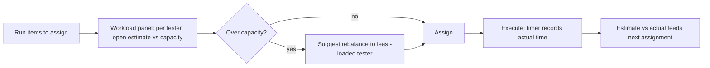

### 5.4 Logging a bug in Jira and tracking it

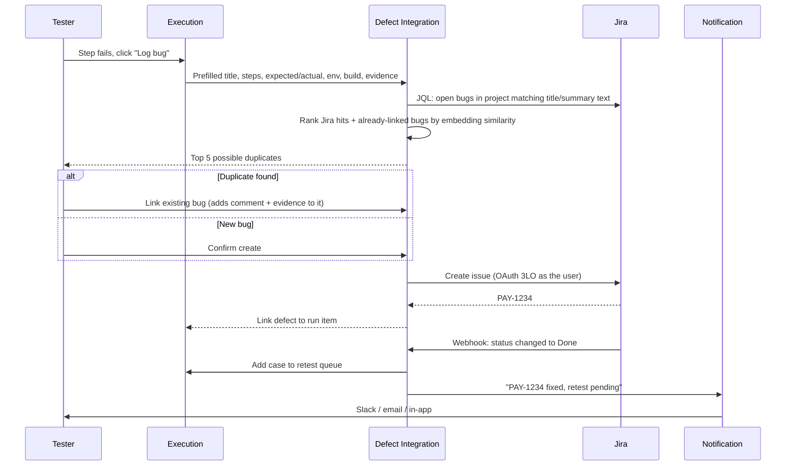

**Duplicate check:** a bug that already exists in Jira is the most common waste in bug logging. Linking to the existing issue also adds a "seen again in build X" comment, which tells the developer the bug is still reproducing.

**Sync reliability:** Jira webhooks can be lost. A reconciliation job runs every 15 minutes, uses JQL to find linked issues updated since the last sync, and repairs any difference.

### 5.5 Automation results

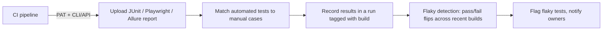

### 5.6 Exploratory testing session

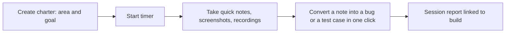

### 5.7 Notification pipeline

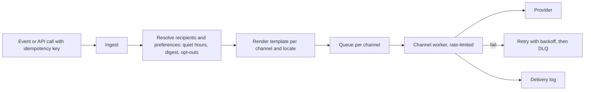

- **Configurable:** channel priority and fallback (for example, in-app first, then email if still unread after 1 hour), digest mode (hourly or daily), routing rules per event, a template editor with preview, and multiple tenants with separate API keys.
- **Notification UI:** manage templates, rules and channel credentials; view delivery logs; resend messages; send tests.
- **Provider changes to plan for:**
  - Amazon Pinpoint reaches end of support on 30 Oct 2026. Use AWS End User Messaging for SMS.
  - Teams' old Office 365 connector webhooks are retired. Use Teams Workflows webhooks or the Microsoft Graph API.

### 5.8 Access from AI agents and Slack

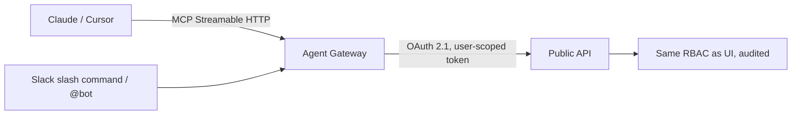

- **MCP tools:** `search_tests(tql)`, `create_test_cases`, `create_run`, `get_run_status`, `log_bug`, `get_prd`, `get_traceability`.
- **Slack:** `/tcm run smoke PAY`, `/tcm status RUN-88`, approve and reject buttons for reviews, and alerts when a run fails.
- **Security rule:** the gateway never has more permissions than the user calling it.

### 5.9 Collaboration and meetings

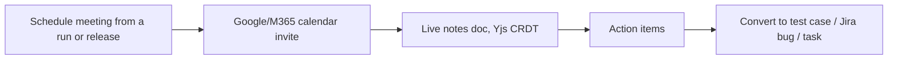

The editors are built on proven open-source components rather than written from scratch:

| Need | Component |
|---|---|
| Real-time sync | Yjs + Hocuspocus |
| Word-like documents | TipTap |
| Whiteboard | tldraw or Excalidraw |
| Sheets | Univer |

### 5.10 Release readiness

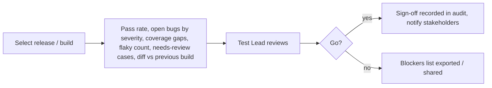

### 5.11 Custom roles and permission changes

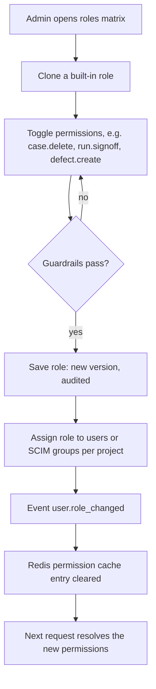

**Guardrails:**
- An admin can't grant a permission they don't hold themselves.
- The last Org Admin can't be removed or downgraded.
- Built-in roles can be cloned but not edited, so there is always a known-good baseline.

### 5.12 Configuring a notification rule (Notification UI)

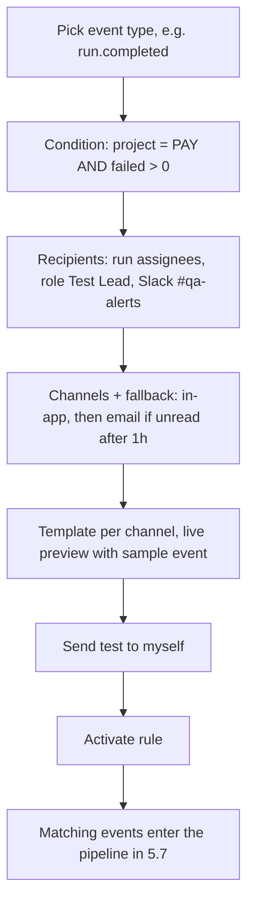

- Rules belong to a tenant. A user's own preferences (quiet hours, digest, opt-outs) are applied after the rule, so a user can mute a channel but can't mute mandatory notices such as a security alert.
- Every rule change is versioned, and the delivery log shows which rule version triggered each message.

### 5.13 PRD lifecycle and requirement-change impact

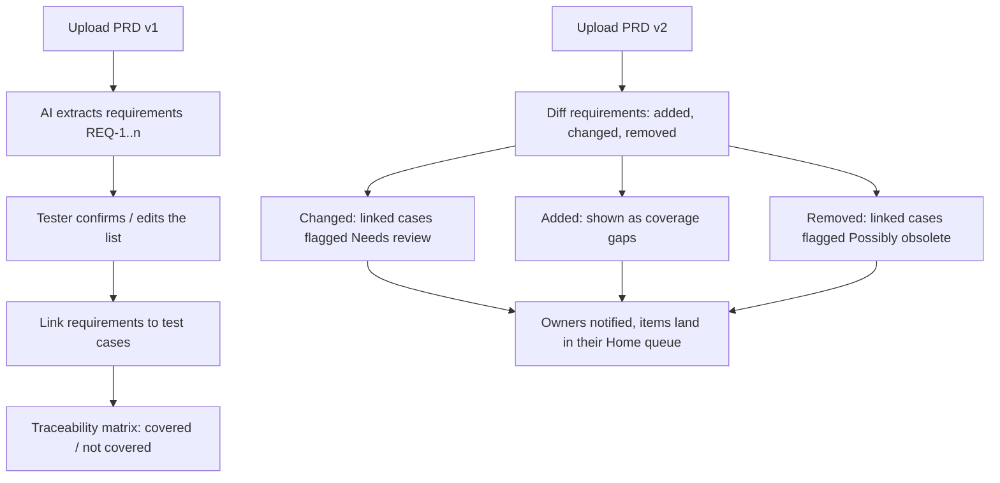

- A case flagged "Needs review" still runs, but it shows a warning banner in the execute view until its owner confirms it or updates it.
- The release readiness report (§5.10) counts flagged cases, so a release can't look fully covered while its tests describe the old behaviour.
- Cross-PRD knowledge graph, API spec ingest, overlap/contradiction detection and coverage-driven test generation extend this flow: see [requirements-intelligence-plan.md](requirements-intelligence-plan.md).

### 5.14 Bug tracker and retest loop

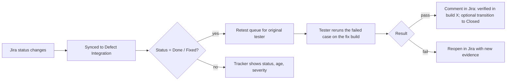

**Tracker view columns:** Jira key, summary, synced status, severity, age, assignee, fix version, linked cases and runs, retest state. It supports TQL filters (`defect.status = Done AND retest = pending`) and grouping by module or severity.

### 5.15 Saved filter → dashboard widget → subscription

```mermaid
flowchart LR
  A[Write TQL in search] --> B[Save filter, share with project]
  B --> C[Add as dashboard widget: count, table, chart, grouped]
  B --> D[Subscribe: instant / daily digest]
  D --> E[Indexer checks new and changed docs against subscribed filters]
  E --> F[Event filter.matched]
  F --> G[Notification pipeline]
```

Subscription matching runs in the indexer, using OpenSearch percolator queries (the stored query is matched against each new document), so there is no polling per user.

### 5.16 Test health and build comparison

```mermaid
flowchart TD
  A[Nightly health job] --> B["Stale: not run in N days (per-project setting)"]
  A --> C["Always failing: failed in last N runs"]
  A --> D[Flaky: from 5.5]
  A --> E["Needs review: from 5.13"]
  B & C & D & E --> F[Health report + badges on each case]
  G["Pick base build and head build"] --> H[Compare results per case]
  H --> I["New failures / fixed / still failing / newly added / not run"]
  I --> J[Share or attach to release readiness]
```

- Health badges appear on the case itself, in the grid editor and in TQL (`health = stale`), so cleanup can be planned like any other work.
- Build comparison uses the case versions each run item points to, so it compares what actually ran and is not affected by later edits to the cases.

---

## 6. Search and TQL

```
project = PAY AND label IN (smoke, regression) AND lastResult = Failed
  AND updated >= -7d AND text ~ "otp retry"~3
  ORDER BY priority DESC  GROUP BY module
```

- **Parsing:** a PEG grammar (peggy) turns the query into a syntax tree, and the tree is translated into an OpenSearch query. Every field is checked against an allowlist, so user input never reaches the query unvalidated.
- **Proximity search:** `"otp retry"~3` means "these words within 3 words of each other". OpenSearch does this with `match_phrase` and `slop`. Postgres full-text search can't express "within N words", which is why search runs on OpenSearch.
- **Grouping:** OpenSearch aggregations, shown as collapsible groups in list views.
- **Extras:** saved and shared filters, autocomplete for fields and values, filters as dashboard widgets, and subscribing to a filter to get notified of new matches.

### 6.1 Index strategy at 10M cases

```mermaid
flowchart TD
  P[Project] --> S{Case count}
  S -- "under ~1M" --> SH["Shared index: cases-shared, routed by project_id"]
  S -- "over ~1M" --> DE["Dedicated index: cases-{project}, 2-4 primary shards"]
  SH & DE --> AL["Alias per project: cases-{project}"]
  AL --> Q[All queries and writes go through the alias]
```

- **Small projects share one index**, with `project_id` as the routing key, so a query touches only one shard. Thousands of tiny per-project indexes would waste memory on the cluster.
- **Large projects get their own index.** Shards are kept around 10–50 GB each, so a 10M project (~40 GB primary) gets 2–4 primary shards. The project is moved online with the same alias-swap reindex as in §3.1 when it crosses the threshold.
- **The application never uses index names directly, only the alias.** That is what makes the moves and reindexes invisible to users.

### 6.2 Vector search (duplicates and similarity)

- Vectors live in OpenSearch k-NN, next to the text they describe, so a query such as "similar cases, but only in module Payments with label smoke" is a single request. This replaces pgvector: an in-memory HNSW index over 10M vectors in Postgres would need tens of GB of database RAM.
- Stored at **512 dimensions** (OpenAI embeddings support a reduced `dimensions` setting) in **on-disk mode**, which keeps a compressed copy in memory and rescores from disk. Accuracy loss is small for duplicate detection, and memory use drops by roughly an order of magnitude.
- Each embedding model gets its own vector field (§2.3), because local models such as `nomic-embed-text` produce a different size (768 dimensions).

---

## 7. Performance and caching

| Layer | Approach |
|---|---|
| Edge | CloudFront for static assets and the notification UI; WAF rate rules |
| Next.js | Server Components; caching with tag-based revalidation on read-heavy pages |
| API | ETags and conditional requests; cursor pagination (never OFFSET) |
| Redis | Sessions, resolved permissions, project and module trees, dashboard results with a TTL; events clear stale entries |
| Database | Aurora Postgres behind RDS Proxy; read replicas for analytics and lists; partial and GIN indexes; `results`/`audit` partitioned by month |
| Async | Slow work (imports, exports, Jira calls, indexing, AI) goes through queues, never inside a user request |
| Autoscaling | ECS scales on CPU and request count; Lambda concurrency limits protect downstream services |

### 7.1 Capacity and sizing

**Target: 1,000 users a day.** Working assumptions behind the numbers (revisit these once real usage data exists):

| Metric | Assumption | Derived load |
|---|---|---|
| Peak concurrent users | 30% of daily users during working hours | ~300 |
| Request rate per active user | 1 request every ~5 s | ~60 RPS at peak; designed for 5× burst = 300 RPS |
| Results recorded | ~200 per active tester per day | ~200k rows/day, ~6M/month (monthly partitions handle this easily) |
| Attachments | Screenshots, recordings, logs | ~10–20 GB/month in S3 |

**Starting sizes** (all across 2 AZs):

| Component | Size | Scales to |
|---|---|---|
| Next.js web | 2 Fargate tasks, 1 vCPU / 2 GB | 6 tasks |
| core-api | 2 tasks, 1 vCPU / 2 GB | 6 tasks |
| insight, agent-gateway | 2 tasks each, 0.5 vCPU / 1 GB | 4 tasks |
| knowledge | 2 tasks, 1 vCPU / 2 GB (Hocuspocus keeps open docs in memory) | 4 tasks |
| Aurora PostgreSQL Serverless v2 | Writer + 1 reader, 2–32 ACU, behind RDS Proxy. Sized for the data working set of 10M-case projects, not for traffic | 64 ACU, more readers |
| ElastiCache Valkey | Primary + replica, small node | Larger node |
| OpenSearch | 3 data nodes (r7g.xlarge.search, ~500 GB gp3 each) across 3 AZs, 1 replica shard | More nodes; confirm with the `perf` seed benchmark |
| Notification | Lambda + SQS, reserved concurrency per channel | Pay per use |

The request load is modest. The setup above has roughly 10× traffic headroom (about 10,000 users a day) by adding tasks and ACUs, with no design change. What drives cost is **data volume** (§3.1). OpenSearch and Aurora are sized for 10M-case projects, and the app servers stay small. The first real design pressure is the OpenSearch cluster as more projects reach the millions.

### 7.2 Rate limits

Two layers: WAF per IP at the edge, and a Valkey token bucket per principal (user, PAT or agent) in the app. Over-limit requests get `429` with `Retry-After`.

| Principal | Limit | Why |
|---|---|---|
| Any IP (WAF) | 2,000 requests / 5 min | Blocks scraping and credential stuffing before it reaches the app |
| Browser user | 20 RPS, burst 60 | Well above normal use; the grid editor batches its saves |
| PAT (CI) | 10 RPS; 60 automation report uploads per project per hour | CI retries can loop |
| MCP / AI agent | 5 RPS per user | Agents loop far faster than humans |
| Slack command | 1 RPS per user | |
| Outbound to Jira | Shared queue per Jira site, following Jira's rate-limit headers | A burst of bug logging must not get the whole site throttled |

**Tenant quotas:** 10M rows per CSV import (XLSX: about 1M per sheet, which is the format's limit), one running import per project at a time, 100 MB per attachment, and a storage cap per plan.

### 7.3 Availability, backup and disaster recovery

| Data | Protection |
|---|---|
| Aurora Postgres | Multi-AZ with automatic failover to the reader; point-in-time restore (PITR) for 35 days; daily snapshot copied to ap-south-2 (Hyderabad) |
| S3 (documents, evidence, collab snapshots) | Versioning + cross-region replication to ap-south-2 |
| DynamoDB (notification) | PITR, 35 days |
| OpenSearch | Rebuildable from Postgres with a reindex job; automated snapshots only speed up recovery |
| Valkey | Cache only. No backup; a cold cache just means a few slower requests |
| Events | Outbox rows kept 7 days + EventBridge archive, so any consumer can replay |

| Failure | RPO (data lost) | RTO (downtime) | How |
|---|---|---|---|
| One AZ lost | ~0 | < 5 min | Automatic: Aurora failover, ECS reschedules tasks in the other AZ |
| Bad deploy / data corruption | ≤ 5 min | ~1 h | Roll back task definition; Aurora PITR to a new cluster for data |
| Region lost | ≤ 24 h | ~8 h | Terraform applies the stack in ap-south-2 from copied snapshots and replicated S3; OpenSearch is rebuilt from Postgres (a 10M-case reindex takes hours, so search is the last thing to come back) |

A restore drill runs every quarter: restore the latest snapshot to a scratch cluster and run the smoke suite against it. A backup that has never been restored doesn't count as a backup.

---

## 8. Security

- **Authentication:** OIDC everywhere. Cognito on AWS; SAML/OIDC SSO, MFA, SCIM.
- **Tokens:**
  - JWTs that expire after 15 minutes, with refresh-token rotation.
  - PATs for CI and MCP, with scopes and an expiry date.
- **Authorization:** project-scoped role checks in every service, plus Postgres RLS as a second layer.
- **Service-to-service calls:** private subnets, ECS Service Connect, IAM roles. No shared secrets.
- **Data protection:**
  - KMS encryption at rest and TLS 1.2+ in transit.
  - Secrets stored in Secrets Manager.
  - Uploads scanned by GuardDuty Malware Protection for S3.
- **Application security:** OWASP ASVS checklist, strict CSP, CSRF protection, Zod validation at every API boundary, and the TQL field allowlist.
- **Audit:** an append-only audit log covering every service, plus sign-off records.

---

## 9. Observability

- **Instrumentation:** OpenTelemetry SDK in every service. A trace ID is carried through HTTP calls and inside the event envelope.
- **AWS:** CloudWatch Logs and Metrics, and X-Ray (through the ADOT collector).
- **Local:** Grafana + Tempo + Loki + Prometheus in Docker, fed by the same OTel exporters.
- **Health checks:** `/healthz` for liveness and `/readyz` for readiness in every service. ECS and Docker Compose both use them.

---

## 10. Local development — full feature parity

**Rule:** application code talks to infrastructure only through the AWS SDK or standard protocols (S3 API, SQS API, SMTP, OIDC). Moving between local and AWS is only a matter of configuration (endpoint URLs and credentials). There are no code branches such as `if (local)`.

```mermaid
flowchart LR
  subgraph Docker Compose
    PG[(Postgres 17)]
    VK[(Valkey)]
    OS[(OpenSearch + Dashboards, k-NN)]
    LS[LocalStack: S3, SQS, EventBridge, Scheduler, DynamoDB, SES, API GW]
    KC[Keycloak: OIDC / SAML IdP]
    MP[Mailpit: SMTP + inbox UI]
    SB[Provider sandbox: captures SMS / Slack / Teams / Discord / Jira / Calendar calls, with UI]
    OBS[Grafana + Tempo + Loki + Prometheus]
    OL[Ollama: local chat + embedding models]
  end
  SVC[All Node services + notification workers + Next.js] --> PG & VK & OS & LS & KC & MP & SB & OBS & OL
  TUN[cloudflared / ngrok tunnel - optional] -. real Jira / Slack webhooks .-> SVC
```

| Cloud component | Local equivalent | Notes |
|---|---|---|
| Aurora Postgres | Postgres 17 container | Same major version as Aurora; same migrations and RLS policies |
| ElastiCache Valkey | Valkey container | |
| OpenSearch Service | OpenSearch container | Same index templates |
| S3, SQS, EventBridge, EventBridge Scheduler, DynamoDB, API GW WebSocket | LocalStack | Same SDK calls with the endpoint overridden. Fallbacks if a LocalStack feature is missing or license-gated: MinIO (S3), ElasticMQ (SQS), DynamoDB Local |
| Lambda (notification channel workers, webhooks, indexer) | Same handler code run as Node processes that poll the local queues | No Lambda emulation needed; each handler is a plain function that is wrapped for Lambda in the cloud |
| Cognito | Keycloak | Both are OIDC; the app only knows about OIDC |
| SES | Mailpit (SMTP) | Every email can be viewed in the Mailpit UI |
| SMS, Slack, Teams, Discord | Provider sandbox | Records every outgoing payload and shows it in a UI. Set a real webhook URL in `.env` to send to the real service |
| Jira Cloud | Provider sandbox Jira mock, **or** a real Jira dev site + tunnel for webhooks | The mock can simulate status-change webhooks from its UI |
| Google/M365 Calendar | Provider sandbox calendar mock, or real OAuth apps | |
| OpenAI / xAI / Anthropic / Bedrock | **Ollama (fully offline)**, real API keys, or a recorded-response mock | Selected per task through the same config as production (§2.3); see §10.3 |
| MCP server | Runs on `localhost`; add it with `claude mcp add` | The same OAuth flow, using Keycloak |
| CloudFront / WAF | Next.js dev server; rate limiting runs in the app as well | |

### 10.1 Machine prerequisites

Checked on the target laptop on 27 Sep 2026: 32 GB RAM, 4 cores / 8 threads (i5-1135G7, no discrete GPU), 111 GB free on C:, Docker Desktop with WSL2 (Ubuntu).

| Item | Required | Found | Action |
|---|---|---|---|
| Node.js | 24 LTS | 20.19 (end of life since April 2026) | `nvm install 24 && nvm use 24` (nvm4w is already installed) |
| pnpm | Through corepack | pnpm 11 crashes on Node 20 | Fixed by the Node upgrade |
| Docker Desktop | Running, WSL2 backend | Installed, not running | Start it; enable start on login |
| WSL memory cap | `.wslconfig`: `memory=20GB`, `processors=6` | Default | Leaves ~12 GB for Windows, VS Code and the browser |
| OpenSearch kernel setting | `vm.max_map_count=262144` in the Docker WSL VM | Not set | OpenSearch refuses to start without it |
| Disk | ~20 GB (dev), ~60 GB (perf seed) | 111 GB free | Enough; the perf seed can be deleted after benchmarking |

### 10.2 Compose profiles and memory budget

Four laptop cores and 32 GB can't run everything at 10M scale at the same time, so Docker Compose profiles choose what runs.

| Profile | Adds | Memory in WSL | Use for |
|---|---|---|---|
| `core` (default) | Postgres (2 GB), Valkey, OpenSearch single node (2 GB heap), LocalStack, Keycloak, Mailpit, provider sandbox | ~7.5 GB | Everyday development and every workflow in §5 |
| `obs` | Grafana, Tempo, Loki, Prometheus | +1.5 GB | Tracing and debugging |
| `ai` | Ollama with a small chat model and an embedding model | +5 GB | Offline AI (§10.3) |
| `perf` | Raises Postgres to 6 GB and OpenSearch to a 6 GB heap | ~15 GB total | 10M-case benchmarks. **Don't combine with `ai`**: together they exceed the 20 GB cap |

Node services and the Next.js dev server run on Windows (outside the WSL cap), using about 3–4 GB with hot reload.

### 10.3 Offline AI

```mermaid
flowchart LR
  CFG["AI_MODE=local"] --> PL[Provider layer, same code as production]
  PL --> OL[Ollama on localhost:11434]
  OL --> CH["Chat: small instruct model, 3-4B, 4-bit, tool-calling capable"]
  OL --> EM["Embeddings: nomic-embed-text, 768 dimensions"]
  PL -. "AI_MODE=cloud" .-> CL[OpenAI / xAI / Anthropic with real keys]
  PL -. "AI_MODE=mock" .-> MK[Recorded responses, used by CI and e2e tests]
```

- **`AI_MODE=local`** sends every AI task to Ollama. No request leaves the laptop, which also makes it the reference setup for a future "local only" tenant policy (§2.3).
- **Speed on this laptop:** CPU only, so a small model produces roughly 8–15 tokens a second. A "generate 10 cases from this PRD section" call takes a minute or more. That is fine for testing features, not for judging output quality; use `cloud` mode for that.
- **Ollama can run natively on Windows** instead of in the `ai` profile. It's slightly faster and sits outside the WSL memory cap. The app only needs `OLLAMA_BASE_URL`, so both work the same way.
- **Model names are configuration** (`.env`), not code, and can be swapped as better small models come out. Choose a chat model with reliable tool calling, since structured output depends on it.
- **Tests use `mock` mode**, so CI never depends on model speed or on a model's randomness.

### 10.4 Seed sizes

| Seed | Content | Time on this laptop | Embeddings |
|---|---|---|---|
| `demo` | 1 org, 3 projects, 1k cases, users for every role, runs, Jira links, PRDs, boards | ~1 min | Real (local or cloud) |
| `dev` (default) | `demo` + one project with 100k cases and 30 days of run history | ~5 min, plus ~20–30 min for local embeddings in the background | Real (local or cloud) |
| `perf` | One project with **10M cases**, ~30M versions, a 1M-item run, 90 days of results | ~30–60 min to generate and index; ~50 GB disk | **Synthetic** (seeded random vectors). Embedding 10M texts on a laptop CPU would take more than a day. These vectors test k-NN speed, not match quality |

The `perf` seed writes straight into Postgres with `generate_series` and `COPY`, not through the API (the API path would take days). It then runs the normal bulk reindex job, so the reindex path from §3.1 gets tested too.

### 10.5 Developer commands

- `pnpm infra:up` starts the `core` profile. `pnpm infra:up:full` adds `obs` and `ai`. `pnpm infra:up:perf` starts the perf profile.
- `pnpm db:migrate && pnpm seed --size demo|dev|perf` creates the schemas and loads a seed (§10.4).
- `pnpm dev` starts every service and the Next.js app with hot reload (Turborepo).
- `pnpm test:e2e` runs Playwright against the local stack with `AI_MODE=mock`.
- `pnpm perf` (needs the perf seed) times a fixed set of scenarios and writes a report. The scenarios: open a module tree, first grid page, TQL search with grouping, proximity search, k-NN duplicate check, create an 800k-item run, bulk-edit 100k cases. These are the measurements that replace the estimates in §3.1.

**Local is done when:** every workflow in §5 runs end to end on this laptop, the Notification UI shows deliveries for all 6 channels through the sandbox, `AI_MODE=local` works with the network disconnected, and `pnpm perf` has a baseline report.

**Infrastructure as code:**
- Terraform (or CDK) for AWS.
- The same EventBridge rules and queue definitions are loaded into LocalStack by a bootstrap script, so local routing matches production.

---

## 11. Repository layout

```
/apps
  web/                 Next.js app
  notification-ui/     Notification admin UI (static export)
/services
  iam/  repository/  execution/  defect/  search/  analytics/
  docs/  collaboration/  meetings/  ai/  agent-gateway/  audit/
  notification/        ingest, workers, API (Lambda handlers)
/deploy
  core-api/  insight/  knowledge/  agent-gateway/   entrypoints that mount modules (§1.1)
/packages
  contracts/           event schemas + API types (Zod), shared by all services
  sdk/                 typed API client (used by web, MCP, Slack bot, CLI)
  cli/                 CI uploader for automation results
  tql/                 TQL grammar + query translator
  platform/            logger, OTel, auth middleware, outbox relay, config loader
/infra
  terraform/           AWS
  local/               docker-compose, LocalStack bootstrap, provider sandbox
```

---

## 12. Full feature list

**Test design**
- Module tree, grid editor, shared steps, data-driven cases, custom fields, labels
- Step-table or BDD/Gherkin case format, with `.feature` export
- Case dependencies (prerequisites) and estimated duration
- Versioning with diff and restore, and a review workflow
- Excel import/export with column mapping
- Command palette (Ctrl+K) and full keyboard shortcuts
- Test health: stale, always-failing, flaky and needs-review badges

**Execution**
- Static and dynamic runs, scheduling, environments and builds, configuration matrix
- Evidence capture through a browser extension (screenshot, recording, console log, HAR file)
- Exploratory sessions, automation result import, flaky detection
- Dependency-ordered runs with automatic Blocked marking
- Workload-aware assignment (estimate vs capacity, actual time tracking)
- Build-to-build comparison: new failures, fixed, still failing

**Defects**
- One-click Jira bug with prefilled details
- Duplicate check against open Jira bugs before creating
- Two-way sync with reconciliation, a retest queue and a bug tracker view

**Knowledge**
- PRDs and documents with version history, requirement extraction, and a traceability matrix with coverage gaps
- Requirement-change impact: a new PRD version flags affected cases

**Collaboration**
- Comments, mentions, presence
- Live documents, sheets, whiteboards and boards
- Meetings with notes and action items

**Search**
- TQL, proximity search, grouping, saved and shared filters, filter subscriptions

**Analytics**
- Dashboards, trends, coverage, release readiness and sign-off, exports

**AI**
- Generate test cases from PRDs, suggest edge cases, detect duplicates, select tests based on what changed
- Works with OpenAI, xAI (Grok), Anthropic (direct or through Bedrock) and offline local models; model chosen per task, bring-your-own-key, fallback chain, token budgets, provider allowlist per tenant

**Access**
- Web app, MCP for AI agents, Slack bot, public REST API, PATs, CLI

**Admin**
- SSO and SCIM, custom roles, onboarding, audit log, notification configuration

---

## 13. Assumptions and open questions

**Assumptions**
- Multi-tenant SaaS product (hence `org_id` and RLS everywhere).
- Jira Cloud, not Jira Data Center.
- ECS Fargate rather than EKS; EventBridge + SQS rather than Kafka.
- Traffic target is 1,000 users a day. Sizing and the 5-unit deployment (§1.1, §7.1) follow from that.
- Up to 10M test cases in the largest project; most projects are far smaller (§3.1, §6.1).
- "ap-south west" in the requirements was read as **ap-south-1 (Mumbai)**, since AWS has no ap-southwest region. DR is in ap-south-2 (Hyderabad).
- AI keys: a platform key per provider by default, with optional per-tenant BYOK (§2.3).
- Local-first: the full platform is built and tested on a laptop (§10) before AWS is set up.

**Open questions**
1. Confirm the region: ap-south-1 (Mumbai)?
2. Will the notification service be sold as a separate product, or used only by this platform?
3. Meetings: build a meeting product, or integrate with Teams, Google Meet and Zoom (the current design integrates)?
4. Compliance needs (SOC 2, GDPR)? For strict data residency, note that Bedrock's Global cross-Region inference can process requests outside India (§2.3).
5. Default AI provider per task in production? The layer supports all of them; this only sets the platform defaults.
6. Does xAI offer a public embeddings API today? Sources disagree. Until it's confirmed, xAI is chat-only in this design.
7. Does the LocalStack licence suit the team? If not, the fallbacks in §10 apply.
8. Is a region-loss RTO of ~8 hours acceptable? A warm standby region would bring it under 1 hour but costs roughly double.
