# API Testing Plan

API Studio is a single place inside TestBench to store API specs, send requests, build test suites from those specs, chain APIs into workflows, and run functional, load, quality and security checks with detailed reports.

**Status:** phases A1, A2, A3 and A4 are built (`services/apitest`, `/api` in the web app), except the Studio hybrid (UI steps mixed into API workflows), which waits on the Studio runner. A1: the Postman-style client, environments with secrets, scripts, imports and the spec library. A2: quality check, enrichment, generated variations, coverage and the assistant. A3: dependency map, workflows, suites, schedules, monitors, reports, drift and impact. A4: the safety gate (verified hosts, production guard, audit), OWASP API checks, load tests with k6 export, the mock server, and WebSocket and SSE requests. In-process limits: load tests run up to 100 users for 600 seconds, and larger ones are exported as k6 scripts; WebSocket and SSE requests are sent from the builder and are not yet run by suites, workflows or load tests.
**Expands:** [testing-studio-plan.md](testing-studio-plan.md) §8 (API testing) and §9 (load testing). The spec-to-rules pipeline comes from [requirements-intelligence-plan.md](requirements-intelligence-plan.md) §2.1.
**Primary user:** a tester who wants a tool like Postman that also tests APIs for them. **Backup:** an automation engineer who writes scripts and reviews the generated suites.
**Principle:** same as the Studio. AI helps while you author (enrichment, variations, ordering). What runs is fixed and repeatable.

---

## 1. Scope

What was asked for, plus the gaps this plan fills.

| Area | Asked for | Added to close gaps |
|---|---|---|
| API client | Build and send calls, pre/post scripts, variables, workspaces, folders, saved variations | Environments, secrets, auth helpers with token refresh, history, cookie jar, client certificates, code snippets, imports (Postman, Insomnia, Bruno, cURL, HAR) |
| Spec library | Store many Swagger docs | Versions, diff with breaking-change flags, sync from a URL, spec viewer, GraphQL introspection |
| Test generation | Build API sets with variations from a spec | Review queue, coverage matrix (endpoint × status code), link generated tests to repository cases |
| Enrichment | Talk back and forth with the user when a spec is thin | Enrichment kept as an overlay so the original spec is never changed, reapplied to new spec versions, filled in from observed traffic |
| Workflows | Show which APIs belong to a project and the order to call them | Dependency graph inferred from the spec, setup/teardown, polling and waits, branching |
| Quality | API structure quality check | Lint rulesets with a score, custom rules, CI gate |
| Load | Load testing | Reuses workflows as k6 scenarios, with the existing safety gate |
| Assistant | Help bot: explain shared routes, map a requirement to one API or a chain, handle auth and cookies | Grounded answers only, gap reports, workflow and variation drafts, auth pattern detection, cookie storage choice per run (§16) |
| Extra | | Security checks (OWASP API Top 10), schema drift, mock server, schedules and monitors, CI trigger, Jira bugs from failures |

---

## 2. Architecture

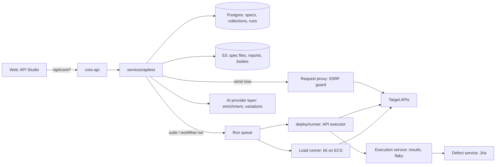

| Piece | Where | Why |
|---|---|---|
| UI | `apps/web/src/features/api-studio/` | Same split as the other screens |
| Contracts | `packages/contracts/src/apitest.ts` | Zod schemas shared by web and service |
| Service | `services/apitest`, mounted in core-api | Specs, collections, variables, generation, workflows |
| Request proxy | Inside the service | Every call goes out from the server, never from the browser: no CORS trouble, one place for SSRF checks and secret injection |
| Executor | `deploy/runner`, a new API job type next to Playwright jobs | One runner, one evidence format, existing queue and limits |
| Script sandbox | QuickJS (WASM) inside the executor | Runs untrusted pre/post scripts with no file, network or process access |
| Load | k6 on ECS, as in Studio §9 | Already decided |

---

## 3. Organising work

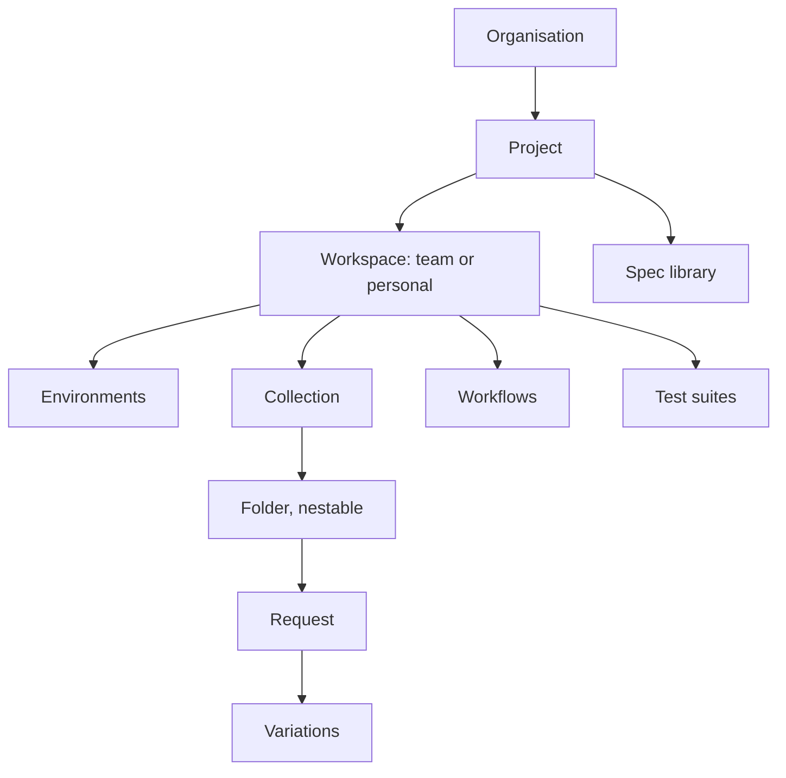

| Object | What it holds | Notes |
|---|---|---|
| **Workspace** | Collections, environments, workflows, suites | Team workspaces are shared in the project; personal ones are private drafts that can be moved into a team workspace |
| **Collection** | Folders and requests, collection-level auth, variables and scripts | Can be linked to a spec, so its requests stay tied to spec operations |
| **Folder** | Requests and sub-folders; folder-level auth, variables, scripts | Scripts run outer to inner: collection → folder → request |
| **Request** | Method, URL, params, headers, body, auth, scripts, assertions, docs | Linked to a spec operation (`operationId`) when one exists |
| **Variation** | A saved override of a request: different body, params, headers, auth or expected result | "Create order: 0 items", "Create order: expired token". Each variation is runnable on its own and is the unit a test suite is built from |
| **Example** | A saved request and response pair | Used by the docs view and the mock server |

Common features on every object:

- Rename, move, duplicate, drag to reorder, archive, restore.
- Version history with diff and restore. A run pins the version it ran, like Studio tests.
- Comments and mentions (Collaboration service).
- Search across requests, URLs and bodies (Search service).
- Permissions from IAM custom roles: view, run, edit, manage environments, manage secrets, run load tests.

---

## 4. Request builder

```
┌ Collection tree ─┬ POST {{baseUrl}}/orders            [Send ▾] ─────────┐
│ ▾ Orders         │ Params │ Headers │ Body │ Auth │ Pre │ Post │ Tests  │
│   POST Create    │ { "items": [{ "sku": "{{sku}}", "qty": 2 }] }         │
│     · 0 items    ├───────────────────────────────────────────────────────┤
│     · no auth    │ 201 Created · 184 ms · 1.2 KB    Body │ Headers │ Tests│
│   GET  By id     │ { "id": "ord_91", "total": 1998 }                     │
└──────────────────┴───────────────────────────────────────────────────────┘
```

| Feature | Detail |
|---|---|
| Methods | GET, POST, PUT, PATCH, DELETE, HEAD, OPTIONS |
| URL | Path params (`/orders/:id` or `{id}`), query params table synced both ways with the URL text |
| Headers | Table with enable/disable per row, header presets, auto headers shown but greyed out |
| Body | JSON (with schema-aware autocomplete when linked to a spec), form-urlencoded, multipart with files, raw text/XML, binary, GraphQL (query + variables) |
| Auth | None, inherit, Bearer, Basic, API key (header or query), OAuth 2.0 (client credentials, auth code with PKCE, password), Digest, AWS SigV4, cookie session from a Studio auth profile |
| Token refresh | OAuth tokens cached per environment and refreshed before expiry |
| Settings per request | Timeout, follow redirects, TLS verify on/off (off shows a warning), HTTP/1.1 or HTTP/2, proxy |
| Client certificates | mTLS certificates per host, stored as secrets |
| Cookie jar | Per environment; view, edit and clear |
| Response viewer | Pretty/raw/preview, JSON tree with path copy, search, images and PDFs shown inline, headers, cookies, size |
| Timing | DNS, TCP, TLS, time to first byte, download; shown as a waterfall |
| Save response | As an example, or to a file |
| History | Every send kept 30 days per user, with the exact resolved request; restore into a tab |
| Tabs | Several open requests, unsaved-change markers, duplicate tab |
| Code snippets | cURL, JavaScript fetch, Python requests, Java, Go, C# from the resolved request, secrets masked |
| Import | Postman v2.1 collections and environments, Insomnia, Bruno, OpenAPI, cURL paste, HAR |
| Export | Postman v2.1, OpenAPI (from collection), cURL |
| Other protocols | GraphQL in A1. WebSocket and SSE in A4: connect, send messages, listen for a bounded time, assert on the incoming messages as a JSON list. gRPC is not planned (§21) |

---

## 5. Variables and environments

Resolution order, most specific wins:

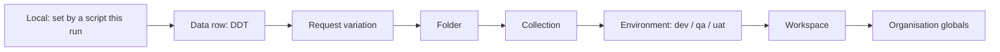

| Feature | Detail |
|---|---|
| Syntax | `{{name}}` anywhere: URL, headers, body, auth fields, assertions |
| Environments | Named sets per workspace (dev, qa, uat, staging). One is active; runs choose theirs explicitly |
| Initial vs current value | Initial value is shared with the team; current value is per user, so personal tokens are not pushed to everyone |
| Secret variables | Stored in the existing secret store by reference, never in collection JSON, exports, logs, reports or Jira. Shown masked; reveal needs the permission and is audited |
| Dynamic variables | `{{$uuid}}`, `{{$timestamp}}`, `{{$isoDate}}`, `{{$randomInt}}`, `{{$randomEmail}}`, Indian presets (`{{$randomPhoneIN}}`, `{{$randomPAN}}`) from the Studio data generator (Studio §6) |
| Capture from response | Point at a value in the response viewer → "Save as variable" writes a post-script line or a no-code extractor |
| Unresolved check | Unknown `{{name}}` is highlighted before send; a run fails fast with the variable name |
| Diff | Compare two environments side by side, to spot a missing key in uat |

---

## 6. Pre- and post-request scripts

Scripts run at collection, folder and request level, before the request is sent and after the response arrives.

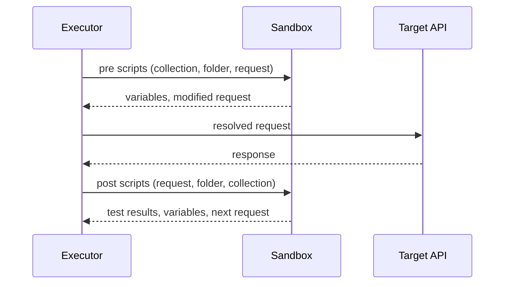

| Feature | Detail |
|---|---|
| Language | JavaScript, run in QuickJS with no network, file or process access |
| API | `tb.request`, `tb.response`, `tb.variables.get/set`, `tb.environment`, `tb.expect` (Chai style), `tb.test(name, fn)`, `tb.crypto` (hash, HMAC, base64, JWT decode), `tb.faker`, `tb.skipRequest()`, `tb.setNextRequest(name)` in workflows |
| Postman shim | `pm.*` maps onto `tb.*` so imported Postman scripts keep working. Unsupported calls are listed on import, not silently dropped |
| `tb.sendRequest` | Allowed, but it goes through the same proxy and SSRF guard as normal sends |
| Limits | 1 second CPU and 32 MB memory per script, 30 seconds total per request including `tb.sendRequest` |
| Editor | Monaco with autocomplete for `tb.*`, snippets ("save token", "check status 200", "check schema"), console output in the response pane |
| No-code first | Testers use assertions and extractors (§7). Scripts are for the cases those cannot express, like signing a request |

---

## 7. Assertions and extractors (no code)

| Assertion | Example |
|---|---|
| Status | equals 201, in 2xx, not 500 |
| Response time | under 800 ms |
| Header | `Content-Type` contains `application/json` |
| Body value | JSONPath or XPath: `$.total` equals `{{expectedTotal}}`, greater than, contains, matches regex, is one of |
| Existence and type | `$.id` exists, is string, is not empty |
| Array | length is 2, every `$.items[*].qty` > 0, contains an item where `sku = X` |
| Schema | Matches the spec's response schema for this status, or a pasted JSON Schema |
| Snapshot | Matches a saved response, with fields to ignore (`id`, `createdAt`) |
| Cross-request | `$.total` equals the sum from the previous step |

Extractors do the reverse: pull a value into a variable (JSONPath, header, cookie, regex). Assertion failures show expected against actual with a JSON diff.

---

## 8. Spec library

Every project has a library of API specs. A project can hold many specs (one per microservice, or public and internal APIs).

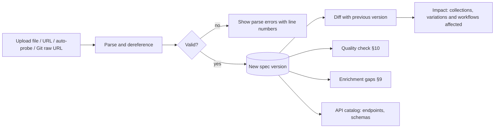

| Feature | Detail |
|---|---|
| Formats | OpenAPI 3.0, 3.1, Swagger 2.0 (converted to 3.x internally), YAML or JSON, multi-file specs with `$ref` across files (upload a zip), GraphQL introspection |
| Sources | File upload, public URL, URL with auth header, auto-probe of common paths (Studio §8.1), traffic capture from Test Browser sessions |
| Sync | A URL source can be re-fetched on a schedule or from CI; a new version is made only when the content hash changes |
| Versions | Immutable versions with who, when, source and a label (`v2.3`, a build number). Tag a version per environment ("uat runs v2.3") |
| Diff | Endpoints added, removed, changed. Breaking changes flagged: removed endpoint, removed or renamed field, new required request field, narrowed enum, type change, status code removed |
| Impact | After a new version: which requests, variations, workflows and suites now point at a changed or removed operation. They are marked Needs review, like cases after a PRD change |
| Viewer | Read-only docs view (tags, operations, schemas, examples) with "Open in request builder" on every operation |
| Catalog | All operations across all specs in the project, searchable, with owner, tag, spec, coverage and last run status |
| Traffic merge | Endpoints seen in traffic but missing from the spec are listed as "undocumented", with a suggestion to add them |

---

## 9. Enrichment layer

Most real specs are thin: no examples, no error responses, no description of which field comes from which call. Tests generated from a thin spec are shallow. The enrichment layer finds the gaps, asks the user, and stores the answers next to the spec.

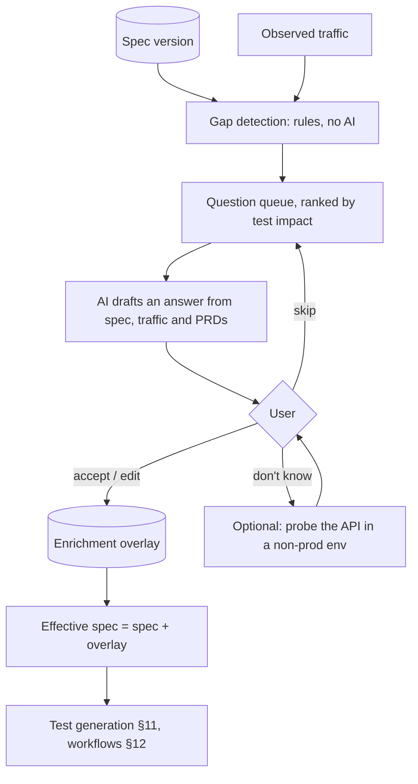

**What is detected**

| Gap | Why it matters for tests | Question asked |
|---|---|---|
| No request or response examples | No realistic happy-path data | "Here is a generated example for `POST /orders`. Is it realistic? Edit it." |
| Missing error responses (400, 401, 403, 404, 409, 422) | No expected result for negative tests | "What does `POST /orders` return when `qty` is 0? Status and body?" |
| No constraints on a field (`min`, `max`, `pattern`, `enum`) | No boundary tests | "Is there a limit on `qty`? Allowed values for `status`?" |
| Missing `required` | Cannot tell a validation bug from optional behaviour | "Is `email` required on sign-up?" |
| Missing security scheme or per-operation security | No auth tests | "Does `GET /orders` need a token? Which roles may call it?" |
| Hidden dependencies | Cannot order calls | "`orderId` in `GET /orders/{orderId}`: does it come from `POST /orders` response `$.id`?" |
| Business rules | Assertions stop at the schema | "Should `total` equal the sum of `price × qty`?" |
| Side effects | Cannot verify or clean up | "Does `DELETE /orders/{id}` remove it, or set `status=cancelled`?" |
| Idempotency, pagination, rate limits | Missing test types | "Is `POST /payments` idempotent with `Idempotency-Key`? Page size limit?" |
| Undocumented endpoints from traffic | Missing coverage | "`GET /orders/{id}/invoice` was seen in traffic. Add it?" |
| Vague descriptions | Poor readable test names | Suggests a one-line summary per operation |

**How the conversation works**

- Questions come one operation at a time in a side panel next to the spec viewer, highest test impact first. The user can batch answer ("all list endpoints paginate with `page` and `size`, max 100").
- Every AI-drafted answer is marked as a draft until a person accepts it. Nothing AI-written is used in tests before that.
- Answers can be structured (a status code and schema) or free text. Free text is turned into structured rules and shown back for confirmation.
- A completeness score per spec and per operation shows progress: "Orders API: 64% ready for testing, 11 questions open."
- Questions can be assigned to someone else (the developer who owns the service), with a notification and a link.

**How the overlay is stored**

| Rule | Detail |
|---|---|
| Separate from the spec | The uploaded spec is never edited. The overlay is a list of JSON Patch style additions keyed by JSON pointer, with author, source (user, traffic, AI accepted) and time |
| Effective spec | Spec + overlay, computed on read. Everything downstream uses the effective spec |
| New spec version | Overlay entries are reapplied by pointer and operation ID. Entries whose target changed are marked stale and asked again; entries the new spec now covers itself are retired |
| Export | Effective spec can be exported as OpenAPI, so the team can push the answers back into their source spec |
| Provenance | Every generated test step links back to the spec pointer or overlay entry it came from |

---

## 10. Structure quality check

A lint pass on every spec version, with a score and a report.

| Category | Example rules |
|---|---|
| Completeness | Every operation has a summary, `operationId`, at least one 2xx and one 4xx response, response schemas, examples |
| Naming | Plural resource nouns, consistent case (kebab paths, camelCase fields), no verbs in paths (`/getOrders`) |
| Consistency | Same field has the same type everywhere, one date format, one ID format, one error body shape across the API |
| HTTP semantics | GET has no body, POST create returns 201 with `Location` or the resource, DELETE returns 204/200, correct use of 404 vs 403 |
| Versioning | Version in path or header, applied the same way everywhere |
| Pagination and filtering | List endpoints paginate, one pagination style, max page size declared |
| Security | Security scheme declared, no API keys in query strings, sensitive fields not in URLs, `writeOnly` on passwords |
| Errors | Common error schema (RFC 9457 problem details recommended), error codes documented |
| Breaking change policy | Compared to the previous version, see §8 |

| Feature | Detail |
|---|---|
| Engine | Spectral-compatible rulesets, so teams can bring their own `.spectral.yaml` |
| Rulesets | Built-in default, strict, and custom per organisation or project; rules can be switched off with a reason |
| Severity | Error, warning, info. Score is weighted by severity and operation count |
| Report | Per rule and per operation, with the JSON pointer, a short why and a suggested fix |
| Runtime check | Beyond the static spec: during runs, responses that break the declared schema, missing headers, or inconsistent error shapes are reported as drift |
| Gate | A suite or CI call can fail on "any new error-level issue" or "score below N" |

---

## 11. Generating test sets from a spec

From the effective spec (spec + overlay), the generator builds variations per operation. Generation is rule-based and repeatable. AI only fills realistic values and names.

| Variation type | Built from |
|---|---|
| Happy path | Examples, or data generated from the schema |
| Required field missing | Each `required` field removed, one at a time |
| Wrong type | Each field given a wrong type |
| Boundaries | `min - 1`, `min`, `max`, `max + 1`; `minLength`, `maxLength`; empty string; very long string |
| Enum | Each allowed value, plus one invalid value |
| Format | Invalid email, date, UUID, URI |
| Pattern | Values that match and do not match the regex |
| Auth | No token (401), expired token, wrong role (403), another tenant's resource (BOLA) |
| Not found | Unknown ID (404) |
| Conflict | Duplicate create (409), if the overlay says the field is unique |
| Pairwise | Combinations of optional fields and enums, reduced with pairwise selection |
| Business rules | From the overlay, for example `total = sum(price × qty)` |
| Idempotency | Same request twice with the same key |
| Pagination | First page, last page, page past the end, size above the maximum |

- Each variation carries its expected result: status, schema, and any rule assertions.
- Variations land in a review queue grouped by operation. Accept, edit, or reject. Rejections are remembered so regenerating does not bring them back.
- Accepted variations can be linked to repository test cases, or create cases, so API coverage shows up in the same traceability and analytics as manual testing.
- Coverage matrix per spec: operations × expected status codes, coloured by covered, generated but not accepted, and missing.
- Regenerate after a spec change touches only affected operations, and keeps manual edits.

---

## 12. Workflows (calling APIs in order)

A workflow is a sequence of requests where values from one response feed the next. The plan answers "these N APIs belong to this project, and here is the order to call them".

**Finding the order**

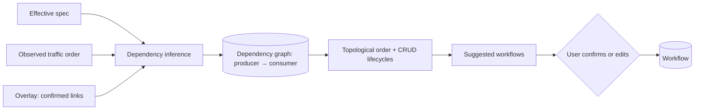

| Signal | Example |
|---|---|
| Name and type match | `POST /orders` returns `$.id`; `GET /orders/{orderId}` needs `orderId` of the same type |
| Resource hierarchy | `/customers/{id}/orders` needs a customer first |
| `links` in OpenAPI 3 | Used directly when present |
| Auth | Token endpoint comes before everything that needs the scheme |
| Traffic | The order calls were made in a recorded Test Browser session |
| Overlay | Links confirmed by the user in enrichment |

Each inferred link shows its confidence and reason. Low-confidence links become enrichment questions (§9).

**Suggested workflows**

| Kind | Example |
|---|---|
| CRUD lifecycle | Create → read → update → read → delete → read returns 404 |
| Business journey | Login → search product → add to cart → checkout → pay → get order |
| Setup only | The minimum chain to reach a state ("an order in `shipped` state") for other tests and for Studio UI tests (Studio §8.3) |
| Project map | Whole-project view: every operation as a node, links as edges, grouped by tag or spec. Shows orphan operations with no producer |

**Workflow editor**

| Feature | Detail |
|---|---|
| Steps | A request or variation, a wait, a poll ("repeat `GET /jobs/{id}` until `status = done`, max 60 s"), a condition (if/else on a variable), a loop over an array or data set, a sub-workflow |
| Data passing | Drag a response field onto the next step's input, or use `{{steps.createOrder.response.body.id}}` |
| Setup and teardown | Teardown always runs, even after a failure, so test data is cleaned up |
| Views | Canvas (graph) and list, kept in sync |
| Run modes | Step through one call at a time (debug), or run all |
| Parallel branches | Independent steps can run in parallel inside a workflow |
| Reuse | A workflow can be a step in a suite, a load scenario, or a setup step for a Studio UI test |

---

## 13. Test suites and runs

A suite is a list of variations and workflows with run settings. It reuses the Execution service so API runs show up with UI runs.

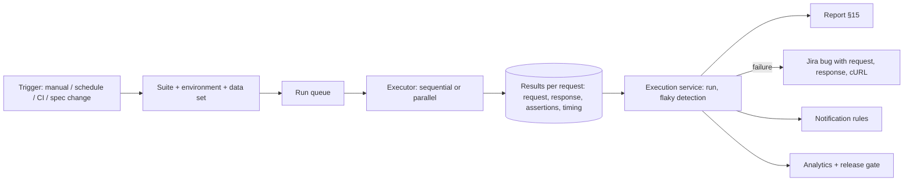

| Feature | Detail |
|---|---|
| Composition | Pick variations, folders, workflows, or a saved filter ("all generated auth tests for Orders API") |
| Environment | Chosen per run; scheduled and CI runs must name one |
| Data-driven | Bind a data set (Repository data sets or Studio generators); runs once per row, results per row |
| Order | Sequential by default for workflows; independent variations run in parallel, max 10 at a time per run (same limit as Studio) |
| Retries | Retry a failed request up to N times; a pass after retry is recorded as flaky, not pass |
| Stop rules | Stop on first failure, or continue |
| Delay | Fixed delay between requests, for rate-limited APIs |
| Schedules | Cron per suite, with its own environment |
| Monitors | A small suite run every 5 to 60 minutes against an environment, alerting on failure or latency above a threshold |
| CI trigger | Personal access token + `POST /api/core/apitest/suites/{id}/runs`, returns a run ID; CLI waits and exits non-zero on failure; JUnit XML output |
| Spec-change trigger | New spec version can run the affected suites automatically |
| Rerun | Rerun only failed, or rerun one request from the report with the same resolved values |

---

## 14. Load, security and contract checks

These reuse the suites and workflows above. Load details, safety gate and limits stay in [testing-studio-plan.md](testing-studio-plan.md) §9.

**Load**

| Feature | Detail |
|---|---|
| Source | Any workflow or suite becomes a k6 scenario; no load script is written by hand |
| Profiles | Smoke, load, stress, spike, soak; custom stages |
| Data | Unique data per virtual user |
| Thresholds | p95/p99 latency, error rate, requests per second, per endpoint |
| Results | Live dashboard, per-endpoint percentiles, compare with previous run or build |
| Safety | Ownership verification, non-production default, caps, auto-abort, audit log (Studio §9) |

**Security (OWASP API Security Top 10)**

| Check | Mode |
|---|---|
| Broken object level authorisation (BOLA/IDOR) | Active: user B replays user A's requests with two test accounts |
| Broken authentication | Active: missing, expired, tampered tokens |
| Broken function level authorisation | Active: normal role on admin operations |
| Excessive data exposure | Passive: response fields not in the schema, sensitive-looking fields (password, token, PAN) |
| Mass assignment | Active: extra writable fields (`role`, `isAdmin`) in create/update |
| Rate limiting | Active, behind the load safety gate |
| Security headers, CORS, TLS | Passive on every response |
| Injection probes | Active, gated, non-production only |

Active checks need the same ownership verification as load tests.

**Contract and mocks**

| Feature | Detail |
|---|---|
| Schema drift | Every run compares responses with the effective spec and reports extra, missing or wrongly typed fields |
| Mock server | A mock URL per spec version, serving examples or schema-generated data, with per-request overrides. Lets frontend and tests start before the API exists |

---

## 15. Reports

| Report | Contents |
|---|---|
| Run summary | Pass, fail, skipped, flaky; duration; environment; spec version; who or what triggered it |
| Per request | Resolved request and response (secrets masked), assertions with expected and actual, JSON diff, timing waterfall, script console |
| Workflow | Step timeline with the values passed between steps |
| Coverage | Operations × status codes tested; operations never tested; per spec and per tag |
| Quality | Lint score and issues for the spec version used |
| Drift | Schema drift found during the run |
| Load | Percentiles, throughput, errors, per endpoint; comparison chart |
| Security | Findings with severity, request to reproduce, suppress with expiry (Studio findings pipeline) |
| Trends | Pass rate, latency and flaky rate over time, per suite and per endpoint |
| Formats | In-app, shareable link, HTML, PDF, JUnit XML, JSON |

A failed request files a Jira bug with the request, response, cURL snippet, environment and spec pointer attached, through the existing Defect service and the tester's own Jira connection.

---

## 16. API assistant and session layer

A chat panel in API Studio that knows the project's APIs. Paste routes and it explains them and what to test. Paste a requirement and it tells you which API, or which chain of APIs, does it. It also works out how each API authenticates and sets up the session for you.

It is also reachable from the MCP server and the Slack bot (M5), with the same permissions.

### 16.1 What it knows

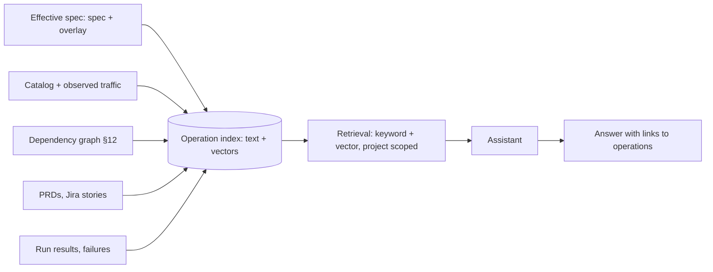

| Rule | Detail |
|---|---|
| Grounded | Every endpoint in an answer must resolve to a catalog operation and is shown as a link. A name that does not resolve is dropped and reported as "not found" |
| Says when it does not know | Missing information becomes an enrichment question (§9) instead of a guess |
| Algorithms decide, AI explains | Which chain of calls is valid comes from the dependency graph; the model picks between valid chains and writes the explanation |
| No secrets to the model | Secret variables, tokens, cookies and masked fields are stripped before anything goes to the AI provider |
| Provider layer | Runs through the existing AI provider layer with its per-task model, tenant policy and token budget |

### 16.2 Mode 1: explain routes

Input: a list of routes, pasted cURL, an Express/FastAPI/Spring router file, a HAR, or a spec fragment.

| For each route it gives | Example for `POST /orders` |
|---|---|
| Purpose | Creates an order for the logged-in customer |
| Inputs | Body `items[]` (sku, qty), header `Idempotency-Key`; required and optional marked |
| Auth | Bearer token, role `customer` |
| Depends on | `POST /auth/login` for the token, `GET /products` for a valid `sku` |
| Produces | `$.id` used by `GET /orders/{orderId}`, `POST /payments` |
| Side effects | Reserves stock; creates a payment intent |
| Example | A ready request, opened in the builder with one click |
| What to test | Happy path, qty 0 and max, unknown sku, no token, other customer's cart, duplicate idempotency key |
| Gaps | "No 409 documented for out-of-stock. What happens?" |

Routes that are not in the catalog are added as undocumented operations, with enrichment questions attached.

### 16.3 Mode 2: requirement to APIs

Input: requirement text, a PRD section, or a Jira story.

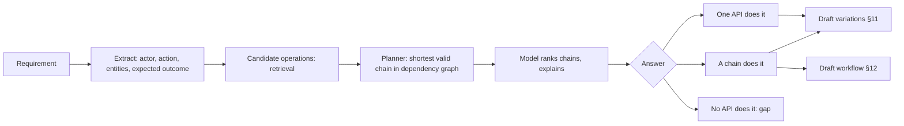

Example: "A customer can cancel an order before it ships and gets a refund."

```
Chain found (confidence: high)
  1. POST /auth/login              → token
  2. POST /orders                  → orderId
  3. POST /orders/{orderId}/cancel   needs status ≠ shipped
  4. GET  /refunds?orderId={orderId} → refund.status = initiated

Gap: no API sets an order to "shipped" for testing the negative case.
     Ask the team, or use PATCH /admin/orders/{id} with an admin profile?

[Create workflow]  [Create variations]  [Link to requirement]
```

| Feature | Detail |
|---|---|
| Planner | Graph search from what the user already has (nothing, or a logged-in role) to the operation that gives the expected outcome. Every step's inputs must be produced by an earlier step, the user, or a data set |
| Preconditions | Chains that need a state ("order is shipped") include the setup steps, or report that no API can reach that state |
| Gap report | Requirement parts with no API are listed; the list can be sent to the API owners |
| Traceability | "Link to requirement" adds the workflow to requirement coverage in the Docs service |

### 16.4 Mode 3: ask anything

| Question | What happens |
|---|---|
| "Which API gives the invoice PDF?" | Search over the catalog, with the matching operations |
| "Why does this call return 403?" | Reads the last response, the operation's security and the active auth profile's role; explains the likely cause |
| "Why did last night's suite fail?" | Groups failures by cause (auth, data, schema drift, timeout) from the run report |
| "Make this request for a different role" | Makes a variation with the other auth profile |

The assistant only proposes changes. It never saves, sends or deletes without the user clicking. It never sends a request against an environment marked production.

### 16.5 Session layer: auth and cookies

Many APIs only work after login, and the way they keep the session differs. The session layer detects the pattern once and handles it for every request, run and assistant answer.

**Detection**

| Signal | Detected pattern |
|---|---|
| `securitySchemes` in the spec | Bearer, API key, Basic, OAuth 2.0, OpenID Connect |
| Login call returns a token in the body | Bearer; the JSONPath of the token and its expiry are remembered |
| Login call returns `Set-Cookie` | Cookie session |
| A cookie plus a matching header on writes (`X-CSRF-Token`, `X-XSRF-TOKEN`) | Cookie session with CSRF |
| Traffic from a Test Browser session | Whichever of the above the app really uses |

The assistant shows what it found ("`/api/*` uses a `sid` cookie from `POST /auth/login`, plus `X-CSRF-Token` from the `csrf` cookie on POST/PUT/DELETE") and asks the user to confirm. The result is saved as an auth profile.

**Auth profile**

| Field | Detail |
|---|---|
| How to log in | A login request, a workflow (for multi-step login), OAuth settings, or a Studio browser session (Studio §6.1) |
| Where the credential lives | Header token, cookie jar, or both |
| Refresh | Refresh endpoint, or re-run login before expiry |
| Role and account | Linked to a role; uses the Studio account pool so parallel runs never share a user |
| Scope | Per environment |

**Cookie storage choice**

| Option | Behaviour | Use for |
|---|---|---|
| Don't store | No jar; each request sends only what is set by hand | Stateless APIs, testing "no cookie" cases |
| Per run (default for suites) | Fresh jar per run, dropped at the end | Repeatable runs; no leaks between runs |
| Per workflow step chain | Jar shared inside one workflow execution only | Login → actions → logout flows |
| Saved per environment + profile | Jar kept between sends and runs, encrypted, with expiry | Interactive work in the builder (monitors: open question 7) |

| Rule | Detail |
|---|---|
| Browser rules | `Domain`, `Path`, `Expires`/`Max-Age`, `Secure` (never sent over http), `SameSite` and host-only cookies honoured like a browser |
| Auto re-login | On 401 (or a redirect to the login page), log in again once and retry; a second 401 is a real failure |
| CSRF | Token read from its cookie or login response and added to the configured header on unsafe methods |
| Logout tests | A variation can drop the jar or call logout, then check that the old cookie is rejected |
| Visible | The jar for the current request is shown in the builder; every cookie sent is listed in the report, values masked |
| Stored as secrets | Saved jars and tokens live in the secret store, short expiry, production profiles off by default, access audited |
| Handover to UI tests | The same profile can seed a Studio browser session, and a browser login can seed the API jar |

---

## 17. Security and tenancy

| Rule | Detail |
|---|---|
| Server-side sends only | The proxy and executor send every request. The browser never calls target APIs directly |
| SSRF guard | Block private, loopback, link-local and cloud metadata ranges after DNS resolution, and again on every redirect. Per-organisation allowlist for internal hosts; localhost allowed only in local development |
| Secrets | Secret store references only; masked in history, reports, exports, logs and Jira |
| Tenancy | Every table carries `org_id` with RLS; routes use `projectTx` |
| Sandboxed scripts | QuickJS, no host access, CPU and memory caps |
| Stored bodies | Request and response bodies in S3 with masking rules applied before storage; same retention as Studio evidence (30 days pass, 180 days fail) |
| Audit | Secret reveals, environment changes, load and active security runs |
| Imports | Uploaded specs and collections are parsed with size limits (spec 20 MB, zip 50 MB) and no remote `$ref` fetching unless the host is allowed |

---

## 18. Data model (outline)

| Table | Holds |
|---|---|
| `apitest.spec` | Spec per project: name, source, sync settings |
| `apitest.spec_version` | Immutable version, S3 key, hash, parsed summary, lint score |
| `apitest.spec_overlay_entry` | Enrichment answers keyed by pointer, with source and status |
| `apitest.enrichment_question` | Open, answered, skipped, stale; assignee |
| `apitest.operation` | Catalog row per operation per version |
| `apitest.workspace`, `collection`, `folder` | Tree, with auth, variables, scripts |
| `apitest.request`, `request_version` | Request definition, versioned |
| `apitest.variation` | Overrides and expected result, link to case |
| `apitest.environment`, `variable` | Values or secret references |
| `apitest.workflow`, `workflow_version` | Steps as JSONB |
| `apitest.dependency_link` | Producer → consumer with confidence and source |
| `apitest.suite`, `schedule`, `monitor` | Run definitions |
| `apitest.run_result` | Per request result, S3 keys for bodies; run itself lives in Execution |
| `apitest.lint_ruleset`, `lint_issue` | Rules and findings per version |
| `apitest.auth_profile` | Login method, credential location, refresh, cookie storage option, per environment |
| `apitest.cookie_jar` | Saved jars per environment + profile + account, as secret references with expiry |
| `apitest.operation_embedding` | Vectors for assistant retrieval, per spec version |
| `apitest.assistant_thread`, `assistant_message` | Conversations, with links to the operations and drafts they produced |

---

## 19. Phases

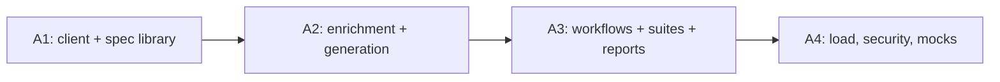

| Phase | Scope |
|---|---|
| **A1** | Workspaces, collections, folders, requests, variations · request builder with auth, history, cookies, code snippets · environments, variables, secrets · pre/post scripts with the `pm.*` shim · no-code assertions and extractors · imports (Postman, cURL, OpenAPI) · spec library with versions, viewer and diff · SSRF guard · session layer: auth profiles, cookie storage options, auto re-login, CSRF |
| **A2** | Quality check with rulesets and score · gap detection and enrichment conversation · overlay and effective spec · variation generation and review queue · coverage matrix · link variations to cases · assistant: explain routes, ask anything, auth pattern detection |
| **A3** | Dependency inference and project map · workflow editor with polling, conditions, teardown · suites, schedules, CI trigger, monitors · reports and trends · Jira bugs from failures · schema drift · spec-change impact · assistant: requirement to API chain, gap report |
| **A4** | Load from workflows (k6) · OWASP API checks · mock server · WebSocket and SSE · UI + API hybrid with Studio |

Each phase is usable on its own. A1 alone replaces Postman for a team.

---

## 20. Risks

| Risk | Mitigation |
|---|---|
| Thin specs give shallow tests | Enrichment layer; completeness score shown before generation |
| Too many generated variations | Review queue, pairwise reduction, group by operation, reject memory |
| Wrong inferred dependencies | Confidence shown, user confirms, low confidence becomes a question |
| SSRF through the proxy | DNS-pinned checks, redirect checks, allowlist, no metadata ranges |
| Imported Postman scripts do not run | Shim covers the common `pm.*` surface; unsupported calls listed on import |
| Tests change shared data | Teardown steps, per-run unique data, account pool |
| Load and active security used on sites the tenant does not own | Studio safety gate |
| Assistant names an endpoint that does not exist | Every endpoint must resolve to the catalog or it is dropped; chains come from the dependency graph, not the model |
| Tokens or cookies reach the AI provider | Secrets and masked fields stripped before every model call |
| Saved cookie jars leak between testers or runs | Per-run jar by default; saved jars are per profile and account, encrypted, short expiry |

---

## 21. Not doing

- gRPC, SOAP/WSDL, AsyncAPI and consumer-driven contract testing (Pact), unless customers ask.
- Running requests from the user's browser or a desktop agent.
- Editing the uploaded spec in place (answers go to the overlay).
- AI deciding requests or assertions at run time.

---

## 22. Open questions

1. Workspace scope: one project per workspace (this plan), or workspaces shared across projects in a product line?
2. Local and private APIs: the Studio decision is "reachable from the cloud". Is that enough for API testing, or do customers need a self-hosted runner for internal APIs?
3. Monitors: include them in A3, or leave them to existing uptime tools?
4. Postman shim depth: which `pm.*` features are must-have? Needs a sample of real customer collections.
5. Mock server: a public URL per spec, or only reachable from TestBench runs?
6. Assistant on router files: pasting source code is supported. Should it also read a connected Git repo's routes, or is that V4 like the Studio's repo route scan?
7. Saved cookie jars: allowed for monitors against staging, or should monitors always log in fresh?
