# Implementation Plan — Testing Studio and Requirements Intelligence

The order to build [testing-studio-plan.md](testing-studio-plan.md) and [requirements-intelligence-plan.md](requirements-intelligence-plan.md), following [technical-design.md](technical-design.md).

**Sizes are relative** (S ≈ days, M ≈ 1–2 weeks, L ≈ 3–5 weeks for one engineer) until team size is known. Milestone IDs use `PF-` (platform), `TS-` (Testing Studio) and `RI-` (Requirements Intelligence) so they don't clash with the existing M1–M5 milestones.

---

## 1. Tracks and dependencies

```mermaid
flowchart LR
  subgraph PF[Platform]
    PF1[PF-1 Shared foundations]
    PF2[PF-2 ML worker + workflow runner]
  end
  subgraph TS[Testing Studio]
    TS1[TS-1 Jira evidence] --> TS2[TS-2 Test Browser + manual]
    TS2 --> TS3[TS-3 Auth, accounts, BYO repo, passive scans]
    TS3 --> TS4[TS-4 Step model, recorder, generator]
    TS4 --> TS5[TS-5 Headless runner + CI]
    TS5 --> TS6[TS-6 Senior help + components]
    TS6 --> G1{Gate G1}
    G1 --> TS7[TS-7 English, triage + RCA, API testing, cross-browser]
    TS7 --> TS8[TS-8 Visual, a11y, findings, pair mode]
    TS8 --> TS9[TS-9 Load, design compare, SEO, active security]
  end
  subgraph RI[Requirements Intelligence]
    RI1[RI-1 Sections, alignment, change types, features] --> RI2[RI-2 Coverage-driven generation + OpenAPI ingest]
    RI2 --> RI3[RI-3 Rules, entities, overlap]
    RI3 --> RI4[RI-4 Contradictions + calibration]
    RI4 --> RI5[RI-5 Advanced design + coverage + data]
    RI5 --> RI6[RI-6 Journeys, impact, GraphRAG]
    RI6 --> RI7[RI-7 Effectiveness]
  end
  PF1 --> TS1 & RI1
  PF2 --> RI1
  TS2 -- traffic capture --> RI2
  TS7 -- API catalog --> RI3
  RI2 -- data profiles --> TS7
  RI5 -- journeys need components --> TS6
```

Two teams (or two people) can run TS and RI in parallel after PF-1. The only hard cross-track links are shown as edges.

---

## 2. Platform

### PF-1 Shared foundations (M)
| Item | Size |
|---|---|
| `studio` schema migration skeleton; `exec` / `defect` / `docs` column additions (technical-design §2.2) | M |
| Contracts: `studio.ts`, `runner.ts`, `kg.ts`, `ml.ts` in `@tb/contracts`; new event types | S |
| `packages/platform/mask.ts` + unit tests (headers, cookies, tokens, emails, phones) | S |
| OpenAPI generation: `@fastify/swagger` + `jsonSchemaTransform` per deploy unit, export script to `docs/api/`, CI staleness check | S |
| Secret store interface (AWS Secrets Manager + local file implementation) | S |
| Compose profile `studio`; SQS queues in ElasticMQ config | S |

**Exit:** migrations apply locally and in CI; `docs/api/*.json` generated for existing units; masking tests pass.

### PF-2 ML worker + workflow runner (M)
| Item | Size |
|---|---|
| `services/ml` scaffold: uv, SQS consumer, health endpoint, Dockerfile with baked weights | M |
| Zod → JSON Schema → Pydantic codegen + CI check | S |
| Postgres workflow runner in Docs: `kg.workflow_run/step`, idempotency, retries, waiting steps, sweeper, admin view | M |
| Eval harness: `kg.eval_run`, gold-set loader, metrics report, CI gate job | M |

**Exit:** a no-op two-step workflow (one AI step, one ML step) runs end to end locally and resumes after killing the worker mid-step.

---

## 3. Testing Studio

### TS-1 Jira evidence (S–M)
| Item | Size |
|---|---|
| Extend `bug-report.ts` with facts sections: preconditions, test data (masked), reproducibility, scope, signals, attachments guide | S |
| `defect.attachment` + upload worker (S3 stream → Jira attachments API, retry, size fallback) | M |
| Evidence preview + untick UI in the bug form | S |
| Jira mock: attachments endpoint in provider sandbox | S |

**Exit metric:** 100% of bugs logged from runs carry their evidence as Jira attachments; zero secrets found in a masking audit of 50 sample bugs.

### TS-2 Test Browser + manual execution (L)
| Item | Size |
|---|---|
| `browser-live` service: session lifecycle, warm pool, CDP screencast, input relay, token auth, idle timeout | L |
| Studio API: `POST/DELETE /sessions`, quota check, `live_session` | S |
| Web: live pane, device/browser picker, throttling | M |
| Manual execution beside the pane: step linking, pass/fail/block, notes | M |
| Automatic evidence: per-step screenshots, video, trace, console, network; masked; trace viewer in app | M |
| Masked network capture stored (feeds RI-2 and TS-7) | S |
| Image-upload overlay (onion skin / slider) | S |
| ECS task definition, ALB sticky WebSocket routing, NAT IPs | M |

**Exit metric:** median session start < 5 s from warm pool; testers complete a manual run with evidence without taking any screenshot by hand; time per manual run with evidence measured against baseline.

### TS-3 Auth, accounts, existing repos, passive scans (M)
| Item | Size |
|---|---|
| Environments, auth profiles (component / API / manual login), validity check, encrypted state | M |
| Test account pool with leases | S |
| "Start as role" in live sessions | S |
| Repo connections: run an existing Playwright repo, ingest results, map `@TC-` tags to cases | M |
| Passive axe + security-header/cookie/TLS checks → `studio.finding` (basic list view) | M |

**Exit:** a live session opens already logged in as a chosen role; an existing Playwright repo runs and its results appear in a TestBench run.

### TS-4 Step model, recorder, generator (L)
| Item | Size |
|---|---|
| Step model Zod schema, `test` / `test_version` tables, save-time validation | M |
| Page library + locator ranking + uniqueness check | M |
| Recorder pipeline (cleanup, locators, typed values → parameters, assert mode) | L |
| Manual run → script conversion | M |
| Step builder + assertion builder UI | L |
| Generator: steps → Playwright code with reliability rules; unit tests per rule | M |
| Data generators level 1–2 (presets incl. Indian locale, rules, per-run uniqueness, seeds, freeze to `repo.data_set`) | M |

**Exit:** a tester records a checkout flow and saves a script that replays green in the live pane.

### TS-5 Headless runner + CI (L)
| Item | Size |
|---|---|
| `services/runner` core: executor, evidence capture, masking, annotated failure screenshot | M |
| Dispatcher: per-run cap 10, global cap 25, round-robin, batching, routing, retries, flaky marking | M |
| Lambda image + handler; reserved concurrency 25; event source max concurrency 25 | M |
| ECS Spot worker for Firefox/WebKit/long tests | S |
| Results consumer + quality gate (3× parallel) | M |
| CI trigger: `POST /ci/runs`, `GET /ci/runs/:id`, `tb run --wait` in `packages/cli` | S |
| Metering: usage counters, quotas at dispatch and session start, threshold notifications | S |
| Local: handler as Node process polling ElasticMQ | S |

**Exit metric:** a 500-test run completes at 10 parallel within the expected 25–50 min; flaky tests never reported green; CI pipeline gets pass/fail.

### TS-6 Senior help + components (L)
| Item | Size |
|---|---|
| Help requests: context capture, states, queue UI, notifications | M |
| Custom components (steps + code) with versions; impact run on publish; rollback | L |
| Code Step + Eject | M |
| Default component pack (OTP mailbox/SMS, upload/download, frames/tabs/dialogs, date picker, drag-drop, shadow DOM) | M |
| Script review: approve to `ready` after the quality gate | S |
| AI self-help before escalation (alternate locator, wait for network, frame/popup detection) | S |
| Stuck-rate report for leads | S |

**Exit metric:** median help request resolved within the team's target; stuck rate trending down month over month.

### Gate G1: validation
Run manual run → script and recorder → script on 2–3 real customer-like apps.

| Measure | Pass |
|---|---|
| Drafts passing 3/3 without edits | ≥ 60–70% |
| Time per script vs hand-written Playwright | ≥ 3× faster |
| Stuck rate | Falling, with top reasons covered by components |

Below target: fix the recorder and generator before TS-7; don't start the AI features.

### TS-7 English, triage + RCA, API testing, cross-browser (L)
| Item | Size |
|---|---|
| `english_to_steps` + live validation + ask-when-ambiguous; "Automate this case" | L |
| Intent storage + heal proposals (approve to apply) | M |
| Triage (rules + `classify_failure`), clustering, routing: product → draft, test → help queue, environment → notify | M |
| `draft_bug_report`: AI summary + basic RCA, merged after tester edit | M |
| API catalog from captured traffic + auto-probe + imports (OpenAPI via RI ingest, HAR, Postman, cURL) | L |
| Request builder, API test packs, chaining, auto-assertions | L |
| Chromium/Firefox/WebKit matrix | S |
| Test-case suggestions surfaced in Studio (from RI-2) | S |

**Exit metric:** ≥ 90% of Jira bugs from automated runs classified as real product bugs by developers (triage precision); English drafts pass rate reported.

### TS-8 Visual, accessibility, findings, pair mode (M)
| Item | Size |
|---|---|
| Visual regression baselines, perceptual diff, approve/reject | M |
| Guided a11y helpers (tab order, a11y tree, zoom, colour-blind, checklist) | M |
| Findings pipeline: dedupe, severity, suppress with expiry, Jira, release gate | M |
| Pair mode on live sessions | S |

### TS-9 Load, design compare, SEO, active security (L)
| Item | Size |
|---|---|
| Domain verification | S |
| `runner-load`: k6 generation from flows, profiles, thresholds, distributed tasks, live dashboard, auto-abort, caps | L |
| Figma connect, frame mapping, overlay, property compare | L |
| SEO checks | M |
| Active security: ZAP + Nuclei on ECS, BOLA/IDOR via API catalog + test users | L |

### Later (V4, from testing-studio-plan §13)
App map + flow suggestions · element-level design mapping, token audit, Zeplin · intercepting proxy · repo route scan, gateway import · export to Git/zip · optional Android emulator · Hindi/Hinglish input · import Selenium/Cypress scripts · onboarding sample app.

---

## 4. Requirements Intelligence

### RI-1 Sections, alignment, change types, features (L)
| Item | Size |
|---|---|
| `parse_document` (Docling) job; `docs.section` with hashes; chunked extraction removes the 40k cut | M |
| Span grounding check on extracted requirements | S |
| `align_versions` (Hungarian) replacing greedy `alignRefs`; keep its tests as regression cases | S |
| Cosmetic / refinement / semantic classification (NLI both ways); only semantic flags cases | M |
| Feature tree, ownership, umbrella/feature PRDs, lifecycle, glossary; feature page | L |
| Gold set v1: 10 PRDs labelled | M |

**Exit metric:** "Needs review" flags drop for cosmetic edits (measure on gold set); zero ungrounded requirements stored.

### RI-2 Coverage-driven generation + OpenAPI ingest (L)
| Item | Size |
|---|---|
| `ingest_api_spec` workflow: parse, dereference, endpoints → Studio catalog, constraints → rules | M |
| `test_model` job: partitions, boundaries, decision tables, API contract conditions | L |
| `write_cases_from_conditions` + data profile per case (Faker + constraints) | M |
| Quality gate: lint, `judge_case_quality`, NLI grounding, auto-revise loop | M |
| Semantic dedupe + subsumption | M |
| Review queue for generated cases; acceptance metrics | S |

**Exit metric:** accepted-unchanged rate ≥ 50% on gold set; invented-expectation rate near zero after the gate.

### RI-3 Rules, entities, overlap (L)
| Item | Size |
|---|---|
| `extract_rules` + normalisation into typed rules | M |
| Entity resolution: candidates, rerank, HDBSCAN proposals, alias table | M |
| `kg.node/edge` with provenance + bitemporal fields; graph explorer | L |
| Blocking + hybrid retrieval (RRF) candidate generation | M |
| Overlap detection + source-of-truth resolution flow | M |
| PRD-vs-spec and spec-vs-traffic checks | M |

### RI-4 Contradictions + calibration (L)
| Item | Size |
|---|---|
| `z3_check`, batch `nli`, `judge_relation` | L |
| `critic` + self-consistency for critical findings | M |
| Calibration model + thresholds; review queue ordered by uncertainty | M |
| Conflict workflow (resolve / intentional / defer), release readiness count | M |
| `clarify` agent drafts | S |
| Gold set v2: 200–500 labelled pairs | L |

**Exit metric:** conflict precision ≥ 85% on gold set and on live review decisions.

### RI-5 Advanced design, coverage, data (L)
| Item | Size |
|---|---|
| State transition, pairwise (covering arrays), role × action, CRUD, MC/DC for critical rules | L |
| Coverage per dimension + heatmap + gap generation | M |
| Relational data with invariants; stateful setup recipes via API catalog | L |
| Data coverage tracking | S |

### RI-6 Journeys, impact, GraphRAG (L)
| Item | Size |
|---|---|
| Process mining from sessions/analytics; Markov model; path cover; rare-risky; interrupted variants; personas | L |
| Journey → Studio journey test composed of components | M |
| Minimisation (set cover) + risk prioritisation + tiering | M |
| Impact propagation with decaying weights + centrality; impact preview | M |
| Stale detection | S |
| GraphRAG: community summaries, faithfulness check, `answer_question`, MCP `ask_knowledge_base` | L |

### RI-7 Effectiveness (M)
| Item | Size |
|---|---|
| Spec mutation score | M |
| Escaped defect analysis loop | M |
| Statistical synthesis (SDV) from masked samples + near-copy check | M |

---

## 5. Test strategy

| Level | What | Tooling |
|---|---|---|
| Unit | Pure functions: generator rules, masking, bug report builder, dispatcher selection, locator ranking, alignment, calibration | Vitest (TS), pytest (ML worker) |
| Contract | Zod ↔ Pydantic generated models; queue message round-trips | CI codegen check + fixture messages |
| Integration | Services against compose Postgres, ElasticMQ, SeaweedFS, Jira mock; workflow resume after crash | Existing integration harness |
| End to end | Live session → record → save → headless run → failure → Jira draft with attachments | Playwright suite in `e2e/` against a bundled sample app |
| ML evaluation | Gold set metrics per job and per task; regression gate on prompt/model/threshold changes | `kg.eval_run` CI job |
| Load (our system) | 30 concurrent live sessions; 25-Lambda dispatch with 3 concurrent runs; ML queue at 10× typical load | k6 against staging |
| Security | Runner cannot reach internal subnets; masking audit on sample evidence; RLS tests for new tables; domain verification bypass attempts | Automated checks in CI + staging |

---

## 6. Definition of done (every milestone)

- Migrations, contracts and generated OpenAPI committed; CI green (lint, typecheck, unit, integration, e2e where touched).
- Works locally with compose (HLD §10 parity) and in staging.
- RLS on new tables; audit events for sensitive actions; masking applied on every new capture path.
- Metrics and alerts for new queues/services.
- Exit metric measured and recorded.
- HLD / plan docs updated where behaviour changed.

---

## 7. Risks to the plan

| Risk | Mitigation |
|---|---|
| Gate G1 fails | Stop before AI features; invest in recorder/generator quality |
| No one owns the ML worker and gold set | Name an owner before RI-3; RI-1/RI-2 are mostly usable without deep ML ownership |
| Live session infra harder than expected (streaming, sticky routing) | Spike in the first week of TS-2 |
| Jira attachment limits vary by site | Size fallback to links built in TS-1 |
| Lambda Chromium quirks | ECS fallback queue exists from TS-5 |
| Scope creep from TS-9 / RI-7 | Treat as optional until earlier exit metrics are met |

---

## 8. Next step

Break TS-1, TS-2, PF-1 and RI-1 into Jira tickets (boards per team), each carrying its exit metric.
