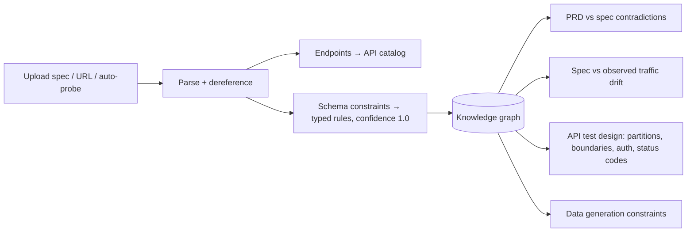
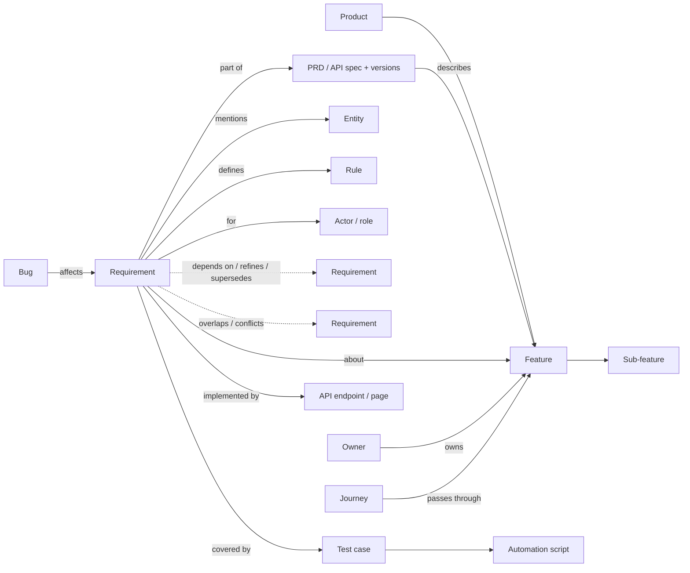
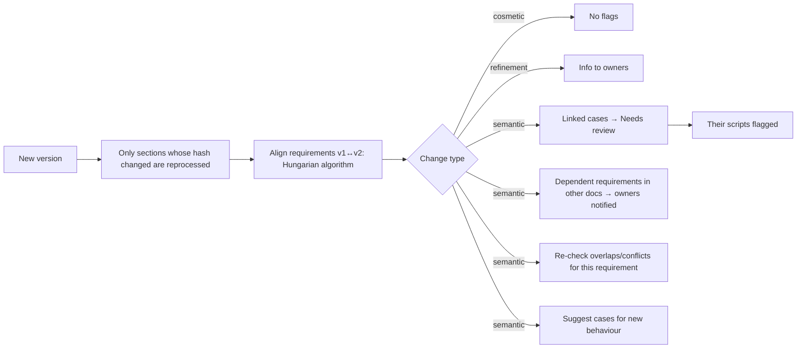
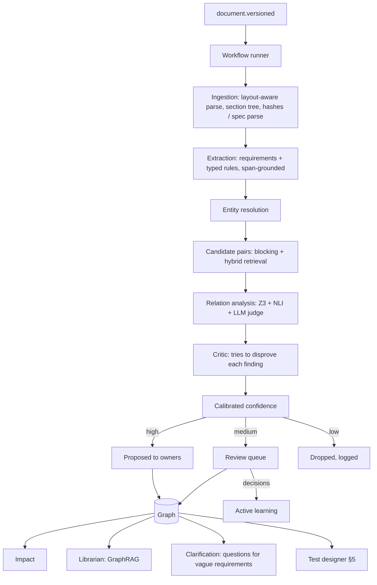
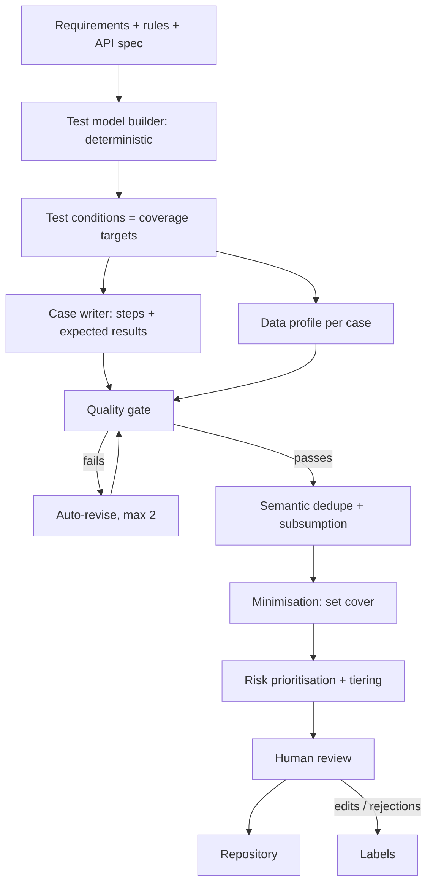

# Requirements Intelligence — Product Plan

Turns PRDs and API specs into a knowledge graph of features, requirements and rules. It finds overlaps and contradictions across documents, tracks the impact of every change, and generates test cases, user journeys and scenario data. The test cases are generated with measurable coverage rather than by asking a model for "N cases".

**Companion to:** [HLD.md](HLD.md) §5.13 (PRD lifecycle), [testing-studio-plan.md](testing-studio-plan.md) (execution side), [technical-design.md](technical-design.md), [implementation-plan.md](implementation-plan.md).
**Extends:** the Docs & Knowledge and AI Assist services. Adds a Python ML worker (technical-design §6).

---

## 1. What exists and what's missing

| Exists today | Missing |
|---|---|
| PRDs with versions, requirement extraction, v1→v2 diff | Anything **across** PRDs: features, shared concepts, dependencies |
| Requirement ↔ case links, traceability, "Needs review" flags | Overlap and contradiction detection |
| `generate_cases`: one requirement, "write N cases" | Coverage-driven generation, a quality gate, journeys, data per case |
| Dedupe by passing existing titles to the prompt | Semantic dedupe and subsumption |
| PRDs cut at 40k characters | Section-based chunking |
| Greedy similarity alignment between versions (`alignRefs`) | Optimal alignment; cosmetic-vs-semantic change detection |

**Principle:** algorithms decide *what* to cover and *whether* two things conflict. LLMs write text, judge nuance and explain. Every claim is grounded in a quoted source span, and humans confirm anything that changes state.

---

## 2. Sources

| Source | What it contributes | Precision |
|---|---|---|
| **PRDs** (umbrella + feature PRDs) | Features, requirements, rules, flows, actors | Medium: free text, extracted |
| **OpenAPI / Swagger specs** | Endpoints, schemas, constraints (required, enum, min/max, pattern, format), auth, status codes | **High: structured, deterministic** |
| **API catalog** (inferred from Test Browser traffic, see testing-studio-plan §8) | Real behaviour of the API | Medium: inferred |
| Jira stories and bugs | Acceptance criteria; where defects cluster | Medium |
| Test results, recorded sessions, analytics (optional) | Real user paths, actual behaviour | Observed |

### 2.1 OpenAPI / Swagger as an input

An uploaded spec is a document of type `api_spec`, versioned like a PRD.



| Spec element | Becomes |
|---|---|
| `required`, `type`, `format` | Validity rules → positive and negative partitions |
| `minimum` / `maximum` / `minLength` / `maxLength` / `pattern` | Boundary rules → boundary values |
| `enum` | Partition per value + invalid value |
| `securitySchemes` + per-operation security | Auth rules → 401/403 cases |
| Responses per status code | Expected results for API cases |
| Tags, operation IDs | Feature mapping hints |

Provenance for spec-derived rules is a JSON pointer (`#/paths/~1orders/post/requestBody/.../quantity/maximum`) rather than a text span.

**Cross-source checks this enables**

| Check | Example |
|---|---|
| PRD vs spec | PRD: "refund within 30 days". Spec: `refundWindowDays.maximum = 45` |
| Spec vs observed traffic | Spec says `price` is a number; traffic shows strings |
| Spec vs tests | Endpoints or status codes in the spec with no cases |

---

## 3. Knowledge graph

### 3.1 Model



**Rule** is the key node. Requirements are broken into typed rules so they can be compared by logic, not only by wording:

```
Rule { entity: Coupon, attribute: validity, operator: =, value: 30, unit: day,
       condition: type = promo, actor: Customer, modality: MUST, polarity: positive,
       source: "§4.2 ¶3" | "#/paths/...", quote: "Promo coupons are valid for…" }
```

### 3.2 Properties

| Property | Why |
|---|---|
| **Provenance** on every node and edge: source span or JSON pointer, extractor + model + prompt version, confidence, status (proposed / confirmed / rejected) | Every claim is traceable; a bad extractor version can be reverted in bulk |
| **Bitemporal**: valid time (true in the spec) and record time (when we learned it) | "Show the graph as of release 1.4" |
| **Human decisions are never overwritten** by re-runs | They are also the training labels (§8) |

### 3.3 Views

Two graph views: **per document** (its requirements, rules, entities, dependencies) and **product-wide**, opened centred on a feature or entity, never all at once.

| View | Shows |
|---|---|
| Feature page | All PRDs, specs, requirements, rules, conflicts, cases, scripts, bugs, journeys for one feature |
| Graph explorer | Per document or product-wide, filter by edge type |
| Conflict & overlap inbox | Per owner, side-by-side quotes |
| Impact view | "What is affected if this changes?" |
| Document health | Open conflicts, uncovered requirements, stale sections, vague wording |
| Ask the knowledge base | Answers with citations (§3.8) |

### 3.4 Ownership and structure

```
Umbrella PRD (global: auth, pricing, roles, glossary)
   ├── Feature PRD: Checkout    owner PM-A
   ├── Feature PRD: Coupons     owner PM-B
   └── API spec: Orders API     owner Tech lead
```

| Role | Owns |
|---|---|
| PM (feature owner) | PRD content, approving changes, resolving conflicts in their feature |
| Tech lead | API specs, dependencies, feasibility |
| QA lead | Confirming extracted requirements and rules, coverage |
| Approver | Moving a version from In review to Approved |

- The umbrella PRD wins by default; a feature PRD may override a global rule only with an explicit, reasoned override.
- **Glossary** normalises terms (Customer = User = Buyer) into one entity.
- Lifecycle: Draft → In review → Approved → Superseded.

### 3.5 Overlap

| Type | Example | Resolution |
|---|---|---|
| Duplicate | Same OTP rule in Login and Payments PRDs | Choose a source-of-truth document; the other references it; cases are shared |
| Partial overlap | Two PRDs describe cancel, different detail | Merge, or split by scope |
| Extension | Refunds builds on cancel rules | Dependency edge, not an overlap |

### 3.6 Contradictions

| Type | Example |
|---|---|
| Value | Coupon validity 30 vs 15 days |
| Permission | "Only Admin can refund" vs "Support can refund" |
| State | Cancel allowed after shipping vs disabled once shipped |
| Range | Min order ₹500 vs free-shipping threshold ₹300 with min order applied |
| Within one document | Section 2 vs section 7 |
| PRD vs API spec | Refund window 30 vs `maximum: 45` |
| Spec vs reality | Enum value never observed; behaviour the PRD doesn't describe |

**Workflow:** Open → assigned to all owners involved → **Resolved** (one requirement changes, triggering §3.7), **Intentional** (add the condition that makes both true), or **Deferred** (owner + date). Conflicts don't block publishing; release readiness counts open ones.

### 3.7 Updates and impact



- **Cosmetic vs semantic:** NLI in both directions. Mutual entailment means cosmetic; one-way means refinement; otherwise semantic. Only semantic changes raise "Needs review", which removes most of the noise in today's flow.
- **Impact preview before approval:** "Changing REQ-12 affects 2 documents, 14 cases, 6 scripts, 1 open bug".
- **Impact ranking:** traversal with decaying weights; **PageRank-style centrality** marks requirements many others depend on, and changes to those get stricter review.
- **Stale detection:** bugs, test results or observed API behaviour diverge from an unchanged requirement → owner nudged.

### 3.8 Ask the knowledge base (GraphRAG)

- Retrieval combines graph traversal (feature → requirements → rules) with hybrid text search.
- **Community summaries:** Leiden clustering of the graph into topic communities with pre-computed summaries, for broad questions ("How do refunds work overall?").
- **Faithfulness check:** each answer sentence is checked with NLI against its cited spans; unsupported sentences are removed. If too little survives: "The documents don't specify this."
- Exposed in the UI and through the existing MCP `get_prd` tool.

---

## 4. Pipeline and agents



| Stage | Technique |
|---|---|
| Ingestion | Layout-aware parsing (Docling) keeps headings, tables, lists; section tree with stable anchors; content hash per section. Specs parsed and dereferenced |
| Clause classification | **SetFit** few-shot classifier: functional / non-functional / context / example. Only requirements go to the LLM |
| Modality + polarity | must / should / may; negation ("must not") |
| Rule extraction | LLM with JSON-schema output into the typed rule schema |
| **Span grounding** | Every extraction quotes its source; the quote is string-matched against the document or it's rejected |
| Normalisation | Units (48 h = 2 days), currency, number words, dates |
| Entity resolution | BM25 + embeddings to find candidates, **cross-encoder** reranking, **HDBSCAN** clustering of unlinked mentions to propose new glossary terms |
| Candidate pairs | **Blocking** on entity + attribute; **hybrid retrieval** (BM25 + OpenSearch k-NN) merged by **reciprocal rank fusion**; only changed requirements |
| Relation analysis | **Z3 SMT solver** proves structured conflicts; **NLI cross-encoder** (DeBERTa-class, MNLI) for text; **LLM judge** for nuance, scope and the reconciling condition |
| Critic | Separate prompt, ideally a different model, tries to find a reading with no conflict; **self-consistency** across samples/providers for critical findings |
| Calibration | Logistic regression + isotonic calibration over all signals → a real probability; thresholds set for precision |

| Agent | Does | Guardrails |
|---|---|---|
| Ingestion | Parse, tree, hashes | Deterministic, no LLM |
| Extraction | Requirements + rules | Span grounding, schema validation |
| Entity resolution | Link / propose terms | Human confirms new entities |
| Relation analyst | Three judges | Structured output |
| Critic | Disprove findings | Different prompt/model |
| Impact | Propagation, ranking | Read-only |
| Librarian | Q&A | Must cite, abstains |
| Clarification | Drafts questions to owners ("fast" → "what p95?") | Drafts only |
| Test designer | §5 | Coverage decided by algorithms |

Orchestration is a **fixed workflow**, not agents choosing their own next step. Typed tool calls, token budgets per job, idempotent steps keyed by content hash, results cached by (content hash + model + prompt version), temperature 0, pinned versions, provider fallback from the AI layer (HLD §2.3). All LLM calls go through AI Assist, so tenant policy and budgets apply.

---

## 5. Test case generation

### 5.1 Pipeline



### 5.2 Test design techniques

| Technique | From | Example |
|---|---|---|
| Equivalence partitioning | Value ranges, enums | Coupon age: valid 0–30, expired > 30, invalid < 0 |
| Boundary value analysis | Numeric rules, spec min/max | ₹499, ₹500, ₹501 |
| Decision tables (minimised) | Multi-condition rules | Coupon type × tier × cart value |
| State transition | State rules | All valid transitions + invalid ones |
| Pairwise / t-way | Independent parameters | Covering arrays (IPOG): 240 combinations → ~20 |
| MC/DC | Critical boolean logic | Each condition independently flips the outcome |
| Role × action matrix | Permission rules | Every role × action, allow and deny |
| CRUD matrix | Entities | Per entity, per role |
| API contract | OpenAPI | Required/optional, types, enums, boundaries, 401/403/404, each documented status |
| Use-case flows | PRD flows | Main, alternate, exception |
| Risk-based error guessing | Past bugs | Extra cases where defects cluster |

### 5.3 Quality gate

| Layer | Checks |
|---|---|
| Lint (deterministic) | Missing expected result, vague words ("properly", "correctly"), compound steps, > 12 steps, missing preconditions, no concrete data |
| Rubric judge (LLM) | Atomic, clear title, actionable steps, observable and specific expected results, justified priority; 1–5 per criterion |
| **Grounding** | NLI: the requirement must entail each expected result, otherwise flagged "invented expectation" |
| Critic | Looks for ambiguity or untestability |

When the source doesn't say what should happen, the case is marked **Needs clarification** and the clarification agent drafts a question. An expected result is never invented.

Dedupe uses embeddings + cross-encoder, and detects **subsumption** (case A fully covers case B).

### 5.4 Coverage

| Dimension | Measures |
|---|---|
| Requirement | Requirements with cases, weighted by risk |
| Rule / partition / boundary | Every partition and boundary exercised |
| Decision + MC/DC | Table rows; MC/DC on critical rules |
| State transition | Valid and invalid transitions |
| Combinatorial | % of t-way combinations |
| Role × action | Permission cells |
| API | Endpoints × documented status codes × constraints |
| Journey | Real user paths (§6) |
| Data | Field partitions actually used in runs |
| Execution | Cases that actually ran in the last N builds |
| Automation | Cases with passing automation |

**Effectiveness, not just coverage**

1. **Spec mutation score:** mutate structured rules (30 → 31, `≥` → `>`, Admin → Support) and check whether some case's expected result would detect each mutant.
2. **Escaped defect analysis:** each production/UAT bug is traced to its requirement and condition; the missing condition is added permanently.

**Risk** = likelihood (defect history, change frequency, complexity) × impact (business criticality). The coverage heatmap is feature × dimension coloured by risk; clicking a gap generates cases for exactly that gap.

### 5.5 Suite optimisation

- **Minimisation:** greedy set cover (ILP for small suites) → smallest suite with the same coverage; redundant cases suggested for archive.
- **Prioritisation:** risk + historical failure rate + change impact of the build.
- **Tiering:** smoke / sanity / regression derived from risk and coverage contribution.

---

## 6. User journeys

A journey is an end-to-end path across features for a persona, composed in Testing Studio from components, with data flowing between steps.

| Source | Technique |
|---|---|
| PRD flows + graph | Feature dependencies and state machines chained into paths |
| Real usage (Test Browser sessions, analytics or logs if connected) | **Process mining**: directly-follows graph with frequencies (Heuristic Miner) |
| App map | Page graph from recordings |

Journeys are modelled as a **Markov usage model** (states + transition probabilities):

| Journey type | Algorithm | Purpose |
|---|---|---|
| Most common | Highest-probability paths | Protect what most users do |
| Full transition coverage | Minimum path cover (Chinese-postman style) | Every transition at least once, fewest journeys |
| Rare but risky | Low probability × high impact | Refund after partial shipment |
| Interrupted | Mutations of common paths | Back, refresh, timeout, double submit, two tabs, resume, network drop |

**Personas** (new, returning, admin, guest, low-bandwidth mobile, screen-reader user) carry attributes that drive journey choice and data generation.

---

## 7. Scenario data

Each test condition declares the data it needs; the generator produces exactly that.

```
Condition: refund for a partially shipped order, Gold customer
Profile:   customer tier = Gold, KYC verified, Maharashtra address (valid PIN ↔ state)
           order: 3 items, 2 shipped, 1 pending, paid by UPI, placed 5 days ago
Invariant: order.total = sum(lines) − discount; created < shipped
```

| Technique | Does |
|---|---|
| Constraint solving (Z3) | Exact partition and boundary values ("cart exactly ₹500") |
| Relational + invariant consistency | Parent/child references valid; business invariants hold |
| Stateful setup recipes | Reach the required state via API sequences from the API catalog, not direct DB writes |
| Indian locale realism | Region-consistent names, PIN ↔ state ↔ city, +91 formats, checksum-valid GSTIN, PAN format, IFSC patterns, UPI IDs, ₹ amounts |
| Statistical synthesis (optional) | From a masked customer sample: Gaussian copula / CTGAN (SDV); generated rows checked against near-copies of real ones |
| Negative / adversarial values | From partitions + unicode, emoji, RTL, zero-width, oversize, injection strings |
| Reproducibility | Seed stored per run |
| Data coverage | Tracks field partitions used in runs; flags gaps ("every test uses a Mumbai address") |

---

## 8. Reliability and evaluation

| Practice | Detail |
|---|---|
| Gold set | Real PRDs and specs with hand-labelled requirements, rules, relations and expert-written suites (extends the eval set in HLD §2.3) |
| Metrics | Extraction F1; entity-linking accuracy; precision/recall per relation type; case acceptance (unchanged / edited / rejected); invented-expectation rate; duplicate rate; coverage per dimension; spec mutation score; escaped defects; Q&A faithfulness |
| Regression gate | Every prompt, model or threshold change runs the gold set; ships only if metrics hold |
| Active learning | Review queue ordered by uncertainty; weekly recalibration |
| Targets | Conflicts shown to owners ≥ 85% precision; invented expectations near zero before review |
| Cost | Cheap filters first (SetFit, NLI, blocking); LLM only on survivors; only changed sections reprocessed |

The gold set needs roughly 200–500 labelled pairs before calibration is trustworthy, and a named owner for evaluation and calibration.

---

## 9. Phases

| Phase | Scope |
|---|---|
| **RI-P1** | Section parsing + hashes (removes the 40k cut) · span-grounded extraction · Hungarian alignment · cosmetic/semantic change classification · feature tree, ownership, umbrella/feature PRDs, glossary, feature page · OpenAPI ingest → catalog + rules · coverage-driven generation (partitions, boundaries, decision tables, API contract) · quality gate (lint, rubric, grounding) · semantic dedupe · data per case · gold set started |
| **RI-P2** | Typed rules + normalisation · entity resolution · blocking + hybrid retrieval · overlap detection · review queue · provenance + bitemporal graph · state transition, pairwise, role matrix · coverage heatmap + gap generation · relational data + stateful recipes · PRD-vs-spec checks |
| **RI-P3** | Z3 + NLI + LLM judges · critic · calibration · conflict workflow + release-gate count · active learning · clarification agent |
| **RI-P4** | Journeys (process mining, Markov model, path cover, personas, interrupted) · minimisation + prioritisation · impact propagation + centrality · stale detection · GraphRAG with faithfulness check |
| **RI-P5** | Spec mutation score · escaped defect analysis · MC/DC · statistical synthesis |

Delivery order and dependencies: [implementation-plan.md](implementation-plan.md).

---

## 10. Limits

- Z3, state transition and MC/DC need structured rules; free-text-only PRDs rely on NLI + LLM with lower precision.
- Contradiction detection produces false positives; every finding shows reasoning and needs human confirmation.
- Process mining needs real usage data; without it, journeys come from documents and recordings.
- Spec mutation measures sensitivity to spec changes, not real code faults.
- Vague requirements produce no useful rules; document health flags them instead.
