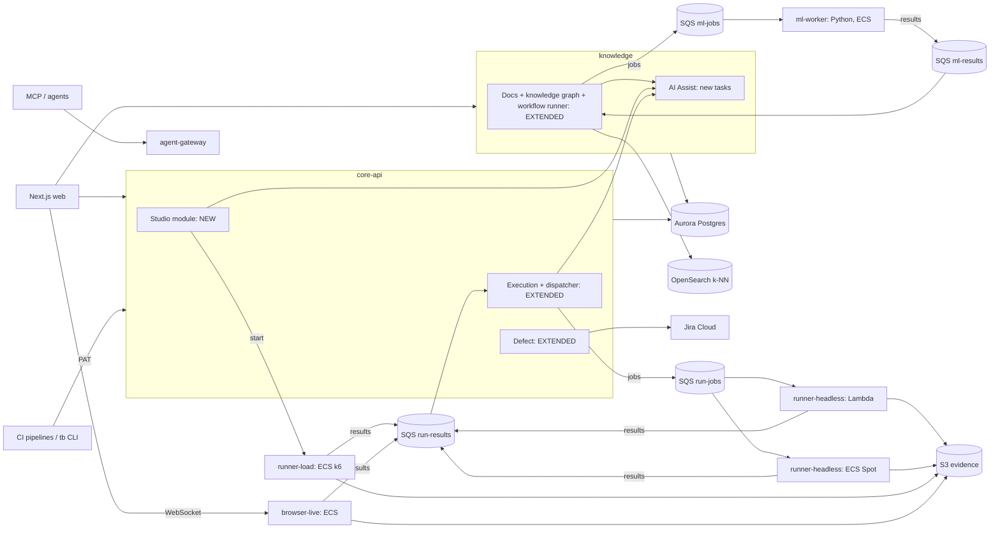
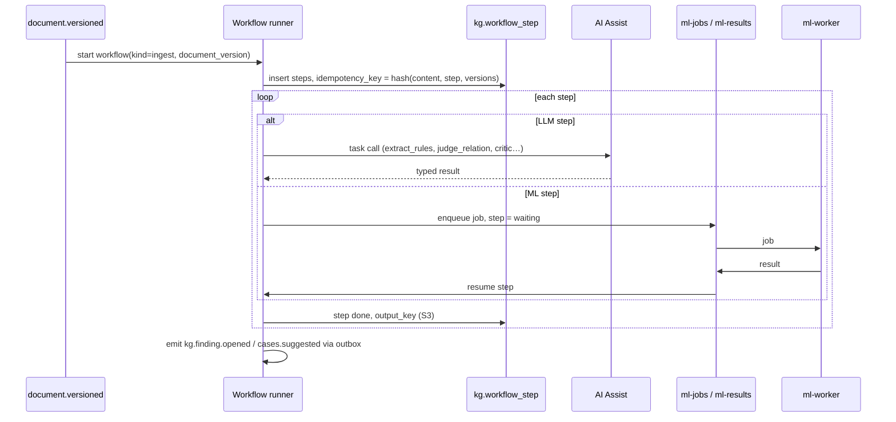
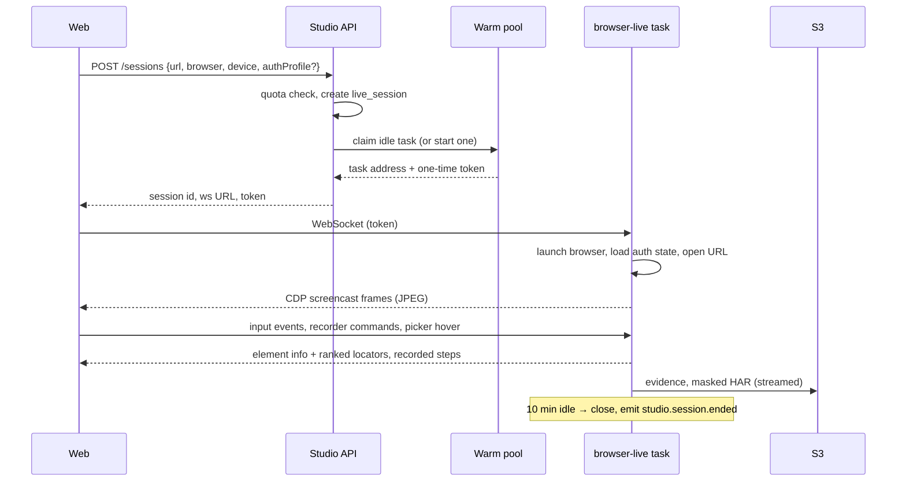

# Technical Design — Testing Studio and Requirements Intelligence

How the features in [testing-studio-plan.md](testing-studio-plan.md) and [requirements-intelligence-plan.md](requirements-intelligence-plan.md) are built on the existing platform. Build order is in [implementation-plan.md](implementation-plan.md).

**Builds on:** [HLD.md](HLD.md). Same rules apply unchanged: module boundaries with their own Postgres schema, `org_id` + RLS on every table, the transactional outbox, idempotent event consumers, Zod contracts in `@tb/contracts`, Kysely + SQL migrations, config-only differences between local and AWS.

---

## 1. Components



| Component | Deploy unit | Runtime | New / changed |
|---|---|---|---|
| **Studio** module | core-api | Node, ECS | New. Tests, steps, components, page library, environments, auth profiles, accounts, help requests, API catalog, load scenarios, findings, usage |
| **Execution** | core-api | Node, ECS | Extended: automated run items, dispatcher, results consumer, triage |
| **Defect** | core-api | Node, ECS | Extended: bug drafts, Jira attachment uploads |
| **Docs** | knowledge | Node, ECS | Extended: sections, API specs, knowledge graph, workflow runner, test design orchestration |
| **AI Assist** | knowledge | Node, ECS | New tasks (§8); same provider layer |
| **browser-live** | own ECS service | Node + Playwright image | New. One task per live session |
| **runner-headless** | Lambda + ECS Spot | Same Playwright image | New |
| **runner-load** | ECS | k6 image + small Node wrapper | New |
| **ml-worker** | own ECS service | Python 3.12 | New (§6) |

Studio sits in core-api because its API has the same request profile as Execution; the runners are separate because their scaling has nothing in common with request handling (HLD §1.1 split triggers).

**Repository layout additions**

```
/services
  studio/            Studio module (TS)
  runner/            shared runner core: step executor, evidence capture, masking (TS)
  browser-live/      live session server (TS, uses runner/)
  runner-headless/   Lambda + ECS entrypoints (TS, uses runner/)
  runner-load/       k6 wrapper (TS)
  ml/                Python ML worker
/deploy
  core-api/          mounts studio/ as well
/packages
  contracts/         + studio.ts, runner.ts, kg.ts, ml.ts
  platform/          + mask.ts (shared masking)
/docs/api/           generated OpenAPI files (§7.3)
```

---

## 2. Data model

All tables carry `org_id`, RLS policies and `created_at`; only the essential columns are listed.

### 2.1 `studio` schema (new)

| Table | Key columns | Notes |
|---|---|---|
| `test` | id, project_id, key_no, title, kind (`ui`/`api`/`journey`), case_id?, status (`draft`/`ready`/`quarantined`/`archived`), current_version, owner | One automated test; optional link to a repo case |
| `test_version` | id, test_id, version, steps jsonb, data_binding jsonb, intents jsonb, quality jsonb, created_by | **Immutable.** Runs pin a version |
| `page_element` | id, project_id, page, name, locators jsonb (ranked), last_verified_at | Central locators |
| `component` | id, project_id, name, kind (`steps`/`code`), inputs jsonb, current_version | |
| `component_version` | id, component_id, version, body jsonb or code_key, changelog, created_by | Tests reference `component_id@version`; upgrading is explicit |
| `environment` | id, project_id, name, base_url, variables jsonb, secret_refs jsonb, is_production, verified_domain_id? | |
| `auth_profile` | id, environment_id, role, login_method (`component`/`api`/`manual`), state_secret_ref, expires_at, check_url | Saved browser state lives in the secret store, not here |
| `test_account` | id, environment_id, role, username, secret_ref, state_secret_ref, status (`free`/`leased`/`locked`), leased_by?, lease_expires_at | Pool; lease by `SELECT … FOR UPDATE SKIP LOCKED` |
| `data_generator` | id, project_id, name, schema jsonb (fields, rules, relations, invariants), seed_policy | Produces rows at run time; can freeze into `repo.data_set` |
| `help_request` | id, test_id, test_version, step_index, status, note, context_key, assignee?, resolution_kind?, resolved_by?, confirmed_at? | §5.4 |
| `live_session` | id, user_id, environment_id?, browser, device, status, task_ref, started_at, last_activity_at, ended_at | |
| `api_endpoint` | id, project_id, method, path_template, request_schema, response_schemas, auth jsonb, sources text[], confidence, sample_count, first_seen, last_seen | API catalog |
| `load_scenario` | id, project_id, name, flow_test_id, profile jsonb, thresholds jsonb | |
| `load_run` | id, scenario_id, environment_id, status, peak_vus, summary jsonb, report_key, aborted_reason? | |
| `finding` | id, project_id, kind (`a11y`/`seo`/`security`/`perf`/`visual`), rule, severity, fingerprint (unique per project), page, status, suppress_reason?, suppress_until?, first_seen, last_seen, evidence_key | Deduped by fingerprint |
| `visual_baseline` | test_id, step_index, browser, viewport, image_key, approved_by | |
| `verified_domain` | id, domain, method (`dns`/`file`), token, verified_at | Required for load tests and active scans |
| `repo_connection` | id, project_id, git_url, branch, secret_ref | Existing Playwright repos |
| `usage` | org_id, period, metric, quantity | Metering (§11) |

### 2.2 Changes to existing schemas

| Schema.table | Change |
|---|---|
| `exec.run` | + `max_parallel` (default 10), `trigger` (`manual`/`schedule`/`ci`) |
| `exec.run_item` | + `source` (`manual`/`automated`), `test_version_id?`, `dispatch_state` (`queued`/`in_flight`/`done`), `attempt`, `flaky`, `data_seed`, `browser`, `device` |
| `exec.evidence` | + `kind` (screenshot/video/trace/console/network/har/report), `step_index`, `masked` |
| `exec.triage` (new) | run_item_id, class (`product`/`test`/`environment`/`data`/`flaky`), signals jsonb, confidence, cluster_id |
| `defect.bug_draft` (new) | id, run_item_id, facts jsonb, ai jsonb, status (`draft`/`sent`) |
| `defect.attachment` (new) | id, defect_id, evidence_id, jira_attachment_id?, status (`pending`/`uploaded`/`failed`/`linked_only`), attempts |
| `docs.document` | + `kind` (`prd`/`umbrella_prd`/`api_spec`), `owner_id`, `lifecycle` (`draft`/`in_review`/`approved`/`superseded`) |
| `docs.section` (new) | id, document_version_id, anchor, path, heading, content_hash, text_key |
| `docs.requirement` | + `section_id`, `modality`, `change_type` (`cosmetic`/`refinement`/`semantic`) |
| `repo.data_set` | Unchanged; generators freeze into it (1,000-row cap stays) |

### 2.3 `kg` schema (new)

| Table | Key columns | Notes |
|---|---|---|
| `node` | id, project_id, kind (product/feature/document/section/requirement/rule/entity/actor/endpoint/journey/persona/test_condition), key, props jsonb, status (`proposed`/`confirmed`/`rejected`), confidence, provenance jsonb, extractor_version, valid_from, valid_to, recorded_at | Bitemporal |
| `edge` | id, src, dst, kind, props, status, confidence, provenance, valid_from, valid_to, recorded_at | Indexed on (src, kind), (dst, kind) |
| `alias` | entity_id, alias | Glossary |
| `finding` | id, kind (`overlap`/`conflict`), subtype, a_node, b_node, judges jsonb, confidence, status (`open`/`resolved`/`intentional`/`deferred`), owners uuid[], resolution jsonb | |
| `review_item` | id, target_kind, target_id, reason, uncertainty, assignee?, decision?, decided_by?, decided_at? | Human decisions = labels |
| `workflow_run` | id, kind, input jsonb, status, started_at, ended_at | §4 |
| `workflow_step` | id, run_id, name, status (`pending`/`running`/`waiting`/`done`/`failed`), attempts, idempotency_key (unique), input_key, output_key, error, next_attempt_at | |
| `eval_run` | id, suite, versions jsonb, metrics jsonb, passed | Regression gate |

Traversals use recursive CTEs with a depth limit. If traversal latency becomes a problem, the node/edge model moves to Neptune without a model change.

### 2.4 S3 layout

```
{org}/{project}/evidence/{run}/{item}/{step}-{kind}.{ext}     screenshots, video, trace, console, network
{org}/{project}/sessions/{session}/…                          live session evidence, masked HAR
{org}/{project}/help/{request}/context.zip                    DOM snapshot, trace, screenshot
{org}/{project}/visual/{test}/{step}/{browser}-{viewport}.png baselines
{org}/{project}/load/{load_run}/report.json|html
{org}/{project}/docs/{document}/{version}/sections/{anchor}.txt
{org}/{project}/kg/workflow/{run}/{step}.{input|output}.json
{org}/{project}/studio/components/{component}/{version}.ts    code components, ejected tests
```

Lifecycle rules: evidence for passing runs expires after 30 days, failures after 180 days. Workflow payloads expire after 30 days.

---

## 3. Events

Added to `EVENT_TYPES` in `@tb/contracts`, same envelope and outbox.

| Event | Producer | Consumers |
|---|---|---|
| `studio.test.saved` / `studio.test.ready` / `studio.test.quarantined` | Studio | Search indexer, Analytics, Notification |
| `studio.component.versioned` | Studio | Studio (impact run), Notification |
| `studio.help.requested` / `studio.help.resolved` | Studio | Notification, Analytics |
| `studio.session.started` / `studio.session.ended` | browser-live | Studio (usage), Studio (API catalog ingest) |
| `studio.api_catalog.updated` | Studio | Docs (graph), AI (suggestions) |
| `studio.finding.opened` | Studio | Notification, Analytics |
| `studio.load_run.completed` | Studio | Analytics, Defect (on threshold breach), Notification |
| `result.recorded` | Execution | Existing consumers; `data.source` now `manual` or `automated` |
| `run.item.triaged` | Execution | Defect (draft for product bugs), Studio (help queue for test issues), Notification (environment issues) |
| `defect.draft.ready` | Defect | Notification (tester to review) |
| `document.versioned` | Docs | Docs workflow runner (existing event, new consumer) |
| `requirement.changed` | Docs | Repository (flags), Studio (flag scripts), Notification; `data.change_type` added |
| `kg.finding.opened` / `kg.finding.resolved` | Docs | Notification, Analytics |
| `cases.suggested` | Docs | Notification (review queue) |
| `usage.threshold_reached` | Studio | Notification |

Queue messages (run jobs, run results, ML jobs, ML results) are **not** domain events. They are typed job messages with their own Zod contracts (`runner.ts`, `ml.ts`) and carry W3C `traceparent` for tracing.

---

## 4. Workflow runner (Docs module)

Multi-step pipelines (ingestion → extraction → … → proposal) run on a small Postgres-backed workflow runner rather than AWS Step Functions.

**Why:** local compose uses ElasticMQ and SeaweedFS, not LocalStack, so Step Functions would break local parity (HLD §10). The pipelines are linear with retries, which a steps table covers. Revisit Step Functions if workflows need parallel fan-out beyond what SQS gives.



- A step whose idempotency key already has a `done` row is skipped, so re-running a document costs nothing for unchanged sections.
- Failed steps retry with backoff (`next_attempt_at`); after the retry limit the run is `failed` and visible in an admin view.
- A sweeper marks `waiting` steps as timed out after a limit. It runs on the scheduler the platform already uses.

**Workflows**

| Workflow | Steps |
|---|---|
| `ingest_document` | parse → section hashes → classify clauses → extract requirements + rules (LLM) → ground spans → normalise → align versions → classify changes → entity resolution → emit `requirement.changed` |
| `ingest_api_spec` | parse + dereference → endpoints to Studio catalog → constraints to rules → align versions |
| `relate` | candidate pairs → Z3 → NLI → LLM judge → critic → calibrate → propose / queue |
| `design_tests` | test model (partitions, boundaries, tables, transitions, pairwise) → conditions → write cases (LLM) → data profiles → quality gate → dedupe → minimise → prioritise → review queue |
| `journeys` | process mining → Markov model → path selection → persona binding → review queue |

---

## 5. Testing Studio internals

### 5.1 Step model

```ts
// @tb/contracts studio.ts: shape only, the Zod schema is the source of truth
Step = {
  id, action: 'open'|'click'|'type'|'select'|'verify'|'use_component'|'code'|'api_request'|'manual',
  target?: { elementId } | { locator },          // page library reference preferred
  value?: string,                                // may contain {data.x} {secret.x} {env.x}
  component?: { id, version, inputs },
  code?: { key },                                // S3, for code steps
  request?: { method, url, headers, body, extract[] },
  assertions: Assertion[],                       // hard | soft
  intent: string,
}
```

The generator (in `services/runner`) turns a pinned `test_version` into Playwright code at run time. Reliability rules (testing-studio-plan §5.1) live in the generator and in save-time validation, so invalid steps can't be saved.

### 5.2 Live sessions (browser-live)



- The WebSocket goes to the task through the ALB with sticky routing by session id. The token is single-use and bound to the user and the session.
- The picker and recorder are injected scripts; the recorder cleanup pipeline runs in the task.
- The warm pool keeps N idle tasks (N configurable, default 5) up to the 30-session cap.

### 5.3 Headless runs and dispatch

- **Dispatcher** (Execution module) is triggered by `run.created`, by result messages and by a periodic sweep. It picks queued items per run while `in_flight < max_parallel`, round-robin across runs, batches 3–5 UI tests (or ~50 API tests) by past duration, and sends one SQS message per batch.
- Routing: Chromium tests under ~10 min → Lambda queue; Firefox/WebKit, long tests, scans → ECS queue.
- Lambda: reserved concurrency 25, SQS event source maximum concurrency 25, batch size 1 message. ECS Spot workers poll their own queue with their own cap.
- Runner flow per test: resolve environment + secrets → lease test account (or auth profile) → generate data from seed → generate code → run in a fresh context → capture evidence → mask → upload → send result message → release lease.
- **Results consumer** writes `run_item` results, evidence rows and `result.recorded`; a failed test is re-queued once; pass on retry sets `flaky`.
- **Triage** runs after a failure: signals (console, network, DOM diff vs last pass, other failures in the same window, retries) → class. Rules first, the AI `classify_failure` task only for ambiguous cases. Failures with the same signature in one run share a `cluster_id`.

### 5.4 Help requests

States: `open → picked → in_progress → needs_info → resolved → confirmed`. On creation, the runner's failure context (screenshot, DOM snapshot, trace, candidate locators, error) is zipped to `help/{id}/context.zip`. Resolution kinds: `locator_fix`, `component`, `code_step`, `data_fix`, `manual_step`. Pair mode reuses the live session WebSocket with a second, read-mostly viewer that can request control.

### 5.5 Components and impact

Tests reference components by version. Publishing `component_version` n+1 triggers an **impact run**: every `ready` test using the component runs against n+1 in a scratch run. The author sees pass/fail per test before choosing "upgrade all passing" or "upgrade selected". Rollback means pointing tests back to version n.

### 5.6 Auth profiles and account pool

- Login happens once per (environment, role) or per pooled account; Playwright storage state is saved **encrypted in the secret store** with an expiry.
- Before use, the runner opens `check_url`. A redirect to login triggers a fresh login via the profile's method.
- Account leases use `FOR UPDATE SKIP LOCKED` with a lease expiry, so a crashed runner can't hold an account forever.
- Manual login method: the tester completes SSO/2FA once in a live session, and the state is captured from there.

### 5.7 API catalog

The live session streams masked request/response metadata to Studio. An ingest job normalises paths (numeric/UUID/slug segments → parameters), merges samples into `api_endpoint`, and infers JSON schemas with per-field presence counts (confidence). OpenAPI uploads write through the Docs `ingest_api_spec` workflow into the same table with `sources = ['spec']`.

### 5.8 Load runs

Scenario → k6 script generated from the flow test's API steps and the data generator. `runner-load` starts K ECS tasks (K = ceil(peak VUs / per-task VUs)), each running k6 with its share. Metrics stream to Studio for the live dashboard; the wrapper enforces the auto-abort limit and the plan's VU/duration caps. Start is refused unless the environment's domain is verified and, for production, an admin override is recorded.

### 5.9 Passive scans

Run inside the runner after page loads: axe-core, header/cookie/TLS checks from captured responses, Lighthouse on scheduled runs only (too slow per step). Findings are fingerprinted `hash(kind, rule, normalised selector or header, page template)` and upserted.

---

## 6. ML worker (Python)

| Aspect | Design |
|---|---|
| Runtime | Python 3.12, `uv` for dependencies, one container image, CPU only |
| Interface | Consumes `ml-jobs`, produces `ml-results`; health endpoint for ECS. No public API |
| Contracts | Zod in `@tb/contracts/ml.ts` → JSON Schema (`z.toJSONSchema`) → Pydantic models via `datamodel-code-generator` at build time. CI fails if generated models are stale |
| Models | Weights baked into the image (offline-capable): SetFit classifier on a small sentence-transformer, DeBERTa-class NLI cross-encoder, MiniLM-class reranker |
| Embeddings | **Not** computed here; they come from the AI layer (one embedding space, tenant policy applies) and are passed in or read from OpenSearch |
| LLM calls | None. All LLM work stays in AI Assist |
| Scaling | ECS service autoscaled on `ml-jobs` queue depth; 4–8 GB memory per task |

**Job types**

| Job | Library |
|---|---|
| `parse_document` | Docling |
| `classify_clauses` | SetFit |
| `normalise_values` | Own rules (units, currency, numbers, dates) |
| `rerank` | sentence-transformers cross-encoder |
| `nli` (batch of pairs) | NLI cross-encoder |
| `cluster_mentions` | scikit-learn HDBSCAN |
| `z3_check` (rules → SAT/UNSAT + conflicting conditions) | z3-solver |
| `align_versions` | scipy `linear_sum_assignment` (Hungarian) |
| `calibrate` / `score` | scikit-learn logistic regression + isotonic |
| `test_model` (partitions, boundaries, decision tables, transitions, pairwise, MC/DC) | Own code + covering-array generation |
| `set_cover` (minimisation) | Greedy; OR-Tools CP-SAT for small suites |
| `graph_metrics` (centrality, communities, path cover) | networkx (PageRank, Leiden via igraph/leidenalg) |
| `process_mining` | pm4py |
| `solve_data` (constraint → values) | z3-solver |
| `synthesize_data` | SDV (Gaussian copula / CTGAN) |
| `spec_mutation` | Own code over typed rules |

---

## 7. APIs

All routes are project-scoped (`/projects/:projectId/...`), authenticated like existing routes, and defined with Zod through `fastify-type-provider-zod`.

### 7.1 New and changed endpoints

**Studio**

| Method + path | Purpose |
|---|---|
| `POST /sessions` · `DELETE /sessions/:id` | Start / end a live session |
| `GET/POST /tests` · `GET/PATCH /tests/:id` | Tests |
| `POST /tests/:id/versions` · `GET /tests/:id/versions/:v` | Save / read a version |
| `POST /tests/from-session` · `POST /tests/from-english` · `POST /cases/:caseKey/automate` | Create drafts |
| `POST /tests/:id/validate` | Live validation of steps |
| `POST /tests/:id/submit` · `POST /tests/:id/approve` | Quality gate + review → `ready` |
| `POST /tests/:id/eject` | Convert to code |
| `GET/POST /components` · `POST /components/:id/versions` · `POST /components/:id/impact` | Components + impact run |
| `GET/POST/PATCH /page-elements` | Page library |
| `GET/POST /environments` · `GET/POST /auth-profiles` · `POST /auth-profiles/:id/refresh` | Environments, auth |
| `GET/POST /test-accounts` | Account pool |
| `GET/POST /data-generators` · `POST /data-generators/:id/preview` · `POST /data-generators/:id/freeze` | Data |
| `GET/POST /help-requests` · `POST /help-requests/:id/transition` | Help workflow |
| `GET /api/endpoints` · `POST /api/import` (openapi/har/postman/curl) · `POST /api/endpoints/:id/test-pack` | API catalog |
| `GET/POST /load/scenarios` · `POST /load/runs` · `POST /load/runs/:id/abort` | Load |
| `GET /findings` · `POST /findings/:id/suppress` | Findings |
| `POST /verified-domains` · `POST /verified-domains/:id/verify` | Ownership |
| `GET/POST /repo-connections` | Existing Playwright repos |
| `GET /usage` | Metering |

**Execution / CI**

| Method + path | Purpose |
|---|---|
| `POST /runs` | Accepts automated items (tests or suites), `max_parallel`, browsers |
| `GET /runs/:id/items?triage=` | Filter by triage class |
| `POST /ci/runs` · `GET /ci/runs/:id` | PAT-authenticated trigger and status for pipelines; used by `tb run --wait` in `packages/cli` |

**Defect**

| Method + path | Purpose |
|---|---|
| `POST /defects/drafts` | Build a draft from a run item (facts + AI text) |
| `PATCH /defects/drafts/:id` · `POST /defects/drafts/:id/send` | Tester edits, then sends |
| `GET /defects/:id/attachments` | Upload status |

**Docs / knowledge**

| Method + path | Purpose |
|---|---|
| `POST /documents` (kind `api_spec` added) | Existing, extended |
| `GET/POST /features` · `GET /features/:id` | Feature tree + feature page |
| `GET/POST /glossary` | Entities + aliases |
| `GET /graph/neighbourhood?node=&depth=&kinds=&asOf=` | Graph explorer |
| `GET /kg-findings` · `POST /kg-findings/:id/resolve` | Overlap / conflict inbox |
| `GET /impact?requirementId=` | Impact preview |
| `GET /review-queue` · `POST /review-queue/:id/decide` | Human review |
| `GET /coverage?feature=` · `POST /coverage/gaps/:id/generate` | Coverage heatmap, gap generation |
| `POST /journeys/generate` | Journey workflow |
| `POST /ask` | Knowledge base Q&A |

### 7.2 Internal messages

| Queue | Message | Contract |
|---|---|---|
| `run-jobs-lambda`, `run-jobs-ecs` | `{ runId, items[], testVersionIds, environmentId, seed, traceparent }` | `runner.ts` |
| `run-results` | `{ itemId, attempt, status, stepResults[], evidenceKeys[], signals, durationMs }` | `runner.ts` |
| `ml-jobs` / `ml-results` | `{ jobId, type, input | inputKey }` / `{ jobId, output | outputKey, error? }` | `ml.ts` |

### 7.3 OpenAPI for our own APIs

- Register `@fastify/swagger` in each deploy unit with `jsonSchemaTransform` from `fastify-type-provider-zod`; the spec is generated from the same Zod schemas the routes already use.
- Each unit serves `/openapi.json`; a script exports them to `docs/api/{unit}.json`. The exported files are committed so API changes show up in PR diffs, and CI fails if they're stale.
- No hand-written YAML.

---

## 8. AI Assist additions

New tasks in `services/ai/src/tasks.ts`, each with a Zod output schema, a mock and versioned prompts:

| Task | Used by |
|---|---|
| `english_to_steps`, `infer_intent`, `suggest_assertions` | Studio |
| `classify_failure`, `draft_bug_report` | Execution triage, Defect |
| `extract_rules` | Docs ingest |
| `judge_relation`, `critic`, `clarify` | Docs relate |
| `write_cases_from_conditions`, `judge_case_quality` | Docs design_tests |
| `answer_question` | Docs Q&A |

`generate_cases` stays for backward compatibility and is replaced in the UI by condition-driven generation once `design_tests` ships. Its 40k-character cut is removed by section chunking.

**Offline mode** (`AI_MODE=local`): all tasks run on Ollama through the existing layer. English → steps and relation judging are slower and less accurate; the UI labels results from local models. The ML worker is offline by design.

---

## 9. Jira evidence and bug reports

**Jira is connected per tester, not per organisation** (built in `services/defect/src/accounts.ts`, migration `0015`):

| Piece | Design |
|---|---|
| `defect.jira_connection` | One row per person: site, email, Jira account id and display name, API token encrypted with `JIRA_TOKEN_SECRET` |
| Actions as the tester | Log bug, link bug, link issue to case, retest comments and reopen all use the caller's own client, so Jira shows their name |
| Viewing | Defect lists and details read our synced copies and need no Jira account |
| Background sync | Each defect is read through its reporter's connection, else another active connection on the same site; with none, the sync status says why |
| Webhooks | Removed with the platform account (they need one account to register them). A project sync account with webhooks is a later option |
| `defect.jira_project_map` | Project → site + Jira key + issue type, verified through the admin's connection. Unmapped projects keep the old convention (same key, reporter's site) |
| SSRF guard | Connected site URLs must match `JIRA_SITE_PATTERN` (Jira Cloud only by default) |
| OAuth ("Connect with Atlassian") | Next step; needs an Atlassian developer app registered by the operator |

- `bug-report.ts` gains the extra facts sections (testing-studio-plan §10.3). It stays a pure function with tests.
- AI text (`draft_bug_report`) is stored separately in `bug_draft.ai` and merged into the description only after the tester's edit.
- Sending creates the issue, then enqueues attachment uploads (`defect.attachment`). A worker claims them with `defect.claim_attachment()`, uploads each file from S3 to `POST /rest/api/3/issue/{key}/attachments` as the person who logged the bug (multipart, `X-Atlassian-Token: no-check`), retries with backoff (2, 4, 8, 16 min), and marks files above the site's upload limit (`/rest/api/3/attachment/meta`) `linked_only`.
- The annotated failure screenshot is produced by the runner at failure time (element box + label drawn on the image).

---

## 10. Security

| Area | Design |
|---|---|
| **Runner isolation** | Runners live in dedicated subnets whose security groups allow egress to the internet through NAT only: no route to RDS, OpenSearch, Valkey or internal ALBs. IMDSv2 with hop limit 1. Each session or batch uses a fresh browser context; each live session a fresh task |
| **User code** (code steps, code components) | Runs only inside runner sandboxes. Never evaluated in API services |
| **Runner credentials** | No broad IAM. Evidence upload via presigned URLs scoped to the run prefix; secrets fetched with a short-lived token scoped to the run's environment |
| **Secrets** | Secret store (AWS Secrets Manager) for credentials and saved browser state; step JSON only holds references |
| **Masking** | `packages/platform/mask.ts` is used by every capture path: auth headers, cookies, tokens, passwords, emails, phones in HAR/network/console; Playwright's screenshot `mask` option for configured selectors; trace ZIPs post-processed to strip headers and cookies before upload |
| **Egress IPs** | NAT Elastic IPs published for customer allowlists |
| **Load + active scans** | Verified domain, non-production default, logged admin override for production, caps, auto-abort, audit events |
| **Tenancy** | RLS on every new table; S3 keys prefixed by org and project; presigned URLs short-lived |
| **Audit** | Session starts, production overrides, secret reads, load runs and scans emit audit events |

---

## 11. Metering and quotas

| Metric | Source | Enforced at |
|---|---|---|
| Live session minutes | `studio.session.*` events | Session start (429 with reason) |
| Headless test-seconds | Result messages | Run dispatch |
| AI tokens | Existing `ai` usage tracking | AI layer (existing budgets) |
| Load VU-minutes | `load_run` summary | Load start |
| Evidence storage | S3 inventory | Retention + plan cap |

`usage.threshold_reached` fires at 80% and 100% and goes to org admins through Notification.

---

## 12. Local development

| Cloud | Local |
|---|---|
| ECS live sessions | `browser-live` compose service running sessions as local browser processes, same image and code |
| Lambda headless | `runner-headless` handler run as a Node process polling ElasticMQ (same pattern as HLD §10 Lambda handlers) |
| ECS Spot / load | Same containers in compose (`runner-headless-ecs`, `runner-load` with k6) |
| SQS | ElasticMQ (already in compose) |
| S3 | SeaweedFS (already in compose) |
| Secrets Manager | Local secrets file behind the same interface |
| ml-worker | `ml` compose service under the `ai` profile |
| Jira attachments | Provider sandbox Jira mock (add an attachments endpoint) |

New compose profile **`studio`**: browser-live (~2 GB), runner-headless (~2 GB), ml under `ai`. `studio` + `ai` together stay under the 20 GB WSL cap only without `perf`.

---

## 13. Observability

- `traceparent` flows web → API → dispatcher → SQS → runner → results → Execution, so one failed test is one trace.
- Metrics: live sessions active/idle/pool size, session start latency, queue depth per queue, dispatch lag, test duration, pass/flaky/fail rate, triage class counts, Jira upload failures, ML job latency by type, workflow step failures, eval metrics per `eval_run`.
- Alerts: queue age > 5 min, pool exhausted, Jira upload failure rate, workflow failure rate, eval regression.

---

## 14. MCP tools (agent-gateway)

Added to the existing tool list: `create_script_from_english`, `run_tests`, `get_run_failures`, `get_bug_draft`, `get_coverage`, `ask_knowledge_base`, `list_kg_findings`. Same OAuth and permission checks as existing tools.

---

## 15. Open technical decisions

| Decision | Default | Revisit when |
|---|---|---|
| Workflow engine | Postgres steps table + SQS | Workflows need wide parallel fan-out or human-wait steps longer than days |
| Live session compute | Fargate | Cost per session hour justifies EC2-backed capacity |
| Streaming | CDP screencast (JPEG over WebSocket) | Users report lag; then WebRTC |
| Lambda architecture | x86_64 | Chromium arm64 builds proven stable in our image |
| Graph store | Postgres | Traversal p95 > 500 ms at real data sizes |
| Trace masking | Post-process trace ZIP | Playwright adds native header redaction |
