# Testing Studio — Product Plan

A testing workspace inside TestBench where manual testers turn their tests into reliable automation, by performing actions or writing plain English. Senior automation engineers step in where a tester gets stuck. The same workspace covers API and load testing, suggests test cases, generates realistic data, and runs cross-browser, visual, accessibility, SEO, performance and security checks. Evidence is captured automatically and travels with every Jira bug.

**Companion to:** [HLD.md](HLD.md). Everything here plugs into the existing services (Execution, Repository, Defect, AI Assist, Search, Analytics, Notification, Collaboration).
**Related:** [requirements-intelligence-plan.md](requirements-intelligence-plan.md) (test design, coverage, journeys, data), [technical-design.md](technical-design.md), [implementation-plan.md](implementation-plan.md).
**Primary user:** a tester who knows testing but may not write code. **Backup:** a senior automation engineer in the same team.
**Goal:** manual testers produce most of the automation themselves. Target: about 80% less effort after a case's first run. This is a hypothesis, measured at the V1 validation gate (§13).
**Out of scope:** native mobile app testing (§15).

---

## 1. Core loop and roles

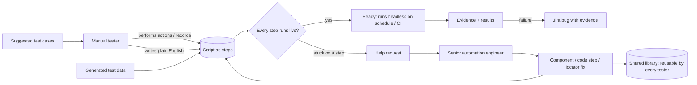

| Role | Does | Never needs to |
|---|---|---|
| **Manual tester** | Runs manual cases, creates scripts through actions or English, picks data, reviews suggestions, raises help requests | Write code |
| **Senior automation engineer** | Answers help requests, builds components and code steps, maintains the page library, reviews flaky tests | Re-write whole tests that a tester started |
| **QA lead** | Reviews suggested cases, watches coverage, stuck-rate and flaky reports, owns release gates | Touch the scripts |

Roles are custom roles in IAM (HLD §5.11). "Automation Engineer" is a role within the customer's own team.

**Where the saving comes from**

| Activity | Today | With Testing Studio | Saving |
|---|---|---|---|
| Manual run with evidence | Run, screenshot, paste, write notes | Run, click pass/fail | ~50–60% |
| Logging a bug | Reproduce, capture, write steps, fill Jira | One click, everything attached | ~80–90% |
| Writing an automation script | Code, find locators, debug, add asserts | Review the draft from the manual run or English | ~80–90% |
| Getting unstuck | Tester gives up, or a senior rewrites the test | Senior fixes one step, and the fix is reusable | ~70% |
| Maintaining scripts after UI change | Hunt broken locators across files | Central locators + heal proposals | ~70–80% |
| Re-running regression | Manual again | Scheduled, automatic | ~95% |
| Test data | Made by hand | Generated per run | ~90% |

---

## 2. Shared core

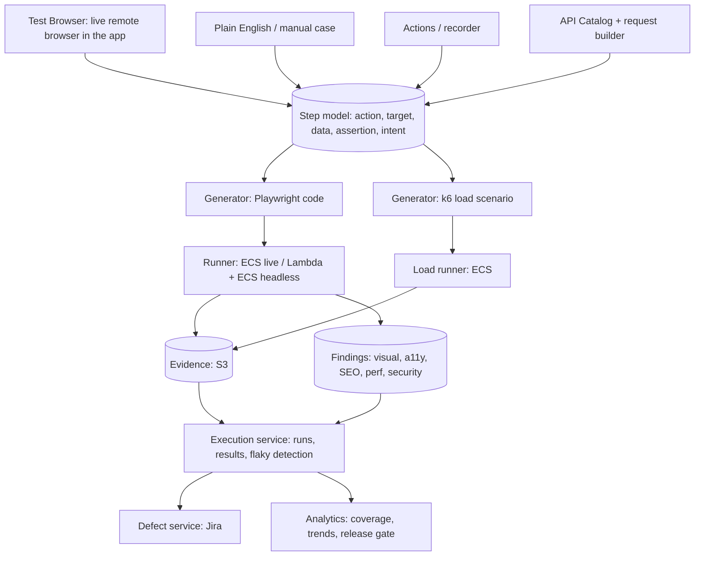

| Piece | What it is |
|---|---|
| **Test Browser** | A real browser session streamed into the TestBench pane. Used for manual testing, recording, locator picking and live validation |
| **Step model** | The single source of truth for a test: structured steps, not code. Not tied to Playwright, so another engine can be added later |
| **Generators** | Turn steps into Playwright code (functional) or k6 scripts (load). Reliability rules (§5) are enforced here |
| **Runner** | One Playwright image used everywhere, so a test behaves the same in the live pane and headless |
| **Evidence + Findings** | One format for every kind of test, attached to run results and Jira bugs |

**Principle: AI at authoring time, never at run time.** AI helps write, suggest, map and heal. What runs is fixed, generated code, so results repeat and AI cost stays predictable.

### 2.1 Storage

Everything lives in our system, on the existing stack: PostgreSQL (Kysely + SQL migrations) for structured data, S3 for files. No Git dependency. Tables carry `org_id` with RLS (HLD §8).

| Data | Store | Why |
|---|---|---|
| Test definitions (step model) | Postgres JSONB, one row per version | Structured and queryable (by component, locator, intent), flexible while the model evolves |
| Test versions | Immutable rows; a run pins the version it ran | Results stay explainable after edits |
| Page library, components | Postgres | One locator fix updates every test that uses it |
| Help requests | Postgres, linked to test + step | Queue, history, metrics |
| Data sets, generators, seeds | Postgres | Reproducible data per run |
| API catalog, collections, load scenarios | Postgres | Shared by API and load testing |
| Findings, baselines, suppressions | Postgres | Dedupe and trends |
| Secrets | Existing secret store, referenced by key | Never inside step JSON or exports |
| Generated code | Not stored; regenerated from the pinned version | One source of truth |
| Ejected code-only tests | S3, versioned, pointer in Postgres | Files, not steps |
| Evidence, traces, HAR, baselines, load reports | S3, keys in Postgres | Large binaries; lifecycle expiry (§16) |

---

## 3. Creating scripts (manual tester)

### 3.1 Test Browser

- The user enters a URL. A container with Chromium starts (or comes from a warm pool) and streams to the pane over WebSocket (CDP screencast). Mouse and keyboard go back the same way.
- An iframe isn't used: most sites block framing, and cross-origin frames block inspection.
- Device picker (emulated phones, tablets, desktops), browser picker (Chromium, Firefox, WebKit), network throttling (3G, slow 4G, offline).

### 3.2 Manual execution (the starting point)

```
┌──────────────────────────────┬────────────────────────────┐
│  Live app                    │  Case TC-123: Checkout      │
│                              │  ✅ 1 Login as admin        │
│   [ the website ]            │  ✅ 2 Search "laptop"       │
│                              │  ▶  3 Add to cart           │
│                              │     Expected: count = 1     │
│                              │     [Pass] [Fail] [Block]   │
│                              │  ○  4 Checkout              │
│                              │  ── Evidence: 14 shots ●rec │
└──────────────────────────────┴────────────────────────────┘
```

- Case steps sit beside the app; the tester's actions link to the current step automatically.
- **Assist mode:** automated steps run by themselves; the tester only does the rest.
- **Exploratory mode:** a charter instead of a case; any moment becomes a bug or a new case (extends HLD §5.6).
- At the end: **"Save as script"** turns the session into a draft (§3.3).

### 3.3 Five ways to create a script

| Way | Who | How |
|---|---|---|
| **From a manual run** | Tester | The session's actions become steps, mapped to the case's steps |
| **Actions / recorder** | Tester | Click through the app; actions are cleaned into steps |
| **Plain English** | Tester | Write what to test; AI builds steps against the live page |
| **"Automate this case"** | Tester | An existing manual case's English steps go through the same English pipeline; the case link is automatic |
| **Step builder** | Tester / senior | Pick action, element, value, assertion from lists |

Teams with an existing Playwright repo can connect it; the runner runs it and results map to cases by tag (`@TC-123`).

**Actions / recorder pipeline**

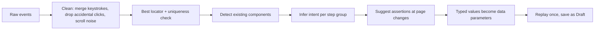

Recorder extras: **assert mode** (click any element to add a check), pause/resume, record into an existing test from step N, password fields replaced by secrets automatically.

**Plain English pipeline**

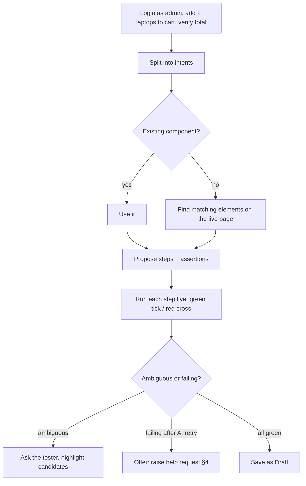

- Components are always reused before new steps are written.
- Values ("admin", "2", "laptops") become data parameters automatically.
- Expected first-try accuracy: 70–85% for clear sentences on well-labelled apps. Live validation, "ask, don't guess" and help requests cover the rest.
- English first; Hindi/Hinglish input later.

### 3.4 What a script looks like

| # | Action | Element | Value / data | Assertion | Intent |
|---|---|---|---|---|---|
| 1 | Use component | Login | role = `{data.role}` | Dashboard visible | Log in as the data row's role |
| 2 | Type | Search box | `{data.product}` | — | Search for product |
| 3 | Click | Add to cart | — | Cart count = `{data.qty}` | Add product to cart |
| 4 | Verify | Cart total | — | Text = `{data.price × data.qty}` | Confirm total reflects quantity |

`{data.x}` from the data set (§6), `{secret.x}` from the vault, `{env.x}` from the chosen environment.

### 3.5 Intent

Every step stores what it's trying to do. Intent powers heal proposals when the UI changes, suggested assertions, matching tests to manual cases, plain-language failure messages, regeneration after a redesign, and readable reports.

### 3.6 Suggestions while building

| When | Suggestion |
|---|---|
| Typing | Autocomplete from the project's own components and page library |
| After recording | "These 5 steps repeat in 4 tests. Ask a senior to make a component?" |
| Locator picked | "No test-id here; ask devs to add `data-testid`" |
| Step added | "No assertion after Submit. Add one?" |
| Test fails | "Button text changed from 'Submit' to 'Save'. Update?" (proposal, human approves) |
| Similar problem seen before | "Another tester was stuck here; component *Upload file* solved it" |

### 3.7 Engineer flexibility

| Tool | Use |
|---|---|
| **Code Step** | Raw Playwright for one step inside a no-code test |
| **Custom Component** | Code written once; appears to testers as a normal step with input fields |
| **Eject** | Whole test becomes pure code; one-way, with a warning |

No two-way code ↔ steps sync: arbitrary code can't be turned back into steps reliably.

**Component versioning.** Tests reference a specific component version. Publishing a new version runs every test that uses it against the new version first ("affects 200 tests: 196 pass, 4 fail"); the author upgrades the passing ones, fixes the rest, and can roll back at any time. A senior's edit never breaks tests overnight.

---

## 4. Stuck → senior help

The tester never has to give up on a test or hand the whole thing over. They flag one step, a senior fixes that step, and the fix goes into the shared library.

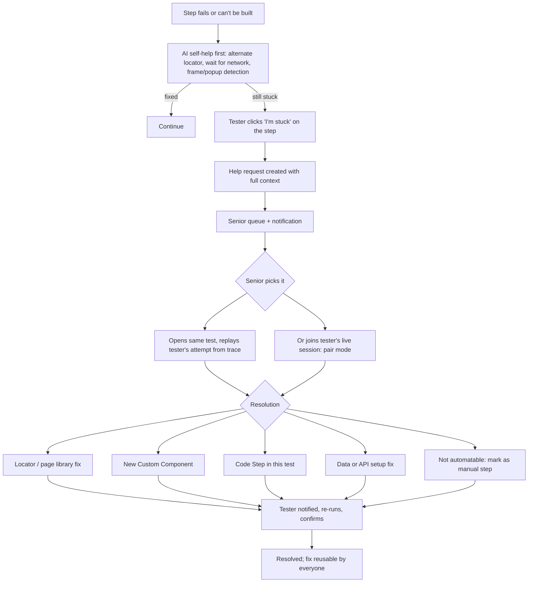

**What a help request carries (collected automatically)**

| Item | Why |
|---|---|
| Test, step, intent, tester's note ("what I tried") | The senior knows the goal, not just the error |
| Screenshot + DOM snapshot at the failure | The senior sees what the tester saw |
| Playwright trace of the attempt | Replay without reproducing |
| Error message, candidate locators tried | No repeated guesswork |
| Environment, browser, data row | Reproducible |

**States:** Open → Picked → In progress → Needs info (back to tester) → Resolved → Confirmed by tester. Requests age visibly; a lead can set a target response time.

**Notifications:** through the existing Notification service (in-app, Slack, Teams, email) to the project's Automation Engineers; the tester is notified on every state change.

**Pair mode:** the senior joins the tester's live Test Browser session (Collaboration service WebSocket), sees the same screen and can take control. Useful for problems that are faster to show than to describe.

**Hybrid tests:** when a step truly can't be automated (hardware token, physical check), it stays a manual step. Headless runs skip such tests; Assist mode runs the automated parts and pauses for the manual step.

**Common stuck points, with ready-made components shipped by default**

| Problem | Default component |
|---|---|
| OTP by email / SMS | Read OTP from test mailbox / SMS inbox (test services) |
| File upload / download | Upload file from test files; verify downloaded file |
| iframes, new tabs, popups | Switch frame / tab / handle dialog |
| SSO / 2FA login | Login once, reuse saved auth state |
| CAPTCHA | Use the provider's test keys or a test-environment bypass |
| Date pickers, sliders, drag-drop | Set date / set value / drag element |
| Shadow DOM, canvas, charts | Pierce shadow DOM; assert via API or data attribute |

**Learning loop:** stuck-rate by app, page and reason is reported to leads. The top reasons tell seniors which components to build in advance. Resolutions become suggestions for the next tester who hits the same pattern.

---

## 5. Reliability and assertions

### 5.1 Reliability rules (enforced by the generator)

| Rule | Enforcement |
|---|---|
| No hard sleeps | The action doesn't exist; auto-waiting everywhere |
| Stable locators | test-id → role + name → label/placeholder/text → CSS; XPath blocked in no-code; uniqueness checked on save |
| Central locators | Elements live in the page library; fix once, fixed everywhere |
| Web-first assertions | Only auto-retrying assertions are generated |
| Isolation | Fresh browser context per test; login via saved auth state, not test chaining |
| Unique data | Each run gets its own generated data (§6) |
| Honest retries | Pass-on-retry is marked flaky, never green; flaky tests can be quarantined |
| Quality gate | A new test runs 3× in parallel and must pass all 3 before it's Ready |
| Script review | After the quality gate, a senior or lead approves the script before it enters regression suites |
| Heal = proposal | Heal proposals need approval; silent healing hides real bugs |

### 5.2 Assertions

- An action that changes the page needs an assertion; the test won't save without one unless the tester marks "no check needed".
- Suggested automatically after recorded actions (URL changed, toast appeared, row count changed).
- Builder: element (visible, enabled, text, value, attribute, count), page (URL, title), data (matches data row, numeric compare), API (status, body field), visual (screenshot vs baseline), accessibility (no critical violations).
- Hard assertions stop the test; soft ones record and continue.
- A lint pass flags weak tests ("only checks the page loaded").

---

## 6. Test data generation

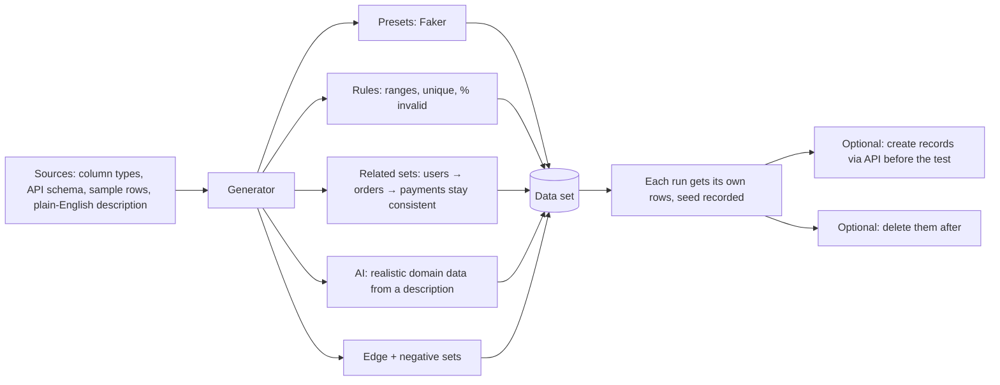

| Capability | Detail |
|---|---|
| **Presets** | Names, emails, phones, addresses, dates, amounts, IDs; Indian locale (Indian names, +91 phones, PIN codes, PAN-format and IFSC-style strings, ₹ amounts) |
| **Rules** | Min/max, length, regex, unique across the set, "10% invalid rows", distributions |
| **From schema** | Fields, formats and enums in the API catalog drive valid values automatically |
| **Related data** | Parent/child sets keep references valid: an order's `userId` points at a generated user |
| **AI-generated** | "50 insurance claims with realistic edge cases": output validated against the schema before use |
| **Edge and negative sets** | Empty, max length, unicode, emojis, special characters, boundaries, wrong types, generated per field |
| **Per-run uniqueness** | Parallel runs never collide (e.g. email includes the run ID) |
| **Reproducible** | The generator seed is stored with the run, so a failed run can be replayed with the exact same data |
| **Freeze** | A generated set can be frozen as a static data set for stable regression |
| **Seeding and cleanup** | Records created via API before a test and removed after (§8.3) |
| **Safety** | Production data is never used; uploaded samples are masked |

Data sets bind to tests for DDT (one run per row) and to load scenarios (unique data per virtual user). Generators can freeze their output into the Repository's existing data sets (`repo.data_set`). Scenario-aware data (constraint solving, invariants, stateful setup) is in [requirements-intelligence-plan.md](requirements-intelligence-plan.md) §7.

### 6.1 Auth profiles and test account pool

| Kind of shared state | Use |
|---|---|
| **Auth profile** (environment + role) | Log in once, save the browser session (Playwright storage state), reuse it in automated tests and in "Start as role" live sessions |
| **Account pool** | Several accounts per role, each with its own saved session; a test leases one and returns it, so parallel tests never share a user |
| State passed between tests | **Not supported**: tests would depend on order. Use API setup instead |

- Login methods: a Login component, an API call, or the tester completing SSO/2FA once by hand in a live session.
- Before use, a protected page is opened; if it redirects to login, the session is refreshed automatically.
- Saved sessions are credentials: encrypted in the secret store, never in evidence, traces or Jira, access logged, short expiry, production profiles off by default, test accounts only.
- Read-only tests may share one profile; tests that change data, or apps that allow one session per user, use the pool.

---

## 7. Test-case suggestions

Suggestions are drafts. They go through the existing review workflow; nothing is added without a human accepting it.

| Source | Suggests |
|---|---|
| **PRDs / requirements** (Docs service + AI Assist `extract_requirements`, `generate_cases`) | Cases per requirement; flags requirements with no cases |
| **Jira stories** | Acceptance-criteria cases for new stories |
| **API catalog** | Per-endpoint packs: happy path, validation, auth (401/403), not found, boundaries |
| **Recorded sessions** | Paths testers walked that have no case yet |
| **Existing cases** | Negative and boundary variants; missing input combinations (pairwise) |
| **Defects** | A regression case for every fixed bug that has none |
| **Code or API changes** | Which existing cases to run for this build (AI Assist "choose tests based on what changed") |
| **Coverage gaps** | Modules, endpoints or requirements with low coverage |

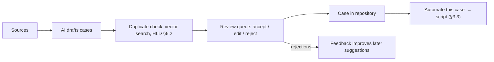

---

## 8. API testing

API tests run on the same runner using Playwright's request API. No browser, so they're cheap.

### 8.1 Finding the APIs (no Swagger needed)

| Source | Notes |
|---|---|
| **Auto-probe** | Checks common spec paths (`/v3/api-docs`, `/openapi.json`, `/swagger/v1/swagger.json`, `/api-docs`, `/swagger.json`, `/graphql`) |
| **Traffic capture** | Main source. Every Test Browser session feeds the catalog: noise filtered, paths normalised (`/orders/123` → `/orders/{id}`), schema inferred with confidence, auth and dependencies detected |
| **Imports** | HAR, Postman, Insomnia, Bruno, pasted cURL |
| **Spec upload** | OpenAPI/Swagger, GraphQL introspection |

Masked network capture starts in the MVP, so the catalog already exists when API testing ships. The catalog can be exported as an OpenAPI spec.

### 8.2 Building API tests

| Feature | Detail |
|---|---|
| Test packs | One click per endpoint: positive, validation, auth, not found, boundaries |
| Chaining | "`id` from `POST /orders` fits `{orderId}` in `GET /orders/{orderId}`. Link?" |
| Auto-assertions | Status, schema match, required fields, response time |
| CRUD flows | Create → Read → Update → Delete → verify 404 |
| Schema drift | Response fields or types that don't match the catalog |
| Plain English | "Create an order with 2 items and verify total" → request chain |
| Request builder | Method, URL, params, headers, JSON/form/multipart body; Bearer, API key, Basic, OAuth2, cookies with auto-refresh; environments; JSON-path variables; no-code assertions; pre/post scripts for seniors; DDT; collections |

### 8.3 UI + API together

- Recorded UI flows show the API calls behind them; one click turns them into an API test.
- UI setup can be replaced by API calls (create user/order via API, then test only the screen).
- Hybrid assertions: click "Place order", then check `GET /orders` in the same test.

---

## 9. Load testing

Load tests reuse the API flows testers already built, so nobody writes load scripts from scratch.

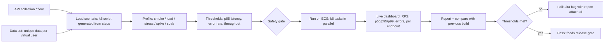

| Area | Detail |
|---|---|
| Tool | **k6** (open source), generated from the step model |
| Profiles | Smoke (few users, sanity), load (expected peak), stress (beyond peak), spike (sudden jump), soak (hours at steady load) |
| Thresholds | e.g. p95 < 800 ms, errors < 1%, ≥ 200 requests/s; test fails when breached |
| Data | Each virtual user gets unique generated data (§6) |
| Scale | Default ceiling **5,000 virtual users** per test, spread across ECS tasks; higher on request |
| Results | Per-endpoint latency percentiles, errors, throughput, trend and comparison with the previous build; stored in S3, summary in Postgres |
| Browser-level load | Out of scope; load is generated at the API level |

**Safety gate (required)**

| Control | Rule |
|---|---|
| Ownership verification | DNS TXT record or file on the target domain |
| Non-production default | Production needs an explicit, logged admin override |
| Caps | Max virtual users and duration per plan |
| Auto-abort | Stops automatically when the error rate or latency passes an abort limit; manual abort button always visible |
| Audit log | Who ran what, when, against which target |

---

## 10. Evidence and Jira

### 10.1 Evidence (automatic, for manual and automated runs)

| Evidence | When |
|---|---|
| Screenshot | Every step, before and after actions |
| Video | Whole session (automated runs: on failure only) |
| Playwright trace | Whole session, replayable in-app |
| Console errors, failed network calls | Highlighted on the step where they happened |
| Environment | Browser, viewport, build, environment URL, data row, data seed |
| Notes | Optional per step |

Passwords, tokens and personal data are masked before storage.

### 10.2 Evidence in Jira bugs

Today the Defect service only writes evidence **file names** into the Jira description (`services/defect/src/bug-report.ts`); the files stay in TestBench, so Jira users without TestBench access see nothing. The bug must carry its own evidence.

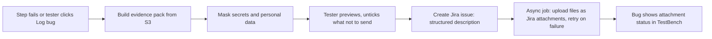

| Item | Format | Attached | Notes |
|---|---|---|---|
| Annotated failure screenshot | PNG | Always | Failed element boxed in red; step number and expected/actual on the image |
| Before / after screenshots | PNG | Always | |
| Video clip | MP4 | Always | Last ~30 s before the failure; full video as a TestBench link |
| Console log | TXT | If errors | Errors and warnings around the failure |
| Failed network calls | TXT + cURL | If 4xx/5xx | Masked request/response, copyable cURL |
| Network capture | HAR (masked) | Optional | |
| Playwright trace | ZIP | Automated runs | |
| Environment | Description | Always | Browser + version, OS, viewport, URL, build, environment, data row |
| Visual / design failure | PNG ×3 + table | When relevant | Design, actual, diff, CSS differences |
| Scan finding | PNG + text | When relevant | Rule, WCAG/OWASP reference, selector, highlighted screenshot, fix guidance |
| API / load failure | TXT + cURL / report | When relevant | Failed assertion, or load report summary |

### 10.3 Self-contained bug report with basic RCA

The developer reading the bug doesn't have TestBench. Everything needed to understand, reproduce and start fixing the bug must be inside the Jira issue.

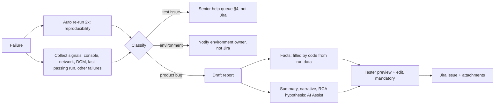

**Facts vs AI.** Environment, steps, values, expected/actual, signals and reproducibility are filled in by code from run data, so they can't be invented. AI (a new `draft_bug_report` task in AI Assist, next to `generate_cases`) only writes the title, the plain-language summary and the RCA hypothesis. AI text is always labelled, and the tester must preview it before sending.

**Report sections**

| Section | Content | Source |
|---|---|---|
| Title | `[Module] What is wrong — where/when`, editable | AI, from intent + expected/actual |
| Summary | 2–3 plain sentences: what the user does, what goes wrong, impact | AI |
| Environment | URL, build/version, browser + version, OS, viewport, date/time (IST) | Run data |
| Preconditions | Account role (never credentials), data state, feature flags | Case + auth profile + data row |
| Test data | Actual values used (product, quantity, amounts); secrets described, not shown | Data row (masked) |
| Steps to reproduce | Numbered plain-language steps with full URLs and real values; no TestBench IDs or jargon | Step model + intents |
| Expected / Actual | Side by side, exact values | Assertion |
| Reproducibility | "3/3 attempts" or "1/3, intermittent"; first failing build, last passing build | Auto re-runs + run history |
| Scope | Fails on which browsers, environments, data rows | Matrix + history |
| Technical signals | Console errors, failed calls with status and masked error body, cURL to reproduce backend calls without the UI | Evidence |
| Basic RCA | Likely layer and cause, evidence, what was ruled out, where to look, confidence | Rules + AI (below) |
| Impact | Blocked test cases and requirements, suggested severity with a reason | Repository + Docs links |
| Attachments guide | One line per file saying what it shows | Evidence pack |
| TestBench link | Optional, last line; the report must stand without it | — |

**Basic RCA: how it's worked out**

| Signal | Points to |
|---|---|
| API returned 5xx, or the wrong value in the response body | Backend (names the endpoint and the field) |
| API response correct, UI shows something different | Frontend (rendering or calculation) |
| Console JavaScript error at the failure time | Frontend (file and line from the stack trace, if source maps exist) |
| Gateway 502/503/504, DNS or timeout on every call | Environment, not a product bug |
| Element missing, but the page looks fine and the text/attribute changed since the last passing run | Test issue (locator), routed to senior help |
| Only one data row fails | Data-specific: the value is named |
| Only one browser fails | Browser-specific |
| Many tests failed in the same minute with the same signal | Shared cause, e.g. login service down: one report, not many |
| Passes on re-run | Flaky: marked, not reported as a product bug by default |
| DOM or API response differs from the last passing run | The diff itself is listed as evidence |

The RCA is a starting point, not a verdict: it states its confidence (High / Medium / Low) and always lists the evidence behind it. Commit-level cause (which change broke it) is out of scope until CI sends commit ranges with builds.

**Example of a generated report**

```
Title:   [Cart] Cart total shows price of 1 item when quantity is 2

Summary
When a customer adds 2 units of the same laptop to the cart, the cart total shows the price of
one unit. Customers would be under-charged at checkout. Reproduced 3 of 3 times on staging.

Environment
https://staging.shop.example.com · build 1.42.0 · Chrome 131 · Windows 11 · 1280×720 · 28 Sep 2026, 14:05 IST

Preconditions
Logged in as a customer account (staging, role "Customer"). Cart is empty.

Test data
Product: "Dell XPS 13" (₹60,000) · Quantity: 2

Steps to reproduce
1. Open https://staging.shop.example.com/login and log in as a customer.
2. Search for "Dell XPS 13".
3. On the product page, set quantity to 2 and click "Add to cart".
4. Open the cart: https://staging.shop.example.com/cart

Expected   Cart total = ₹1,20,000
Actual     Cart total = ₹60,000

Reproducibility   3/3 · First failing build 1.42.0 · Last passing build 1.41.2
Scope             Fails on Chrome, Firefox, WebKit · staging only tested · all data rows with quantity > 1

Technical signals
- POST /api/cart/items → 200, response {"qty":2,"lineTotal":60000}   (lineTotal should be 120000)
- No console errors
- Reproduce without UI:
  curl -X POST https://staging.shop.example.com/api/cart/items -H "Authorization: Bearer <token>"
       -H "Content-Type: application/json" -d '{"productId":"xps13","qty":2}'

Basic RCA (automated analysis, confidence: High)
Likely layer: Backend, cart service.
Evidence: the API response already has lineTotal = 60000 for qty 2; the UI displays the API value
correctly. In build 1.41.2 the same request returned lineTotal = 120000.
Ruled out: frontend calculation (UI matches API), test data (price correct), environment (all calls 200).
Where to look: lineTotal calculation for POST /api/cart/items, changed between 1.41.2 and 1.42.0.

Impact
Blocks "Checkout with multiple quantities" and requirement R-12 "Cart reflects quantity".
Suggested severity: Critical (wrong amount charged).

Attachments
failure.png    cart page with the wrong total highlighted
before.png     product page with quantity 2 selected
after.png      cart page after adding
clip.mp4       last 30 seconds before the failure
network.txt    cart API request and response (tokens masked)
trace.zip      full replay (open at trace.playwright.dev)

Open in TestBench (optional): <link>
```

| Rule | Why |
|---|---|
| Mask before anything leaves TestBench | Auth headers, cookies, passwords, tokens, emails, phones never reach Jira |
| Tester previews and can untick items | Some screenshots show data that shouldn't go to Jira |
| Issue first, attachments async with retry | A slow upload never blocks bug creation |
| Respect the Jira site's attachment size limit | Oversized items become TestBench links |
| Linking an existing bug adds a comment with the new pack | HLD §5.4; retest failures reopen with fresh evidence (HLD §5.14) |
| Evidence stays in S3 under the retention policy | Jira copies are independent |
| Optional "Reproduce in TestBench" link | Opens the Test Browser as the same role (auth profile, never the tester's session), same URL, same data seed |

Files are attached, not embedded inline in the description: inline images through Jira's public API are unreliable.

---

## 11. Other testing types

These reuse the Test Browser, runner, evidence and findings pipeline. Most are passive: they run on pages testers already visit.

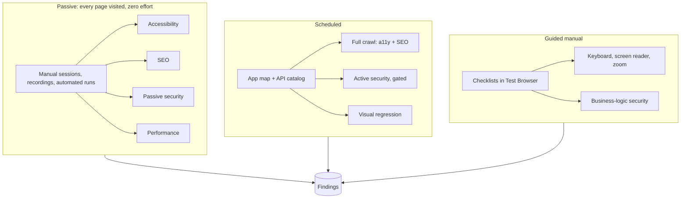

### 11.1 Cross-browser and devices (free tooling only)

| Level | Covers | Runs on | Phase |
|---|---|---|---|
| Emulation | Viewport, pixel density, touch, user agent, orientation | Lambda / ECS | MVP |
| Real engines | Chromium, Firefox, WebKit | Chromium on Lambda; Firefox/WebKit on ECS | V2 |
| Android emulator (optional) | Real Chrome for Android | Open-source emulator in containers on EC2 with KVM | V4, on demand |

No paid device clouds. **Known gap:** real iOS Safari needs Apple hardware; WebKit catches most Safari rendering issues but not iOS-specific behaviour. Customers can record manual runs on their own iPhones as evidence.

**Smart matrix:** full regression on 1–2 primary targets, smoke across all three engines, layout checks on all breakpoints via emulation.

### 11.2 Visual and design testing

| Type | Question | Compared against |
|---|---|---|
| Visual regression | Did anything change since last approval? | Own baseline screenshot |
| Design compare | Does the build match the design? | Figma (REST API) first, then Zeplin, Penpot, uploaded images |

| Method | Use |
|---|---|
| **Property compare**: design values (color, font, spacing, radius, tokens) vs computed CSS | Strict, actionable check |
| **Overlay**: onion skin, slider, side by side, difference highlight | Manual review |
| **Perceptual image diff** with masked dynamic areas | A signal to look, not pass/fail |

Mapping: frame → URL + state, Figma breakpoints → viewports, element mapping by AI confirmed once. Extras: design-token audit, overflow/overlap, clipped text, broken images, fallback fonts.

### 11.3 Accessibility

- **Automated:** axe-core on every page (contrast, labels, alt text, ARIA, headings, landmarks); Lighthouse on schedule. Finds roughly 30–50% of real issues.
- **Guided helpers:** tab-order overlay, focus visibility, accessibility tree view, color-blindness simulation, 200%/400% zoom reflow, reduced motion and dark mode toggles, WCAG 2.2 AA checklist with screenshots.
- **Output:** WCAG report per page; drafted VPAT/ACR.

### 11.4 SEO

Title/meta description · headings · image alt · robots.txt, meta robots, canonical, sitemap · broken links, redirect chains, orphan pages · structured data validation · Open Graph/Twitter tags · hreflang · duplicate content · rendered vs raw HTML · Core Web Vitals and mobile-friendliness. The tenant marks which areas are public.

### 11.5 Performance (page level)

Load time, Core Web Vitals (LCP, INP, CLS), bundle size and slow API calls per page, trended per build. Server capacity is covered by load testing (§9).

### 11.6 Security

Automated security testing of the tenant's own applications; complements, not replaces, a human penetration test.

| Area | Checks | Mode |
|---|---|---|
| Headers, cookies, transport | CSP, HSTS, frame options; cookie flags; TLS versions, ciphers, certificates; mixed content | Passive |
| Leaks | Stack traces, versions, secrets in JS bundles, data the UI never shows | Passive |
| Components, CORS | Frontend libraries with known CVEs; wildcard CORS with credentials | Passive |
| Injection | SQLi, NoSQLi, command injection, XSS, SSTI, XXE | Active (OWASP ZAP) |
| Known misconfigs/CVEs | Template checks | Active (Nuclei) |
| Access control | BOLA/IDOR (User B replaying User A's requests), normal user on admin endpoints | Active (API catalog + test users) |
| Auth, SSRF, redirects, traversal | Session handling, parameter tests | Active |
| Request tampering | Intercepting proxy on the tenant's own traffic | Manual / active |
| Rate limiting | Throttling and lockout actually work | Active, capped |
| Business logic | Coupon reuse, negative quantities, skipped steps | Guided checklist |

Active scans use the same safety gate as load testing (§9): ownership verification, non-production default, scope allowlist, destructive endpoints excluded unless opted in, caps, audit log.

### 11.7 Findings pipeline

Dedupe (one issue across 300 pages = one finding) · severity + standard tag (WCAG, OWASP, SEO) · baseline and suppress with reason and expiry · fix guidance with highlighted element · one-click Jira with evidence · coverage matrix (pages × check type) · release gate in release readiness (HLD §5.10).

---

## 12. Runner infrastructure

```
                ┌──────────────── Live (interactive) ─────────────────┐
User pane ─WS─► │ ECS: one container per session, warm pool, idle kill │ ──► S3 evidence
                └──────────────────────────────────────────────────────┘
                ┌──────────────── Headless (functional) ──────────────┐
Run trigger ──► Dispatcher ──► SQS ──► Lambda (Chromium, API tests)   │
                │                  └─► ECS Spot (Firefox/WebKit,       │──► S3 + Execution service
                │                        long tests, ZAP scans)        │
                └──────────────────────────────────────────────────────┘
                ┌──────────────── Load ───────────────────────────────┐
Load trigger ─► Safety gate ──► ECS: k6 tasks in parallel ──► metrics │──► S3 report + Execution
                └──────────────────────────────────────────────────────┘
                   All runners: VPC, NAT with Elastic IPs (published for allowlisting)
```

| Workload | Current limit | Platform | Why |
|---|---|---|---|
| Live sessions | 30 concurrent, 10-min idle timeout | ECS (Fargate or EC2-backed) | Beyond Lambda's 15-min limit; long-lived WebSocket |
| Headless Chromium UI runs | 25 Lambda (reserved) | Lambda container image | Short, stateless, zero idle cost |
| API tests | Shares the 25 | Lambda, ~50 tests per invocation | No browser |
| Firefox/WebKit, tests > ~10 min, security scans | Own ECS cap | ECS Spot | Lambda limits |
| Load tests | Up to 5,000 virtual users per test | ECS, several k6 tasks | Long-running, network-heavy |
| Per run | Max 10 tests in parallel | Dispatcher | Fairness; protects the customer's app |

### 12.1 Dispatching with 25 Lambdas

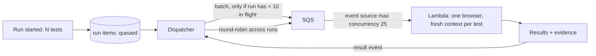

| Mechanism | Rule |
|---|---|
| Per-run cap | In-flight items per run tracked in Postgres; never more than 10 |
| Global cap | Reserved concurrency 25 and SQS event source maximum concurrency 25, so messages wait instead of being throttled |
| Fairness | Round-robin across runs: two runs at full speed, a third gets the remaining 5 |
| UI batching | 3–5 tests from one run per invocation, one browser, fresh context each; batch sized from past durations to finish well under 15 min |
| Retries | One re-queue; pass on retry is marked flaky |

**Throughput:** ~30–60 s per UI test gives roughly 1,500–3,000 tests an hour overall; a 500-test regression at 10 parallel takes about 25–50 minutes. Raising either limit is a config change.

**Rough costs** (verify against ap-south-1): live session ~$0.10/hour (2 vCPU / 4 GB Fargate); headless UI test ~$0.002 (60 s at 2 GB); load tests billed by ECS task time.

| Limit | Handling |
|---|---|
| Lambda 15-min max | Tests over ~10 min routed to ECS |
| Chromium-only in Lambda in practice | Firefox/WebKit on ECS |
| Small `/dev/shm`, 2–3 GB per browser | Standard Chromium launch flags |
| Video is heavy | Video on failure only; trace + screenshots always |
| Parallel runs can overload the customer's app | Per-run cap 10, per-environment cap the customer can lower |

### 12.2 Operations

| Need | Design |
|---|---|
| **CI/CD trigger** | Pipelines (GitHub Actions, GitLab, Jenkins) start a run with a PAT through `tb run --wait`, and get pass/fail back as the step result |
| **Usage limits** | Per-plan quotas on live session minutes, headless test time, AI tokens and load VU-minutes; checked before start; admins alerted at 80% and 100% |
| **Local development** | Same runner image and handlers run in Docker Compose against ElasticMQ and SeaweedFS (HLD §10 parity) |
| **Agents (MCP)** | Agent gateway tools to create scripts from English, run tests, read failures and bug drafts |
| **Offline AI** | With local models only, AI features still work but slower and less accurate, and are labelled as such |

Details: [technical-design.md](technical-design.md) §5, §7, §11, §12, §14.

---

## 13. Phases

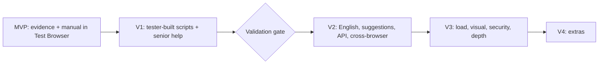

| Phase | Scope |
|---|---|
| **MVP** | Jira evidence attachments (§10.2) + self-contained report with the facts sections (§10.3) · Test Browser (ECS, warm pool, streaming) · manual execution with automatic evidence + trace viewer · device emulation + throttling · existing Playwright repo ingest + tag mapping · storage model (§2.1) · masked network capture · passive axe + security-header checks · auth profiles + test account pool (§6.1) |
| **V1** | Step model + Playwright generator + reliability rules · manual run → script · actions/recorder → script · step builder + assertion builder · quality gate + flaky handling · headless runner (dispatcher + SQS + 25 Lambda) · data generation: presets, rules, per-run uniqueness, seeds · **senior help workflow**, versioned Custom Components, Code Step, Eject, default component pack · script review · CI trigger · usage limits |
| **Validation gate** | Run the session → script flow on 2–3 real apps. Measure: % of drafts passing 3/3 without edits, stuck rate, time per script vs hand-written. Target ≥ 60–70% usable drafts before investing in V2 AI features |
| **V2** | AI bug summary + basic RCA + failure classification (§10.3) · Plain English → steps, "Automate this case" · intent + heal proposals · test-case suggestions (§7) · related-data + AI data generation, seeding/cleanup via API · API catalog + API testing (§8) · Chromium/Firefox/WebKit matrix · pair mode · visual regression baselines · guided a11y helpers · findings pipeline + release gate |
| **V3** | Load testing (§9) · UI + API hybrid tests, schema drift, GraphQL, mock server from spec · Figma design compare · SEO checks · active security (ZAP, Nuclei, BOLA/IDOR) behind the safety gate · VPAT/ACR |
| **V4** | App map + flow suggestions · element-level design mapping, token audit, Zeplin · intercepting proxy · repo route scan, gateway import, OpenAPI export · export tests to Git / Playwright zip · optional Android emulator · Hindi/Hinglish input |

Each phase is usable on its own. Every manual run recorded in the MVP becomes a script draft when V1 ships.

Phases map to milestones in [implementation-plan.md](implementation-plan.md): MVP = TS-1…TS-3, V1 = TS-4…TS-6, gate = G1, V2 = TS-7…TS-8, V3 = TS-9. Each milestone there has its own exit metric.

---

## 14. Risks

| Risk | Mitigation |
|---|---|
| Session/English drafts too brittle to save effort | Validation gate after V1; reliability rules; senior help for the hard 20% |
| Seniors become a bottleneck | Self-help AI first; default component pack; stuck-reason reports drive components built in advance |
| Too code-heavy for testers, too toy-like for engineers | Step builder for testers; components, Code Step and Eject for seniors |
| Flaky tests destroy trust | Generator rules, quality gate, flaky ≠ pass |
| Scope: many testing types | Core loop first; other types are passive add-ons on the same core, phased later |
| Running user code | Sandboxed containers, no internal network access, per-tenant secrets |
| Load tests or scans used against sites the tenant doesn't own | Ownership verification, caps, auto-abort, audit log |
| Live session cost | 10-min idle timeout, warm pool sized to demand, per-tenant caps |
| Captured traffic contains personal data | Masking before storage, tenant masking rules |
| Scan noise | Dedupe, severity, suppress with expiry |
| No real iOS Safari | WebKit in automated runs; manual runs on customers' own iPhones |

---

## 15. Not doing

- Native mobile app testing. The step model stays engine-agnostic so it can be added later.
- Two-way code ↔ steps sync.
- Silent self-healing.
- AI deciding actions at run time.
- Paid device clouds or an in-house device lab.
- A self-hosted runner agent: customer apps are reachable from the cloud.
- Git as the primary store (export may come later).
- Browser-level load testing.
- Contract testing (Pact), gRPC, AsyncAPI unless customers ask.

---

## 16. Decisions and open questions

**Decided**

| Topic | Decision |
|---|---|
| App reachability | Reachable from the cloud; no self-hosted agent |
| Storage | Postgres + S3 in our system (§2.1) |
| Cross-browser | Chromium, Firefox, WebKit in V2 |
| Devices | Free tooling only; real iOS Safari is a known gap |
| Live sessions | 30 concurrent on ECS, 10-minute idle timeout |
| Headless capacity | 25 Lambda reserved concurrency, dispatcher + batching |
| Per-run parallelism | Max 10 tests |
| Long tests | Over ~10 minutes run on ECS |
| Evidence retention | 30 days for passing runs, 180 days for failures |
| Senior help | Within the customer's own team, via an Automation Engineer role |
| Load tool | k6 on ECS, API level |
| Natural language | English first |

**Open**

1. **Team size:** needed to put durations on the phases.
2. **Load test ceiling:** 5,000 virtual users per test is the working default. Confirm or change.
3. **Expert service:** offer TestBench's own automation experts for help requests as a paid add-on later?
